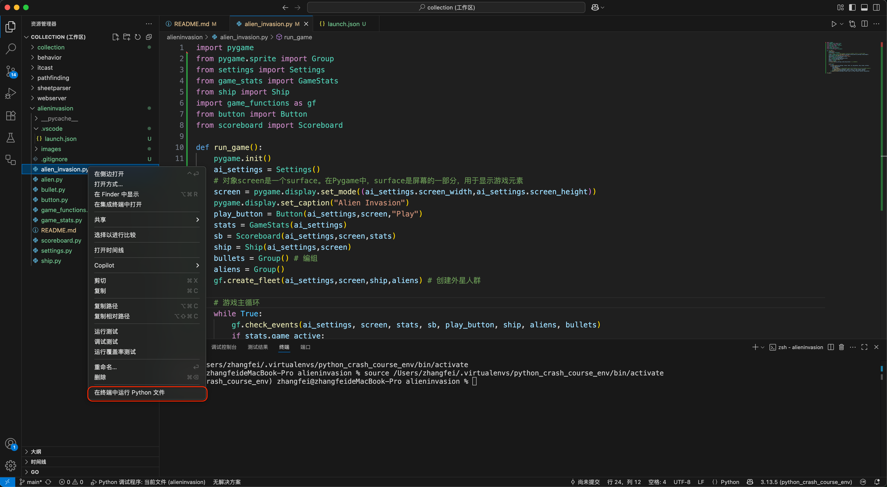
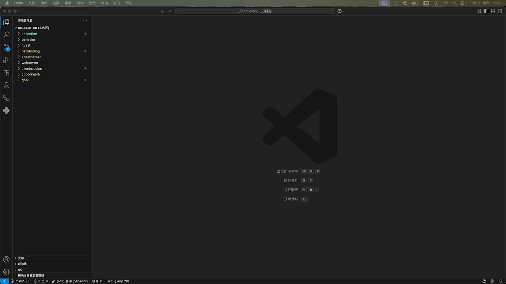

# Alien Invasion - A mini game develop by python

- 参考书籍:《Python编程:从入门到实践》(Python Crash Course)
- 随书资源: [https://www.ituring.com.cn/book/1861](https://www.ituring.com.cn/book/1861)

### 创建Python虚拟环境
---
~~使用`mkvirtualenv`创建虚拟环境~~
* ~~创建Python虚拟环境:`mkvirtualenv python_crash_course_env`~~
* ~~查看Python虚拟环境:`workon`~~
* ~~切换Python虚拟环境:`workon python_crash_course_env`~~
* ~~虚拟环境安装`pygame`包:`pip install pygame`~~
* ~~确认虚拟环境包信息:`pip list`~~
* ~~在`VSCode`中切换Python解释器:~~
  * ~~呼出命令面板:`command + shift + p`~~
  * ~~搜索并选择:`Python:选择解释器(Python:Select Interpreter)`~~
  * ~~选择工作区:`alieninvasion`~~
  * ~~选择解释器:`Python 3.13.5(python_crash_course_env)`~~

参考：[创建python虚拟环境](../readme/vscode.md#创建python虚拟环境)
* 安装`pygame`包：`pip install pygame`
* 查看安装包信息：`pip list`

### 运行游戏
---
* 通过终端：`python alien_invasion.py`
* 通过编辑器：右键`alien_invasion.py`文件，并在上下文菜单中选择`在终端中运行Python文件`

### 搭建调试环境
---
