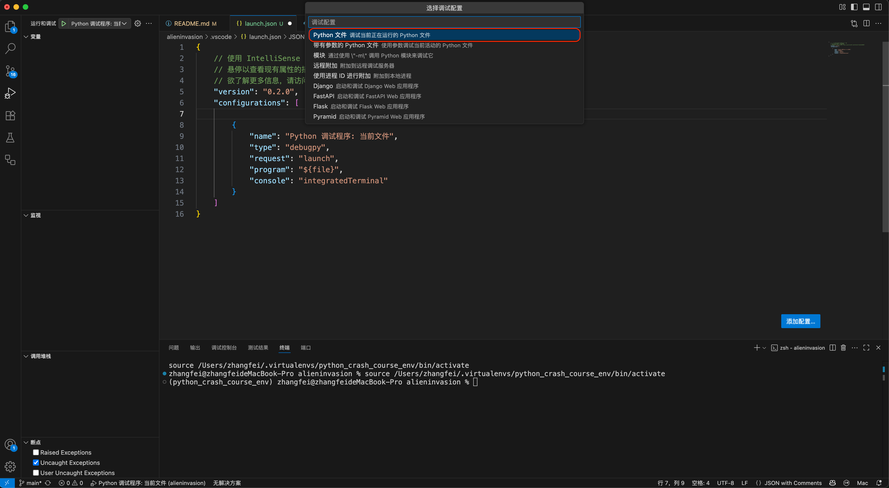

# Alien Invasion - A mini game develop by python
* 参考书籍:《Python编程:从入门到实践》(Python Crash Course)
* 随书资源: [https://www.ituring.com.cn/book/1861](https://www.ituring.com.cn/book/1861)

### 创建Python虚拟环境
* 参考: [readme/blender_development.md](../readme/blender_development.md)
* 创建Python虚拟环境:`mkvirtualenv python_crash_course_env`
* 查看Python虚拟环境:`workon`
* 切换Python虚拟环境:`workon python_crash_course_env`
* 虚拟环境安装`pygame`包:`pip install pygame`
* 确认虚拟环境包信息:`pip list`
* 为当前工作区切换Python解释器:
  * 呼出命令面板:`command + shift + p`
  * 输入并选择:`Python:选择解释器(Python:Select Interpreter)`
  * 选择工作区:`alieninvasion`
  * 选择解释器:`Python 3.13.5(python_crash_course_env)`

### 运行游戏
* 方式1：`python alien_invasion.py`
* 方式2：右键`alien_invasion.py`文件，并在上下文菜单中选择`在终端中运行Python文件`

### 搭建调试环境
* 另见: [itcast/README.md](../itcast/README.md)
* 不同点在于: 需要选择`Python调试程序` -> `Python文件(当前正在运行的Python文件)`

