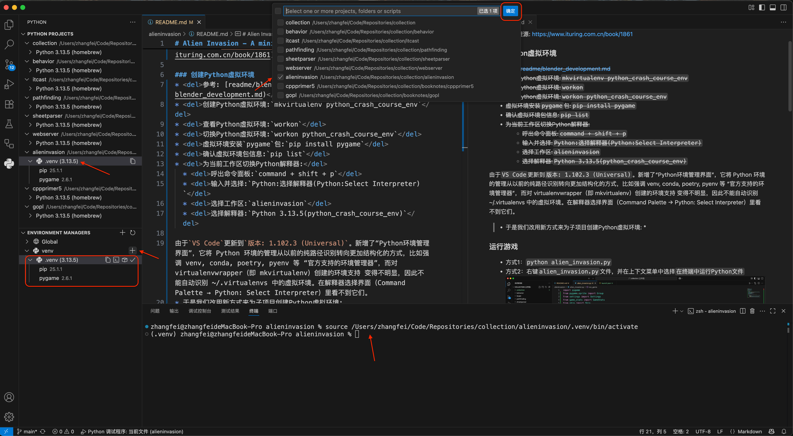

# Alien Invasion - A mini game develop by python

- 参考书籍:《Python编程:从入门到实践》(Python Crash Course)
- 随书资源: [https://www.ituring.com.cn/book/1861](https://www.ituring.com.cn/book/1861)

### 创建Python虚拟环境
* <del>参考: [readme/blender_development.md](../readme/blender_development.md)</del>
* <del>创建Python虚拟环境:`mkvirtualenv python_crash_course_env`</del>
* <del>查看Python虚拟环境:`workon`</del>
* <del>切换Python虚拟环境:`workon python_crash_course_env`</del>
* <del>虚拟环境安装`pygame`包:`pip install pygame`</del>
* <del>确认虚拟环境包信息:`pip list`</del>
* <del>为当前工作区切换Python解释器:</del>
  * <del>呼出命令面板:`command + shift + p`</del>
  * <del>输入并选择:`Python:选择解释器(Python:Select Interpreter)`</del>
  * <del>选择工作区:`alieninvasion`</del>
  * <del>选择解释器:`Python 3.13.5(python_crash_course_env)`</del>

由于`VS Code`更新到`版本: 1.102.3 (Universal)`。新增了`Python环境管理界面`，它将 Python 环境的管理从以前的纯路径识别转向更加结构化的方式，比如强调 venv, conda, poetry, pyenv 等 “官方支持的环境管理器”，而对 virtualenvwrapper（即 mkvirtualenv）创建的环境支持 变得不明显，因此不能自动识别 ~/.virtualenvs 中的虚拟环境。在解释器选择界面（Command Palette → Python: Select Interpreter）里看不到它们。所以在`VS Code`中改用新方式为子项目创建虚拟环境:
* 在`Python环境管理界面(Environment Managers)`中`创建虚拟环境`(这会在当前子项目的“根目录”下创建`.venv`文件夹)

* 为子项目`新建终端`(这会自动激活子项目的虚拟环境)，安装`pygame`包：`pip install pygame`

### 运行游戏
* 方式1(通过终端)：`python alien_invasion.py`
* 方式2(通过编辑器)：右键`alien_invasion.py`文件，并在上下文菜单中选择`在终端中运行Python文件`

### 搭建调试环境
