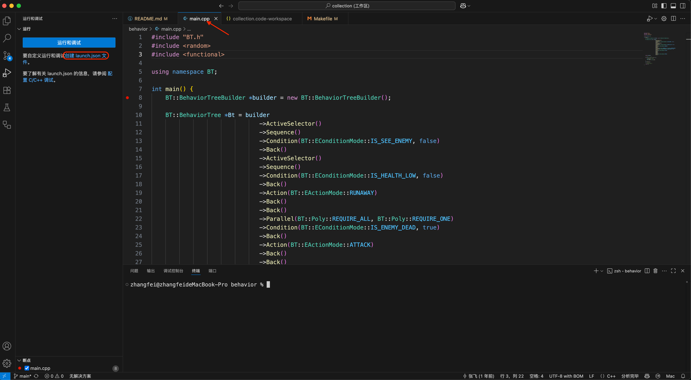
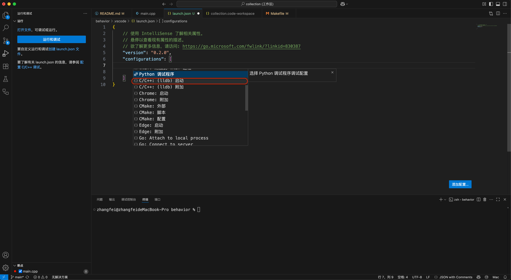
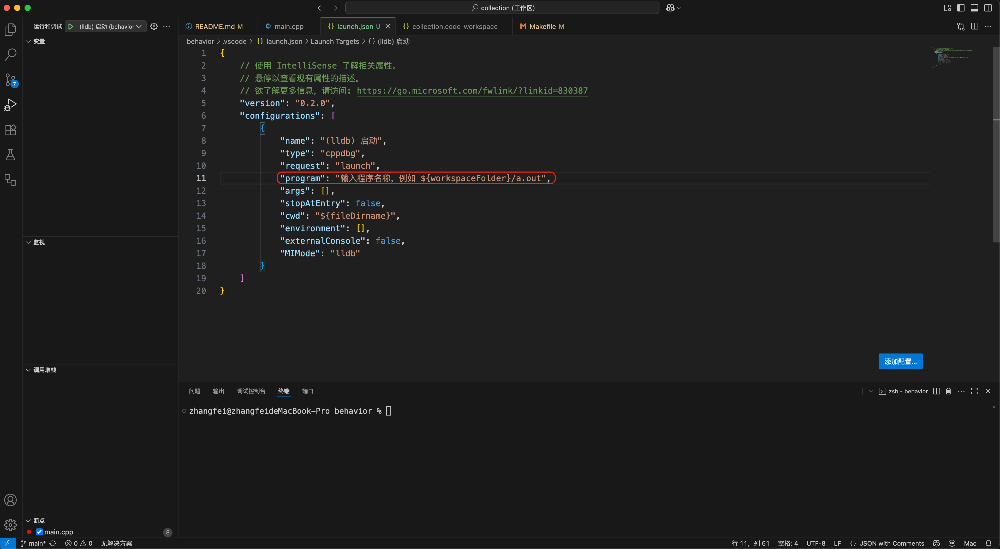
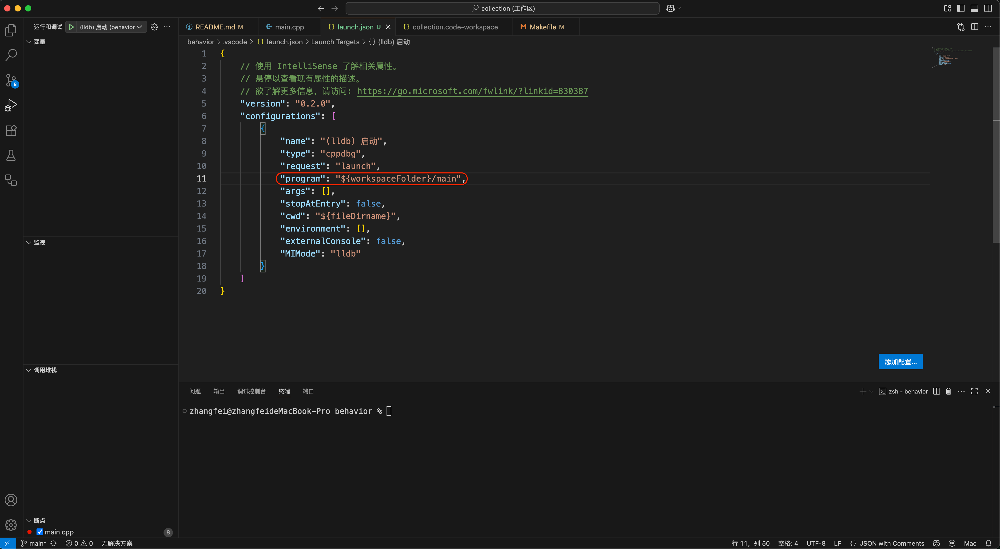
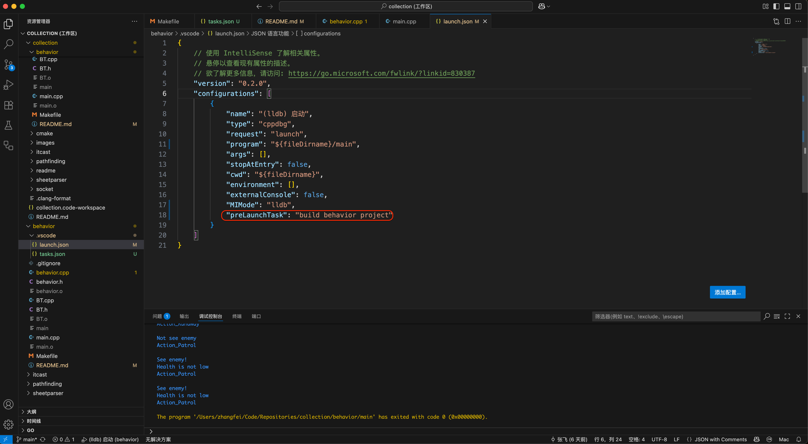
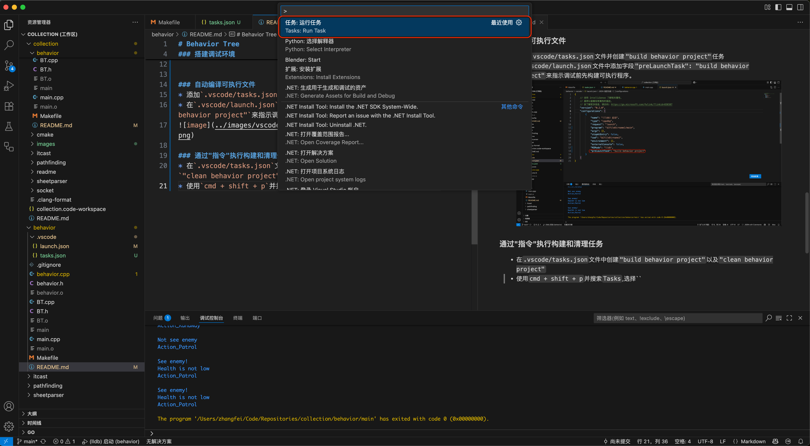
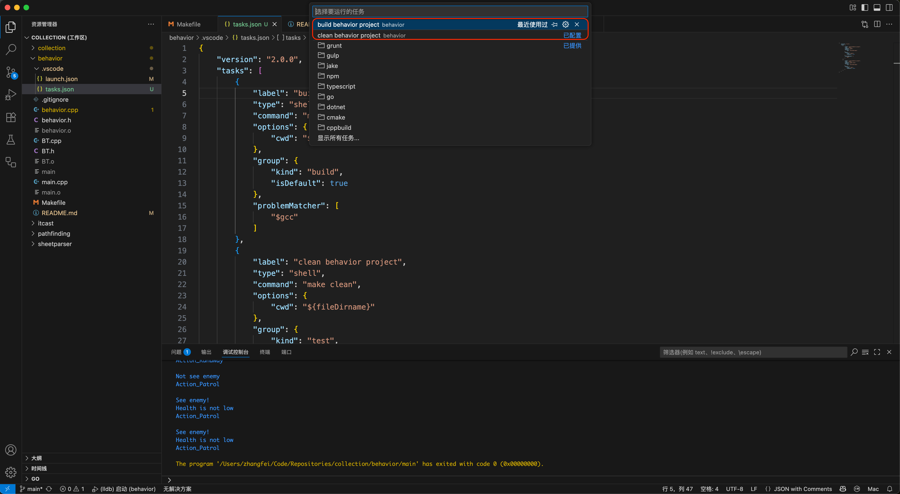

# Behavior Tree
参考: [GameAI-BehaviorTree](https://github.com/zzwzfy/GameAI-BehaviorTree)

### 搭建调试环境
* 选中`main.cpp`(如果不选中cpp文件,vscode可能不能识别当前子文件夹为c++项目,就不能正确配置c++工具链或不能激活c++插件环境,那么在调试配置菜单中就不会显示gdb/lldb相关选项),进入`运行和调试`页签,点击`创建launch.json文件`

* 选择`behavior`工作区,并为该工作区创建`c/c++ lldb(启动)`调试器

* 在生成的`launch.json`文件中修改`program`字段为相应的可执行程序路径

### 自动编译可执行文件
* 添加`.vscode/tasks.json`文件并创建`"build behavior project"`任务
* 在`.vscode/launch.json`文件中添加字段`"preLaunchTask": "build behavior project"`来指示调试前先构建可执行程序。

* `F5`进入调试时会自动构建可执行程序

### 通过"指令"执行构建和清理任务
* 在`.vscode/tasks.json`文件中创建`"build behavior project"`以及`"clean behavior project"`
* 使用`cmd + shift + p`并搜索`Tasks`,选择`任务:运行任务(Tasks:Run Task)`,最后执行自定义的`"build behavior project"`或`"clean behavior project"`任务即可编译/清理项目

* 当然,终端命令`make/make clean`也许更简洁