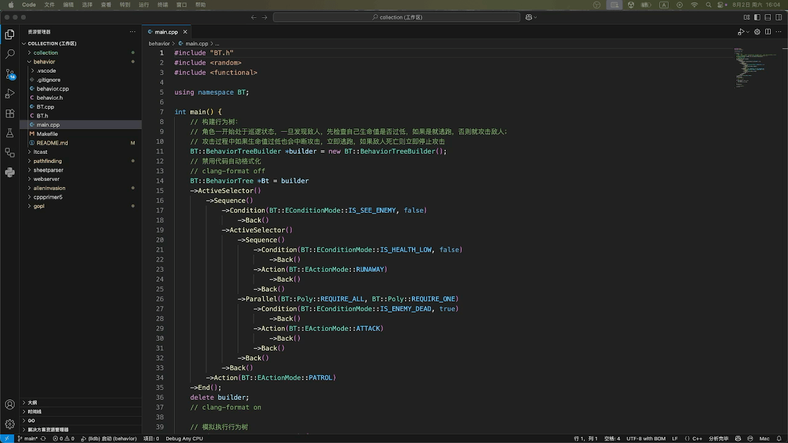

# 行为树AI

一个用c++编写的行为树案例（参考：[GameAI-BehaviorTree](https://github.com/zzwzfy/GameAI-BehaviorTree)）

### 编译和运行
编译：
* （方式1）通过`Makefile`编译项目：`make`
* （方式2）通过`tasks.json`编译项目：
  * 打开命令面板：`shift + cmd + p`
  * 搜索并选择`Tasks: Run Task`
  * 运行`tasks.json`中的自定义任务
  

运行：略

### 搭建调试环境
参考：[创建Python调试器](../alieninvasion/README.md#搭建调试环境)（注意：必须选中`main.cpp`，否则将不会正确配置c/c++工具链或不能激活c/c++插件环境，进而导致`C/C++：（lldb）启动`调试器不会出现在上下文菜单中）

注意：当`工作区`存在多个c/c++子项目时，由于c/c++插件的限制，可能无法正确地创建调试器模版(`launch.json`)。此时，可选择手动创建c/c++子项目的`launch.json`文件并设置相关参数。

**自动化**：我们希望在进入调试前能自动地创建相应的可执行文件。为此，可以在`launch.json`配置中添加字段`"preLaunchTask"`来指定调试前需要执行的`构建任务`。

TODO：调试完成之后自动清理