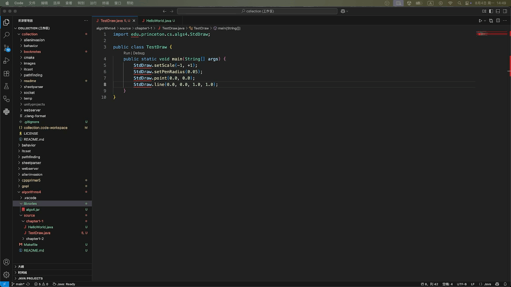

# Algorithms

《Algorithms》（第四版）随书笔记及代码整理

随书资源地址：[Algorithms, 4th Edition](https://algs4.cs.princeton.edu/home/)

### 搭建开发环境

<del>在MacOS中配置开发环境：[Hello World in Java (macOS)](https://lift.cs.princeton.edu/java/mac/)</del>【弃用：不符合“最简原则”】

安装JDK(`algs4.jar`是为**JDK 8- 17**编译的，所以不要使用过高版本)
* 查看`brew`提供的JDK：`brew search temurin`
* 安装**JDK 17**：`brew install temurin@17`
* 验证安装：`/usr/libexec/java_home -V`
* 配置`~/.zshrc`环境变量：
<div style="margin-left: 2em"> <!--代码块的缩进-->

```shell
export JAVA_HOME=$(/usr/libexec/java_home -v 17)
export PATH="$JAVA_HOME/bin:$PATH"
```
</div>

* 应用设置：`source ~/.zshrc`

配置`vscode`
* 下载 [algs4.jar](https://algs4.cs.princeton.edu/code/)，并存放到目录`booknotes/algorithms4/libraries/`
* 安装编辑器扩展：`Extension Pack for Java`
* 打开命令面板：`shift + cmd + p`
* 搜索并选择：`Java: Open Project Settings`
* 在`Project Settings`面板中，将源文件目录（例如：`algorithms4/source/chapter01a`）添加到`Source Paths`中，并点击`Apply Settings`应用设置（注解：Java依赖一种严格类名与路径映射关系，即**完全限定类名（Fully Qualified Class Name, FQCN）**。将源文件目录添加到`Source Paths`，可以使我们无需在源文件中显示声明`Package`，从而专注于算法本身。）
* 在`Project Settings`面板中，将`algs4.jar`包（`algorithms4/libraries/algs4.jar`）添加到`Libraries`中，并点击`Apply Settings`应用设置

* 设置完成后，插件会修改工作区文件（`collection.code-workspace`）并自动添加`"java.project.sourcePaths"`以及`"java.project.referencedLibraries"`字段

### 编译和运行

通过`命令行`编译和运行示例代码
* 切换到“根目录”：`cd booknotes/algorithms4`
* 编译示例：`javac -cp libraries/algs4.jar source/chapter1-1/TestDraw.java`
* 运行示例：`java -cp source/chapter1-1:libraries/algs4.jar TestDraw`

通过`vscode`运行示例代码
* `右键`源文件（例如：`HelloWorld.java`）
* 在弹出的`上下文菜单`中找到`Run Java`并运行

### 调试

通过`vscode`调试示例代码
* `右键`源文件（例如：`HelloWorld.java`）
* 在弹出的`上下文菜单`中找到`Debug Java`并运行
* 注意：本项目不使用`launch.json`来搭建Java调试器


