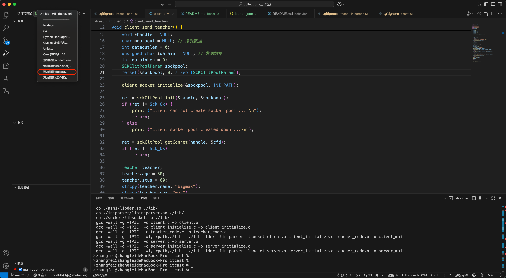
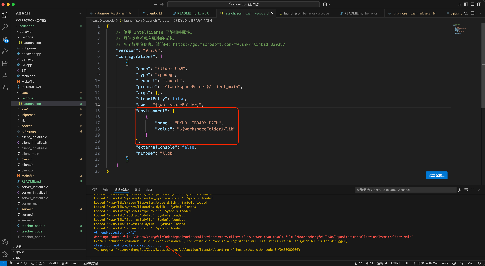

# ITCAST

### 搭建调试环境
* 另见:[behavior readme](../behavior/README.md)
* 不同点在于`运行和调试`界面中，如果已经存在调试器(例如:`(lldb)启动(behavior)`)，那么添加新的调试器配置需要通过下拉菜单中`添加配置(itcast)`来实现。

* 每个项目文件夹（如 behavior/、itcast/）都可以有自己的 .vscode/launch.json，这是 VS Code 多工作区（multi-root workspace）支持的。
* 此外，该项目还需要为调试器指定动态库的位置,需要修改`environment`字段。

* 设置断点,`F5`进入调试