# Blender 笔记

### 偏好设置
---
* 视图切换-自动深度(避免缩放视图很慢):   
  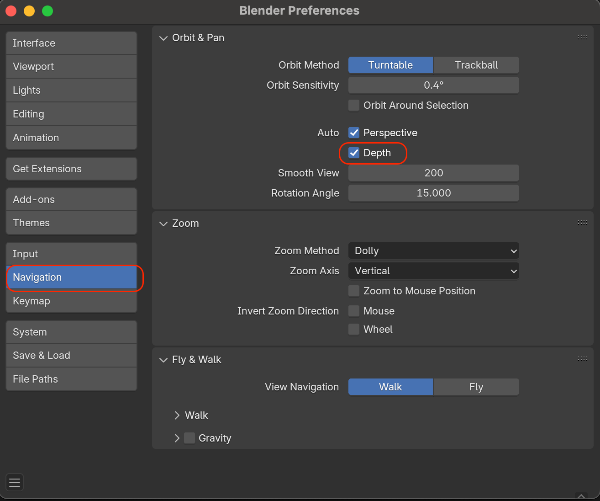<br>
* 右键选择:  
  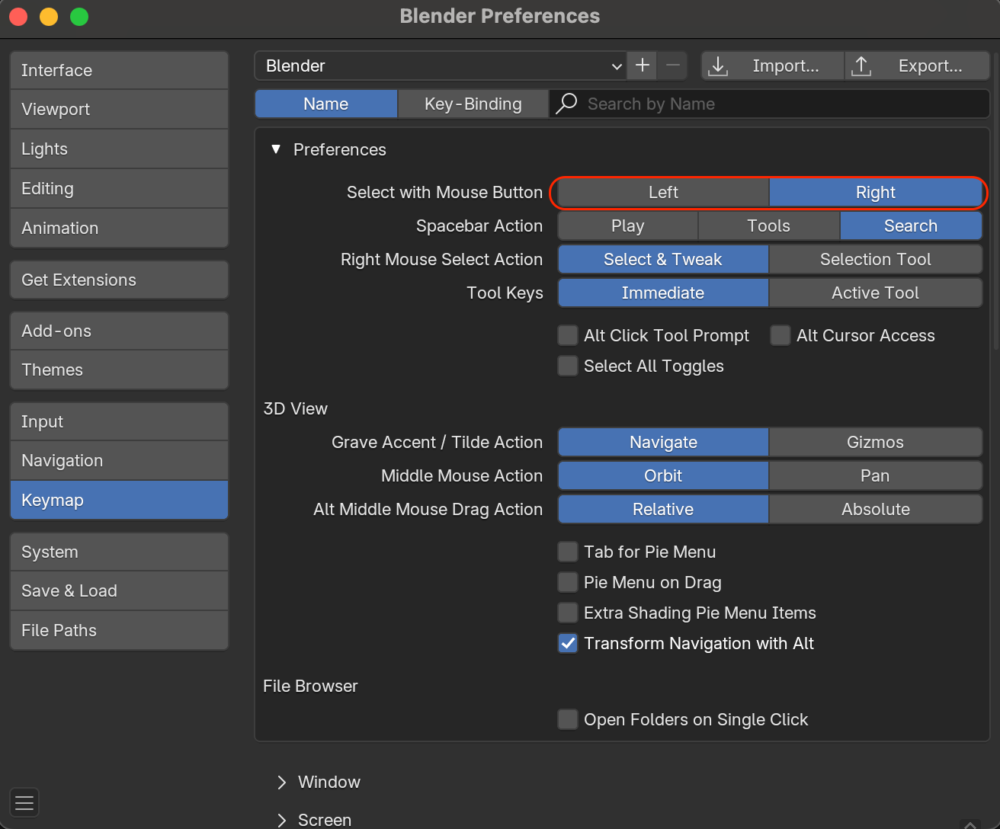<br>
* 空格键搜索:  
  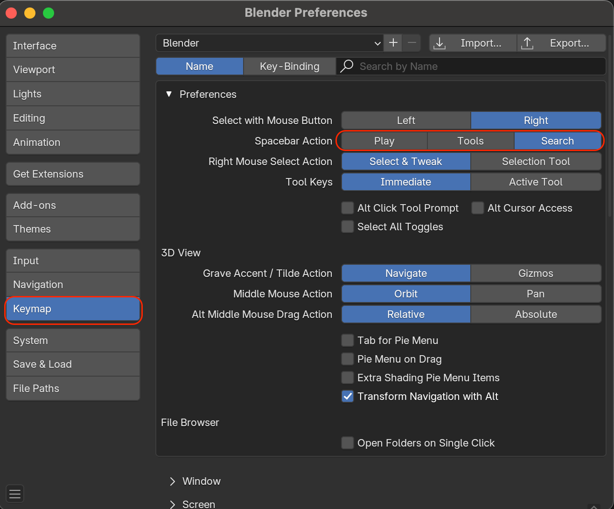<br>
* 鼠标中键视图检视:  
  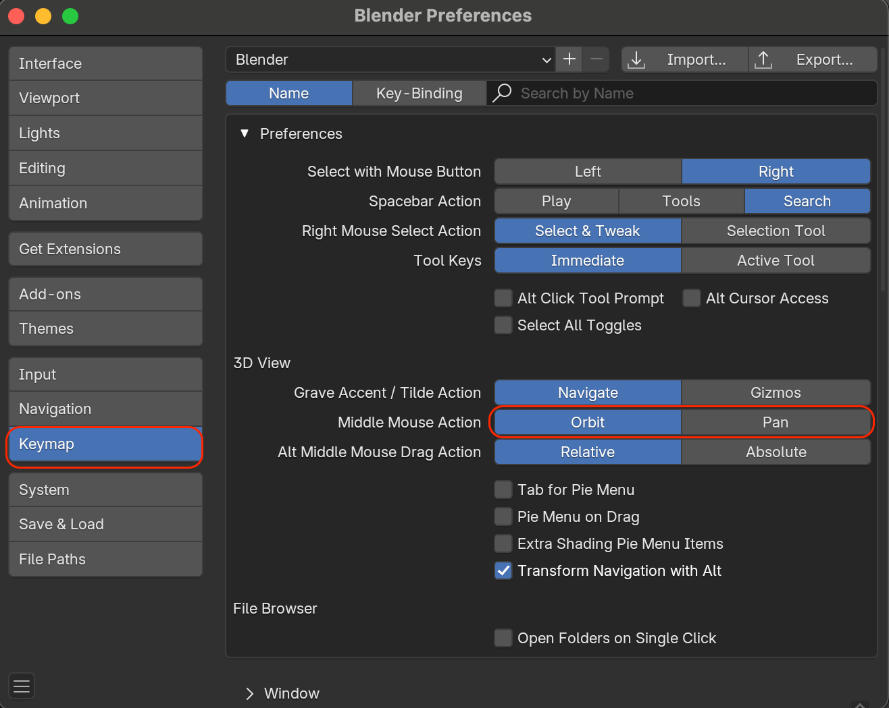<br>

### 快捷键
---
* `shift + 鼠标中键`:<u>**[3D视图]**</u>平移视角
* `shift + s`:游标吸附
* `shift + c`:游标至世界原点
* `a`:全选所有对象
* `control + 鼠标左键`:选择/取消选择(若选择对象非活动对象，则将对象置为活动对象)
* `shift + 右键`:选择/取消选择多个对象
* `shift + 鼠标左键`:<u>**[大纲视图]**</u>范围选择
* `shift + a`:添加对象
* `shift + d`:复制对象
* `x » delete`:删除对象
* `/`:聚焦选中对象/取消聚焦
* `cmd/control + j`:合并多个对象
* `w`:上下文菜单
* `shift + z`:切换到线框模式
* `h`:隐藏(物体/点/线/面)
* `option + h`:恢复所有隐藏(物体/点/线/面)
* `control + l » material`:连接(复用)材质
* `select » select loops » select loop Inner-region`:<u>**[编辑模式-边]**</u>选择两条循环边内部(建议加入`Quick`菜单)
* `g + y`:沿y轴移动
* `g + y + y`:沿y轴移动（`local space`）
* `g + shift + y`:沿`xz`平面移动
* `option + g`:<u>**[物体模式]**</u>重置位置
* `s + y`:沿y轴缩放
* `option + s`:<u>**[物体模式]**</u>重置缩放
* `option + s`:<u>**[编辑模式]**</u>沿法线方向缩放
* `r + y`:沿y轴旋转
* `option + r`:重置旋转
* `cmd/control + a » all transforms`:应用所有变换
* `TAB`:进入编辑模式
* `1`:点选择模式(非数字键盘)
* `2`:边选择模式
* `3`:面选择模式
* `e`:挤出(点/线/面)
* `e + x`:沿x轴方向挤出
* `e + y`:沿y轴方向挤出
* `e + z`:沿z轴方向挤出
* `option + e » 沿法线方向挤出`:<u>**[编辑模式-面]**</u>多个面分别沿其法线方向挤出
* `control + 鼠标左键`:<u>**[编辑模式-点/线/面]**</u>挤出到鼠标位置
* `control + r`:<u>**[编辑模式]**</u>环切
* `control + r + 滚轮Up`:环切并增加切割次数
* `control + r + 滚轮Down`:环切并减少切割次数
* `control + b`:<u>**[编辑模式]**</u>倒角
* `control + b + 滚轮Up`:倒角并增加段数
* `control + b + 滚轮Down`:倒角并减少段数
* `option + 鼠标右键`:<u>**[编辑模式-边]**</u>选择循环边
* `control(按住) + 右键 » 右键`:<u>**[编辑模式-点/线/面]**</u>起点至终点最佳路径
* `control + i`:反选
* `c`:<u>**[编辑模式-面]**</u>刷选
* `c + 滚轮Up`:<u>**[编辑模式-面]**</u>刷选并增加刷子直径
* `c + 滚轮Down`:<u>**[编辑模式-面]**</u>刷选并减少刷子直径
* `v`:<u>**[编辑模式-点/线]**</u>断离
* `control + l`:选择所有相邻元素
* `i`:<u>**[编辑模式-面]**</u>内插面
* `k`:小刀(自定义拓扑)
* `Search(按空格键) » Bridge Edge Loops(桥接循环边)`:桥接两条循环边(**两条循环边须属同一对象**)
* `cmd + e » Bridge Edge Loops(桥接循环边)`:桥接两条循环边(**两条循环边须属同一对象**)
* `g + g`:<u>**[编辑模式-点/线/面]**</u>滑移边线
* `m » 到中心`:<u>**[编辑模式-点/线/面]**</u>合并
* `m » 按距离`:<u>**[编辑模式-点/线/面]**</u>合并(可以用来去除重复点)
* `p » 选中项`:<u>**[编辑模式-点/线/面]**</u>分离
* `Search(按空格键) » Grid Fill`:网格填充(`边`须是偶数)
* `cmd + f » 栅格填充`:网格填充(`边`须是偶数)
* `f`:快速网格填充
* `shift + n`:重新计算法线方向
* `option + n » '翻转'`:翻转法线方向
* `s + z + 0`:沿z轴对齐(例如:选中两个点并使其z坐标相同)
* `shift + tab`:开启/关闭吸附功能(常用于高模拓扑)
* `control + p » 保持偏移量`:<u>**[骨骼]**</u>设置父子关系
* `option + p » Clear Parent`:<u>**[骨骼]**</u>清除父子关系
* `control + l`:<u>**[骨骼]**</u>全选与当前骨骼相连的骨骼链
* `Pose » Constraints » Copy Constraints to select bones`:<u>**[姿态模式-骨骼]**</u>拷贝活动骨骼的'Constraints'到选择的骨骼
* `k » location & rotation`:<u>**[动画]**</u>插入选中骨骼的关键帧
* `shift + space`:<u>**[动画]**</u>播放`timeline`
* `shift + <-`:<u>**[动画]**</u>跳转到起始帧
* `shift + ->`:<u>**[动画]**</u>跳转到结束帧
* `e`:<u>**[编辑模式-曲线]**</u>挤出新的曲线控制点
* `x`:<u>**[编辑模式-曲线]**</u>删除曲线控制点
* `option + s`:<u>**[编辑模式-曲线]**</u>缩放曲线控制点的半径(`radius`)
* `control + t`:<u>**[编辑模式-曲线]**</u>缩放曲线控制点的倾斜角(`tilt`)

### 雕刻边沿
---
#### 问题描述
在雕刻鞋子时，希望雕刻出鞋底和鞋面的边沿并使鞋底平整。

#### 问题解决
使用`Draw Sharp`雕刻工具勾勒出边沿,使用`Smooth`和`Mask`雕刻工具削平鞋底。
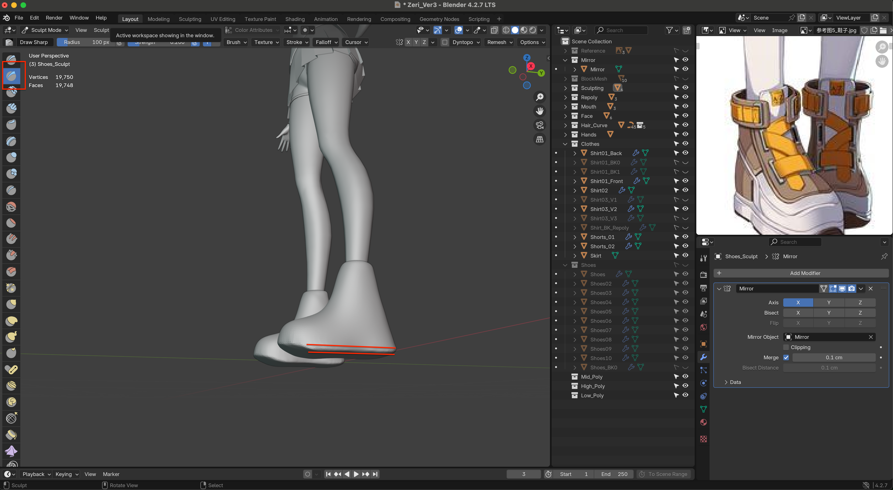

### 遮罩和限制轴向
---
#### 问题描述
在制作“编织手环”时,我们需要对单个"编织绳"进行`抓取`，固定x轴，使雕刻工具(`抓取`)只能在y和z轴上进行。
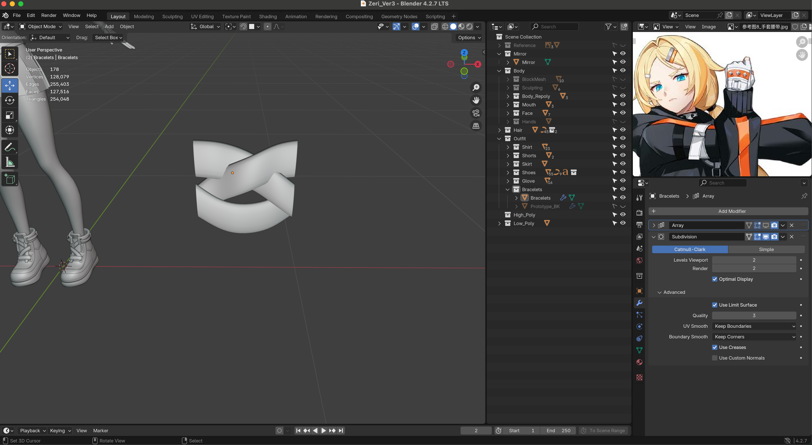

#### 问题解决
1. `operator`路径：`Face Sets » Initialize Face Sets » By Loose Parts`
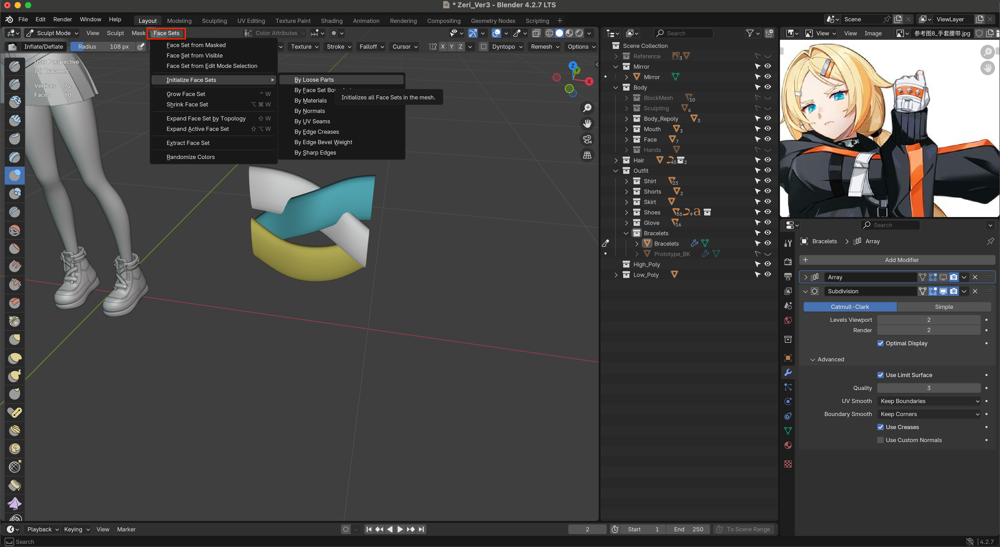
2. `Auto-Masking » Face Sets`[✔]
3. `Auto-Masking » Mesh Boundary`[✔]
4. `Auto-Masking`[✔]
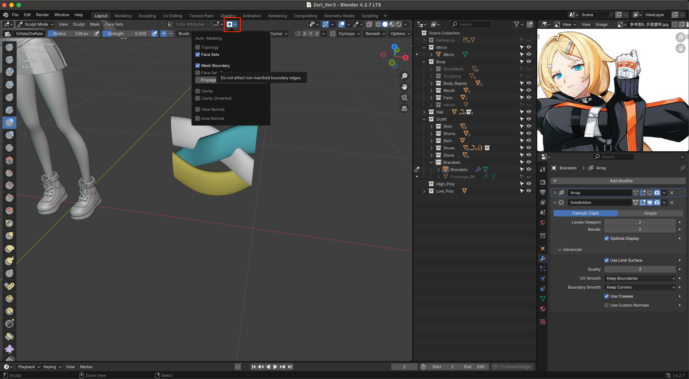
5. `Symmetry » Lock » x`[✔]
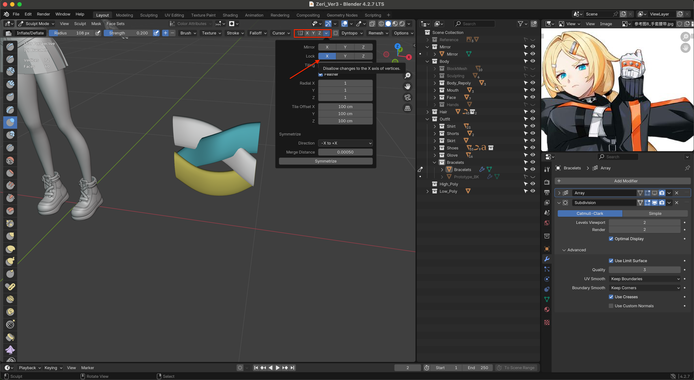

### 点无法准确吸附到最近的面
---
#### 问题描述
在对耳朵部分进行拓扑时，`点`应当吸附到"耳朵"上而非"头部"
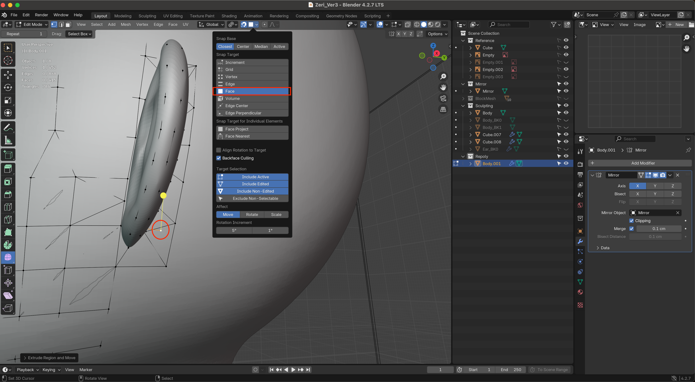

#### 问题解决
1. `Snap Target for Individual Elements » Face Project`[✔]
2. `Snap » Backface Culling`[✔]
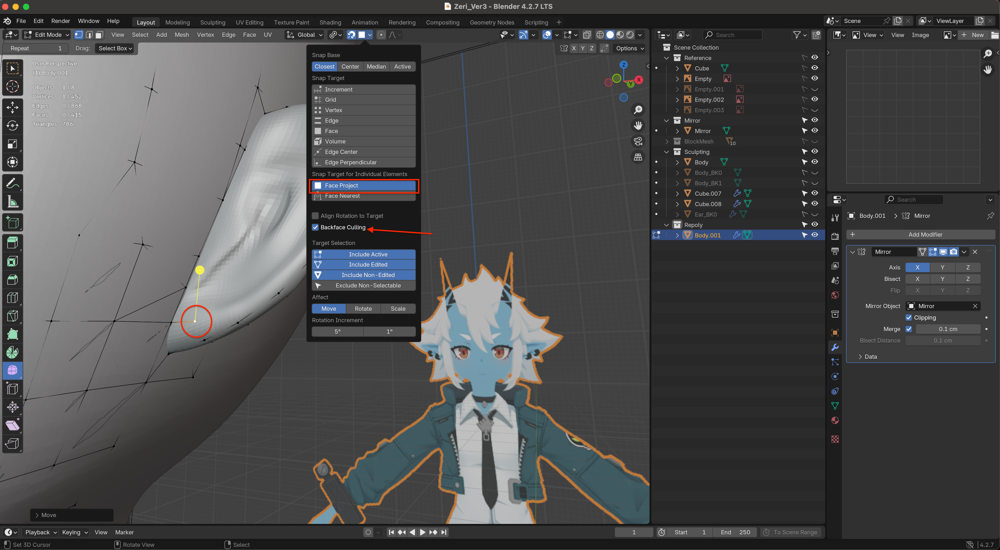

### `e`挤出的点自动吸附到最近的面
---
#### 问题描述
选择`循环边`并挤出，挤出的点不会自动吸附到最近的面

#### 问题解决
1. `Snap Target for Individual Elements » Face Nearest`[✔]
2. `Snap » Backface Culling`[✔]
3. 挤出点后，使用`g`移动顶点(点会自动吸附到最近的面)

### `UV`同步选择
---
#### 经验之谈
展`UV`时，`UV Sync Selection`[✔]

### `UV`与游戏表现和性能【重要】
---
#### 经验之谈
展`UV`时，叠放`UV`布局(例如对称的左右手)可以充分利用`Texture`有限的空间，进而减少`Texture`数量，提升性能。但是会限制艺术表现（例如：左右手`UV`不对称或需绘制不同贴花，这种情况不适合叠放`UV`）

展`UV`时，放大`UV孤岛`以展现更多细节（例如：有可能被`摄像机`聚焦的部位）。相反，缩小`UV孤岛`可以减少细节（例如：被遮挡的，永远不可能出现在`摄像机`中的部位）

展`UV`时，可能遇到如下情况：某部位总体上细节较少，所以对应的`UV孤岛`应当尽可能缩小（例如：人物腿部几乎是纯皮肤色）；但是该部位中的一些区域拥有较多细节，所以这部分区域应当尽可能放大（例如：腿部有贴纸，希望高分辨率展示）。面对这种“矛盾”，我们可以参考米哈游模型的解决方案，即单独挖出拥有较多细节的区域并放大该区域的`UV`，其余区域仍可进行UV叠放。

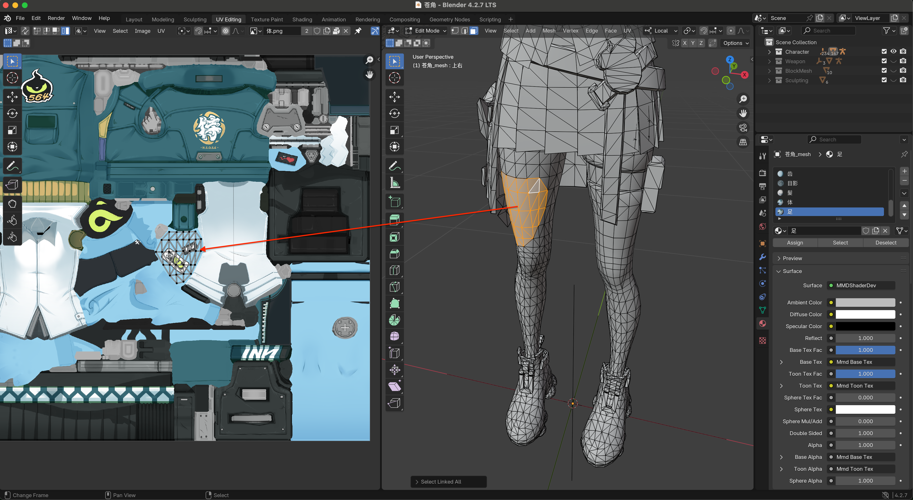
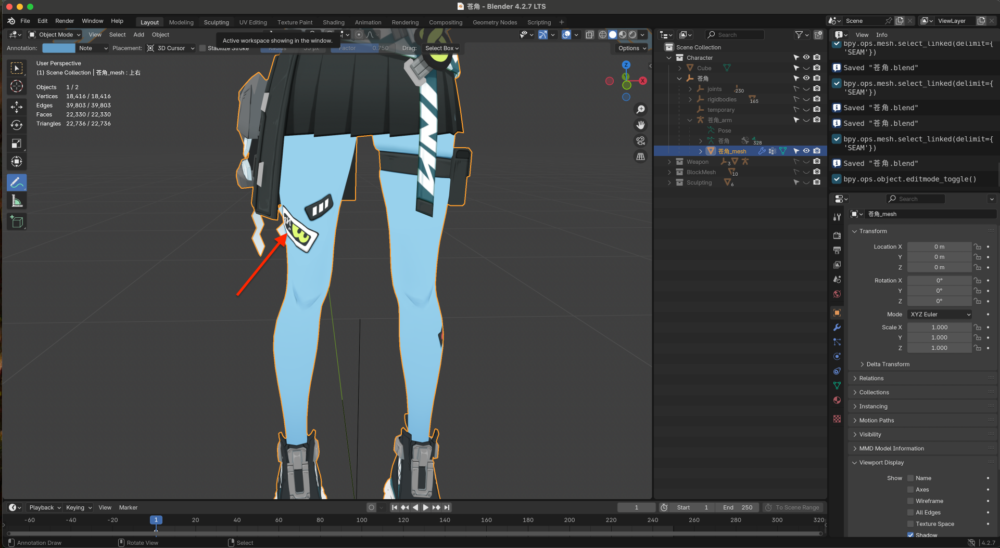

### 外来模型的`UV`
---
#### 问题描述
导入的外来模型可能已有自定义的`Model_UVMap`,与`Blender`默认的`UVMap`不会自动合并为一个`UVMap`。如果不处理或者忘记检查，那么在导入游戏引擎后，整个模型（其中，外来模型可能是“背包”，本地模型可能是“人物”）的UV就会占用两套`纹理坐标`(例如：“背包”的`UV坐标`在`TEXCOORD0`通道，“人物”的`UV坐标`在`TEXCOORD1`通道)，最后会导致渲染代码在采样`UV坐标`时发生错误。

#### 问题解决
在导入外来模型之后，需要确保所有模型在`Blender`中使用同一`UVMap`（可能会涉及到拷贝`UVMap`的操作：`选择源物体 » 选择目标物体 » control + l » Copy UV Maps`）<br> 
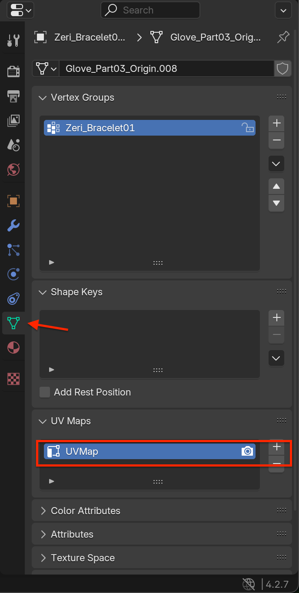<br>

### 建模、绑定和动画分文件(多人协作开发)
---
#### 问题描述
在游戏开发中，一个角色可能会有上百个动画，若`绑定文件`发生更改，我们希望能自动同步到所有的`动画文件`；还需要支持多位动画师同时为一个角色制作动画

#### 问题解决
绑定同步到动画：  
1. 在动画文件中`link`绑定文件的`Collection`（绑定文件会将所有需要`link`的对象放在一个`Collection`中）

2. 对动画文件中链接的<u>**集合**</u>进行库覆写：`右键上下文菜单 » Library Overide » Make » Select & Content`

3. 对动画文件中链接的<u>**集合中的对象**</u>进行库覆写（即一共需要执行两次库覆写）：`右键上下文菜单 » Library Overide » Make » Select & Content`

建模同步到绑定：
1. 在绑定文件中`link`建模文件的`Collection`（建模文件会将所有需要`link`的对象放在一个`Collection`中，该`Collection`同时也是`Substance Painter`的低模源）

2. 在绑定文件的所有链接对象中，筛选需要进行绑定的对象并执行本地化：`右键上下文菜单 » ID Data » Make Local`<br>
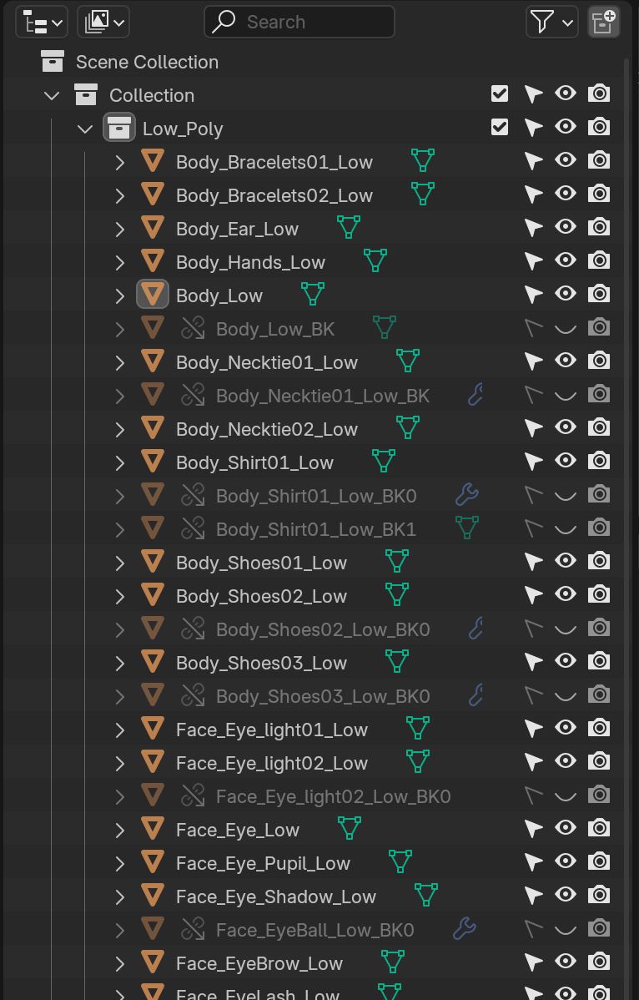<br>

3. 执行`Make Local`之后，可能遇到如下情况：对象本身已经被本地化，但其关联的数据（例如：`Mesh Data`和`Material`）仍是关联状态，导致不能给对象绘制权重。此时，可使用脚本[#对象及其关联数据本地化](#对象及其关联数据本地化)（上述`link`流程较为繁琐，也可直接使用`Append`）<br>
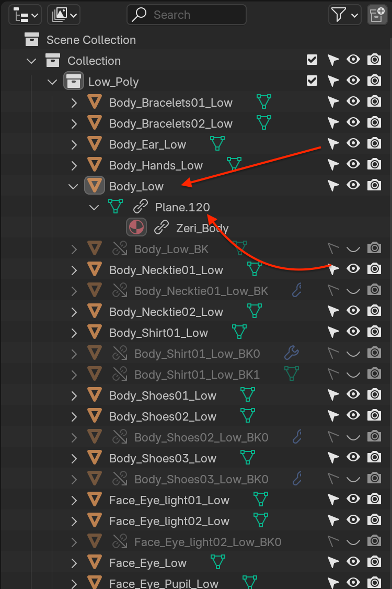<br>     

建模更改同步到绑定
1. 在绑定文件中`Append`建模文件中被修改的对象（建模文件通常会创建新对象并备份原对象，新对象的改动可能是修改了拓扑（例如：“马尾辫”增加了一条分叉），也可能是修改了`形态键`（例如：“脸部”添加或修改了一个`表情键`））<br>
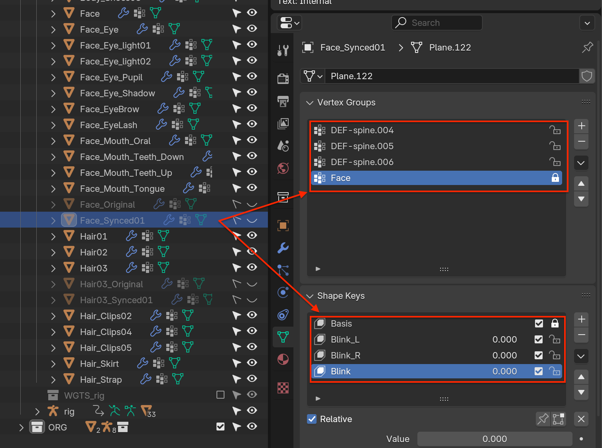<br>

2. 为新对象添加`Data Transfer`修改器(用来转移“旧对象”的权重)
，`Source`：设为原对象，勾选`Vertex Data`[✔]，勾选`Vertex Data » Vertex Groups`[✔]<br>
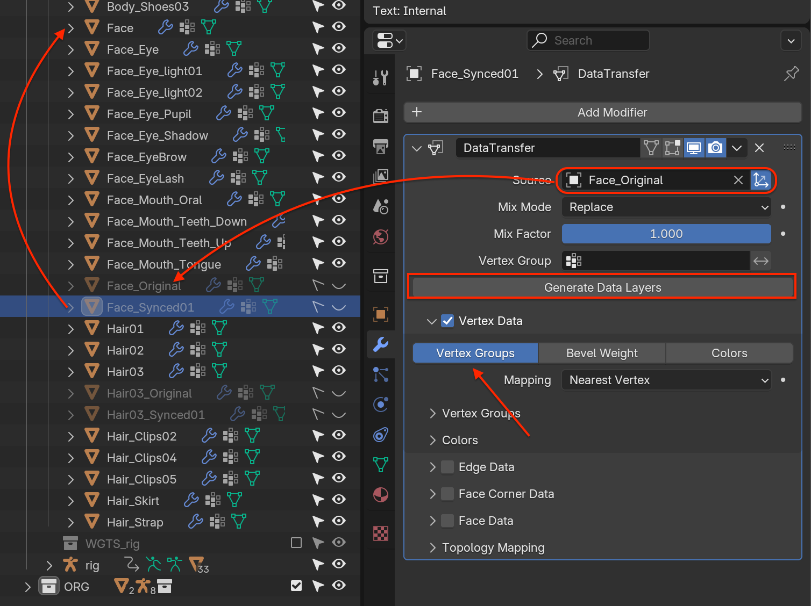<br>

3. 点击`Generate Data Layers`将原对象的顶点组转移到新对象
4. 应用`Data Transfer`修改器
5. 将新对象绑定到骨骼(顶点组来自修改器)：`control + p » Armature Deform`
6. 切换到<u>**[权重绘制模式]**</u>，检查新对象权重是否正确
7. TODO：不追求`100%`自动化，因为权重和形态键这种数据必须人眼确认。可以做一个半自动工具，让重复操作交给脚本，剩下交给绑定师检查。`SVN`只负责版本记录和更新，真正的“更新逻辑”最好在`Blender`内由脚本控制

#### 脚本
##### 对象及其关联数据本地化
```python
import bpy

linked_objects = [
    obj for obj in bpy.context.selected_objects
    if obj.library
]

for obj in linked_objects:
    obj.make_local()

    if obj.data and obj.data.library:
        obj.data.make_local()

    for slot in obj.material_slots:
        if slot.material and slot.material.library:
            slot.material.make_local()

print("选中的链接对象及其关联数据已本地化！")
```

### 绑定和导出的矛盾
---
#### 问题描述
绑定模型时，需要兼顾多人协作、解耦、调试方便、可迭代等，必须分开绑定各部件的`Mesh`。导出模型时，需要兼顾“封装性”、隐藏开发细节等，需要将所有“部件”的`Mesh`合并为一个`Mesh`

#### 问题解决
为每个“部件”的`Mesh`添加一个与“部件”同名的`Vertex Group`，合并各部件`Mesh`后，若需对“部件”返工修改，仍能通过“同名顶点组”来分离该“部件”（另见脚本[#为对象添加同名顶点组](#为对象添加同名顶点组)、[#删除对象的同名顶点组](#删除对象的同名顶点组)）
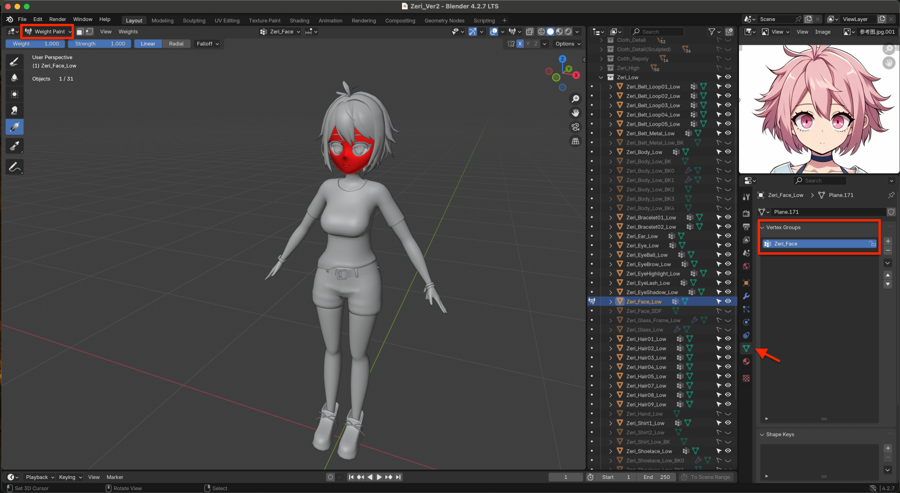
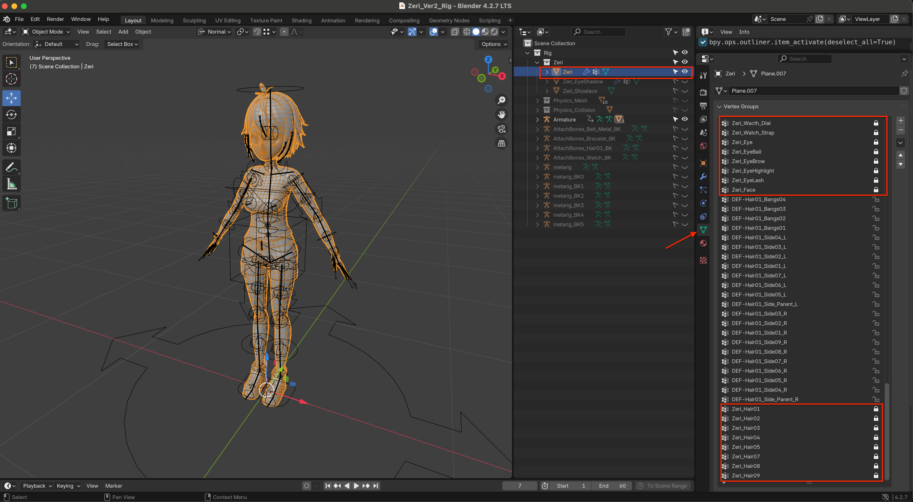
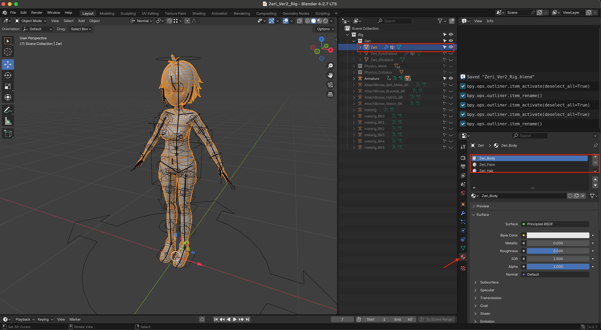

#### 脚本
##### 为对象添加同名顶点组
```python
import bpy

def add_vertex_group_to_selected():
  """为所有选中的网格对象添加同名顶点组，权重设为1.0"""
  selected_objects = bpy.context.selected_objects
  
  for obj in selected_objects:
      if obj.type != 'MESH':
          print(f"跳过非网格对象: {obj.name}")
          continue
      
      if obj.vertex_groups.get(obj.name):
          print(f"已存在顶点组 '{obj.name}'，跳过")
          continue
      
      vgroup = obj.vertex_groups.new(name=obj.name)
      vgroup.add(range(len(obj.data.vertices)), 1.0, 'REPLACE')
      print(f"已为 {obj.name} 添加顶点组并设置权重=1")
  
  print("操作完成")

add_vertex_group_to_selected()
```

##### 删除对象的同名顶点组
```python
import bpy

def remove_vertex_groups_by_object_name():
  """删除选中对象中与对象同名的顶点组"""
  selected_objects = bpy.context.selected_objects
  
  for obj in selected_objects:
      if obj.type != 'MESH':
          print(f"跳过非网格对象: {obj.name}")
          continue
      
      vgroup = obj.vertex_groups.get(obj.name)
      if vgroup:
          obj.vertex_groups.remove(vgroup)
          print(f"已从 {obj.name} 删除顶点组 '{obj.name}'")
      else:
          print(f"对象 {obj.name} 无同名顶点组，跳过")

  print("删除操作完成")

remove_vertex_groups_by_object_name()
```

### `UV`的镜像同步
---
#### 问题描述
镜像对称，更改某一侧`UV`，希望另一侧`UV`镜像同步
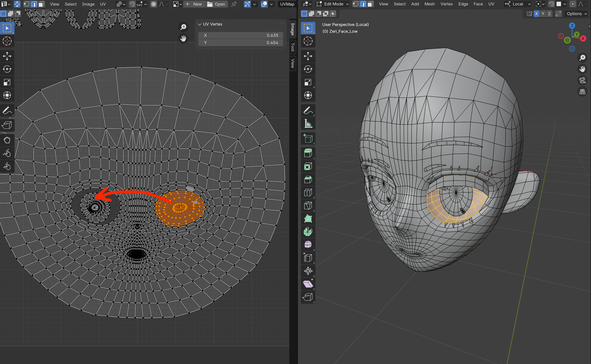

#### 解决方案
删除另一侧`UV`，并添加`Mirror`修改器，`Data » Mirror » U`[✔]
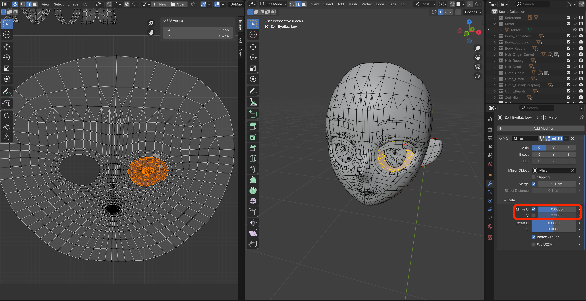

### UV打直
---
#### 问题描述
弯曲的`UV`会占用较多`Texture`空间，打直以更好地布局
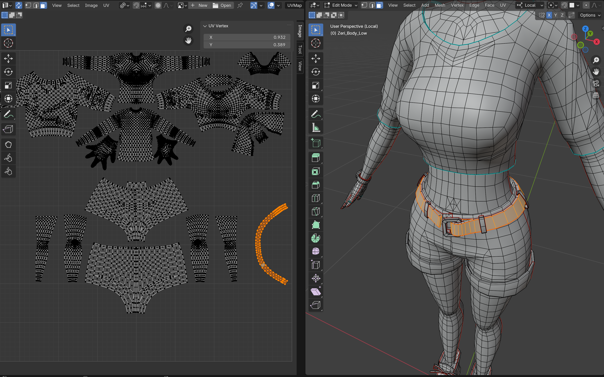

#### 问题解决
  1. 安装插件[UVToolkit](https://github.com/oRazeD/UVToolkit)
  2. `UV Sync Selection`[❌]
  3. `UV孤岛(选中) » UV ToolKit » Straighten UVs`
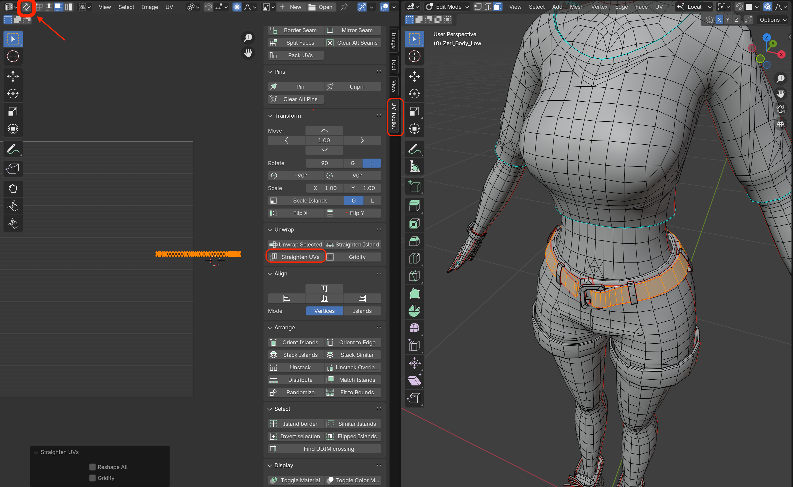

### UV叠放对齐
---
#### 问题描述
在叠放`镜像UV`时，可能会遇到这种情况：大部分顶点对齐，部分顶点不对齐
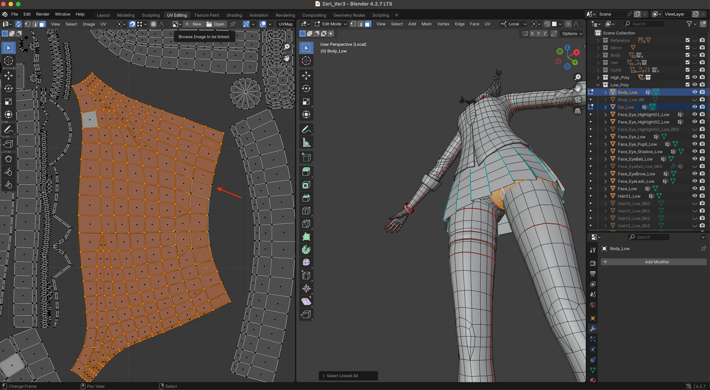

#### 问题解决
  1. `UV Sync Selection`[❌]
  2. `Snap » Snap Target » Vertext`[✔]
  3. `Select Mode » Vertex Select`[✔]
  4. 选择顶点，移动并吸附
  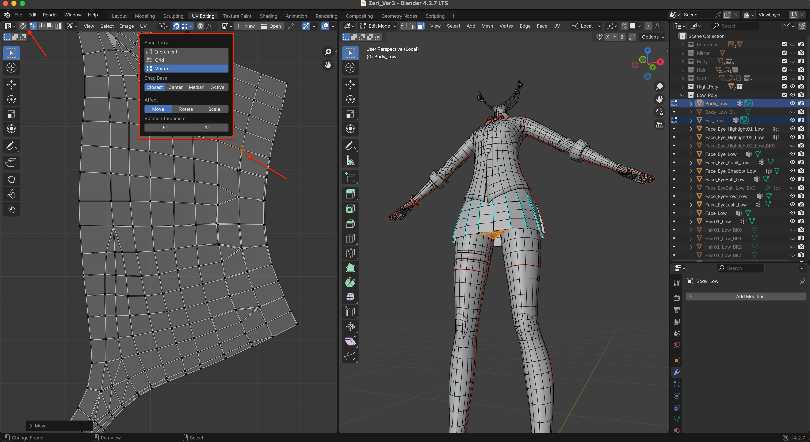

#### 问题延伸
顶点过多时，需要使用脚本[#顶点批量吸附](#顶点批量吸附)（前提是`镜像UV`已经叠放在一起，虽然部分顶点不重合，但位置非常接近）
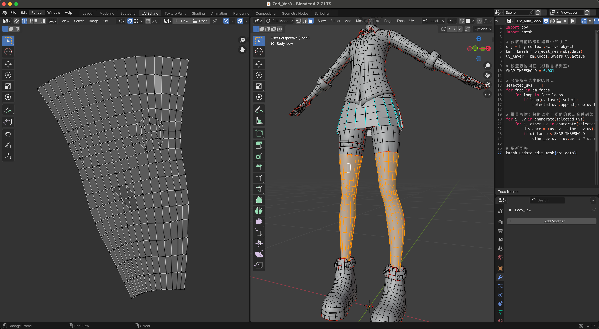

#### 脚本
##### 顶点批量吸附
```python
import bpy
import bmesh

# 获取当前UV编辑器选中的顶点
obj = bpy.context.active_object
bm = bmesh.from_edit_mesh(obj.data)
uv_layer = bm.loops.layers.uv.active

# 设置吸附阈值（根据需求调整）
SNAP_THRESHOLD = 0.001

# 收集所有选中的UV顶点
selected_uvs = []
for face in bm.faces:
    for loop in face.loops:
        if loop[uv_layer].select:
            selected_uvs.append(loop[uv_layer])

# 批量吸附：将距离小于阈值的顶点合并到第一个顶点的位置
for i, uv in enumerate(selected_uvs):
    for j, other_uv in enumerate(selected_uvs[i+1:], i+1):
        distance = (uv.uv - other_uv.uv).length
        if distance < SNAP_THRESHOLD:
            other_uv.uv = uv.uv

# 更新网格
bmesh.update_edit_mesh(obj.data)
```

### 骨骼的精确定位
---
1. `Shift + s » Cursor to Selected`：将游标定位到某处
2. 选择`Bone`的`Head`或`Tail`<u>**[编辑模式下]**</u>
3. `Shift + s » Selected To Cursor`：将`Head`或`Tail`吸附到游标位置

### 根据曲线生成骨链
---
#### 问题描述
为“头发”添加骨骼时，手动调整骨骼位置去适配“头发”会十分浪费时间，我们可以利用头发的原始曲线来生成对应的骨链

#### 问题解决
TODO

### `Rigify`骨架添加自定义骨骼
---
#### 问题描述
我们需要在`Rigify`基础人形骨架上，添加用于头发、衣服、飘带的“自定义”骨骼

#### 问题解决
1. `Shift + a » Armature » Single Bone`添加一个用于“头发”绑定的骨架，切换到<u>**[编辑模式]**</u>并添加`Deform`骨骼（手动添加和对齐骨骼很浪费时间，另见[根据曲线生成骨链](#根据曲线生成骨链)），将所有`Deform`骨骼放入同一个`Bone Colletions`中（例如：`Hair03`）
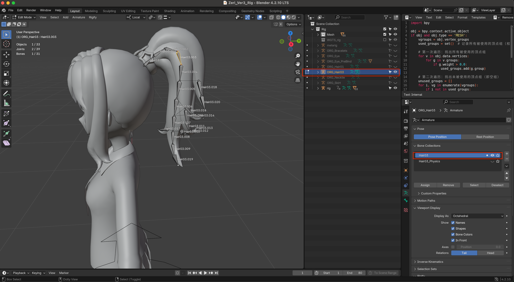
2. 复制`Deform`骨骼为“物理骨骼”并放入另一个`Bone Collection`中（例如：`Hair03_Physics`），骨骼名后缀`_Physics`，`Bone Properties » Deform`[❌]
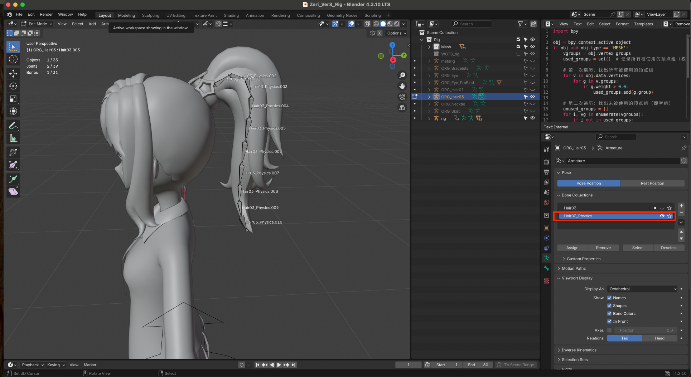
3. 切换到<u>**[姿态模式]**</u>，设置“物理骨骼”（`option(按住) + Enter`：所有选中骨骼批量设置）
   - `Rigify Type » Rig type » basic.row_copy`[✔]
   - `Rigify Type » Options » Widget » bone`[✔]
   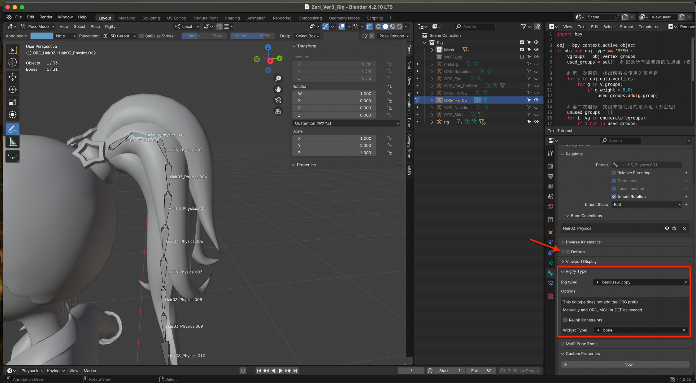
4. 切换到<u>**[姿态模式]**</u>，设置`Deform`骨骼
   - `Bone Properties » Deform`[✔]
   - `Rigify Type » Rig type » basic.super_copy`[✔]
   - `Rigify Type » options » Control`[✔]：要求生成`CTRL-XXX`类型的`Rigify`控制骨
   - `Rigify Type » Options » Widget » bone`[✔]
   - `Rigify Type » Options » Deform`[✔]：要求生成`DEF-XXX`类型的`Rigify`形变骨
   - `Rigify Type » Options » Relink Constraints`[✔]：要求将骨骼约束转移到生成的`rig`的“控制骨”上
   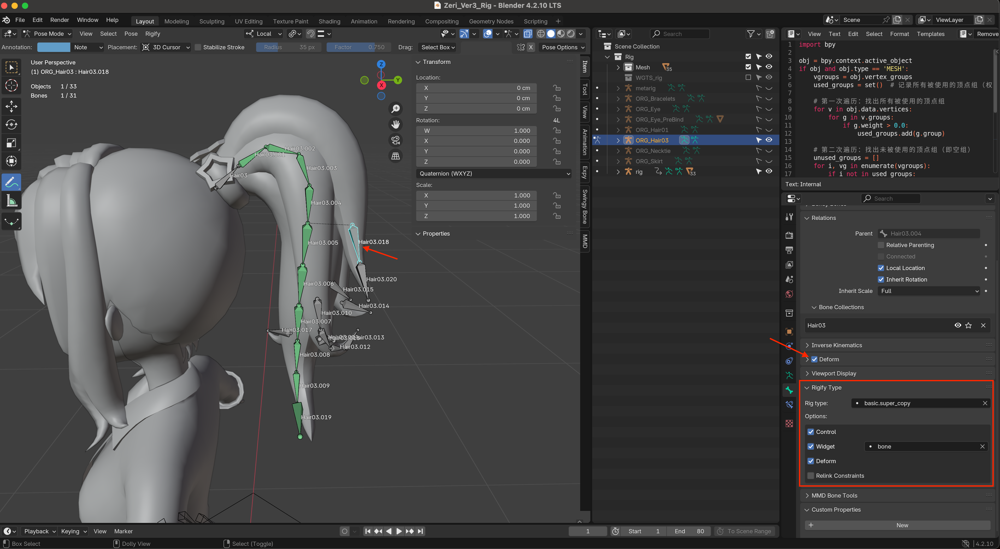
   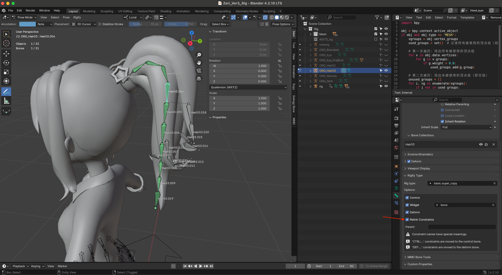
5. `Deform`骨骼需要拷贝物理骨骼的旋转，创建骨骼约束`Bone Constraint » Copy Rotation`，添加前缀`CTRL:`，重命名为`CTRL:Copy Rotation`
   - `CTRL:Copy Rotation » Bone » "XXX_physics"`[✔]
   - `CTRL:Copy Rotation » Mix » Before Original`[✔]
   - `CTRL:Copy Rotation » Target » Local Space`[✔]
   - `CTRL:Copy Rotation » Owner » Local Space`[✔]
   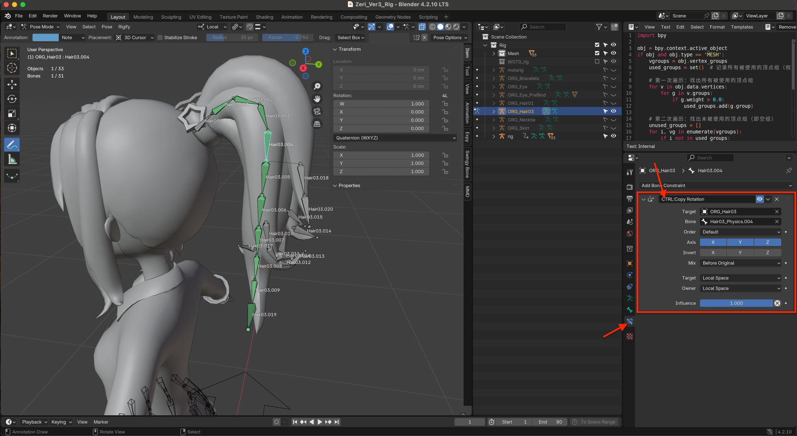
6. 备份“头发”骨架。合并前：`cmd/control » Aplly All Transform`[✔]，合并到`metarig`骨架：`control + j`[✔]，合并后：切换到<u>**[编辑模式]**</u>设置父子关系，最后设置`Bone Collection UI`
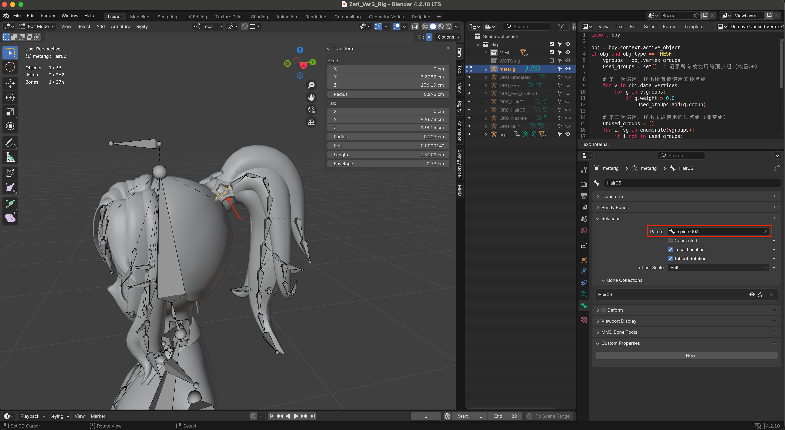
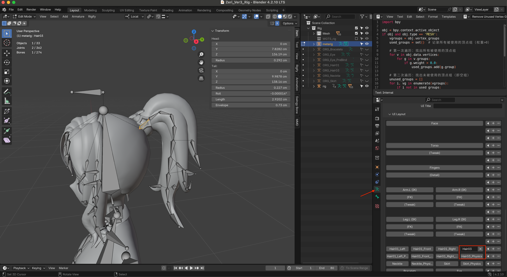
7. 点击`Re-Generate Rig`按钮，重新生成`Rig`(已经绘制的权重不会丢失)。切换到<u>**[姿态模式]**</u>检查`Rig`中父子关系是否正确
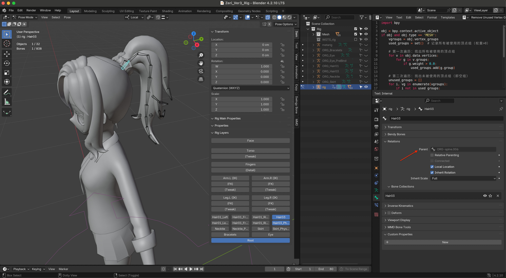
8. 显示`DEF Bone Collection`,对前缀为“DEF-”的骨骼进行权重绘制(另见：[权重绘制](#权重绘制))
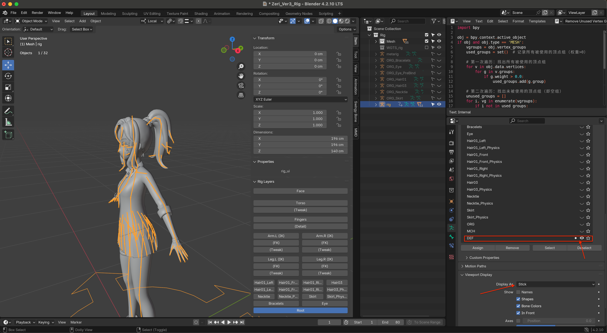
9. 这种`FK`与`Physics`分离的方案，可以使我们有能力在物理模拟结果的基础上，微调`FK`控制器来解决一些物理模拟中的“穿模”问题。实际项目中，物理模拟插件会选择[Bone Physics]()，对于`Rigify`骨架，完全没必要创建`Physics`骨骼集合，因为物理模拟可以在形变骨`DEF-XXX`上进行，然后微调控制骨`CTRL-XXX`来解决物理模拟中的穿模问题。但是对于“自定义”骨架，则需要按上述流程创建两套骨骼集合

#### 参考视频
* [[Blender 4.0 RIGIFY] ＃6-1: Custom Rigs (theory)](https://www.youtube.com/watch?v=Cq2Vw6EFXy0)
* [blender进阶丨头发和衣服动画物理模拟结算](https://www.bilibili.com/video/BV16G4y1z7BD/?spm_id_from=333.1387.favlist.content.click&vd_source=b9589ad635db7dddd215259c55a8a09c)

### 权重绘制
---
#### 经验之谈
以“部件”为单位，使用`control + p » Armature Deform`逐一绑定。注意这里的“部件”不一定是单个`Mesh`，更多情况是由多个`Mesh`组成，需要视具体情况而定，目的是寻找高效合理的绑定方式。例如：脸部(`Face`)与脖子(`Body`)可以先合并，并使用`Merge by Distance`合并“接缝”处顶点，这样`Weight » Assign Automatic From Bones`给到的权重是<u>**连续**</u>的，大大方便之后权重的修缮。绘制完权重之后再分离`Face`与`Body`，则分离后“接缝”处的两组顶点权重是相同的！在动画中便不会<u>**破面**</u>，分离后需要重新检查各`Mesh`中“同名”顶点组权重是否正确（另见：[绑定与导出的矛盾](#绑定和导出的矛盾)）

* _<u>为什么`control + p » Armature Deform`可以多次执行</u>_？重复使用`control + p » Armature Deform`逐一绑定“部件”，并不会影响已绘制好的权重。`Armature Deform`本质上是给`Mesh`添加一个`Armature`修改器。权重信息存储在顶点组中，而顶点组是`Mesh`中的数据，所以绑定新“部件”不会影响旧`Mesh`的权重。当你更改骨骼名称，才会导致顶点组中权重失效，因为骨骼名称与顶点组名称是一一对应的；或者当你对绘制好权重的`Mesh`执行`With Automatic Weights`，那么自动权重会覆盖当前权重

* _<u>为什么不使用`control + p » With Automatic Weights`来自动分配权重</u>_？因为这种方式会将所有`Deform`骨骼纳入到权重分配考量中，这样就不可避免地导致与当前`Mesh`邻近的所有骨骼都参与到权重分配，最终，不相干的骨骼被分配了权重。为了去除不相干骨骼的权重，需大量额外工作。
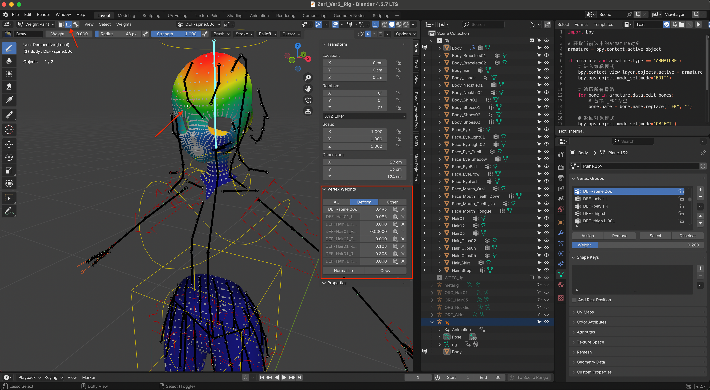

* _<u>为什么不使用`control + p » With Empty Groups`在绑定`Mesh`的同时为其创建空顶点组</u>_？当你使用`With Empty Groups`方式绑定时，会在`Mesh`(裙子)上为每一根骨骼创建一个空的顶点组。这会带来不小的麻烦：1、团队协作混淆，团队成员无法区分真正绘制权重的顶点组和“冗余顶点组”（即未被使用的、权重为0的顶点组）；2、“冗余顶点组”过多，不利于“调试”，更会使权重错误隐藏极深（例如：使用`Normalized`归一化权重时，可能为不相干顶点组分配“细微权重”）
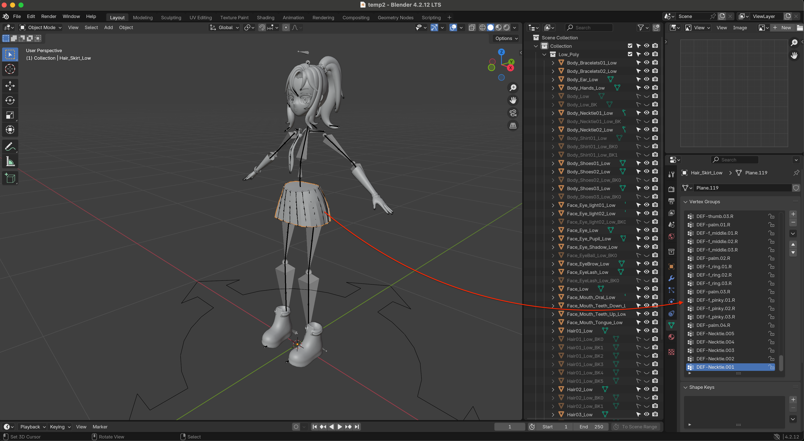<br>

* 为`Mesh`删除“冗余顶点组”（注：按照正确流程绘制权重不会产生“冗余顶点组”）<br>
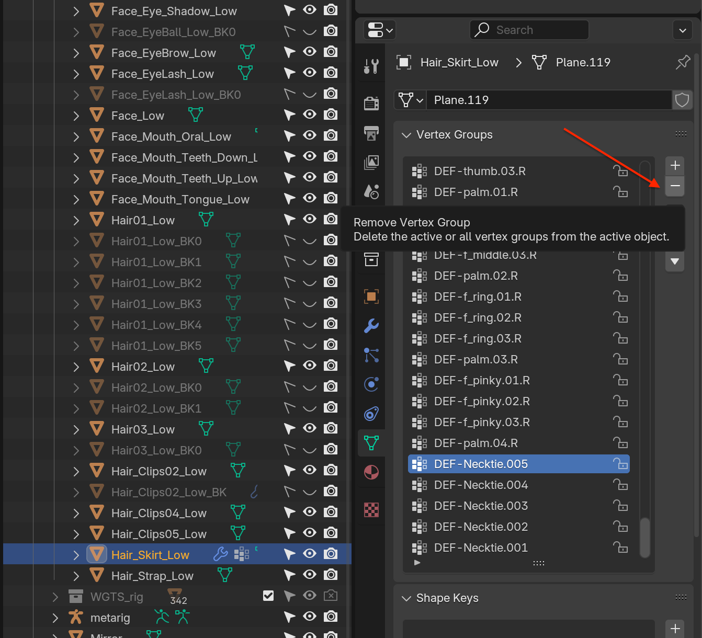<br>

#### 流程及注意事项
1. `control + p » Armature Deform`绑定`Mesh`

2. 进入<u>**[权重绘制模式]**</u>，`Weight » Assign Automatic From Bones`为选中的骨骼🦴分配自动权重（不会产生“冗余顶点组”，但注意不要遗漏本该参与权重分配的骨骼🦴，如果不小心遗漏了某根骨骼🦴，参见[#遗漏骨骼的补救方法](#遗漏骨骼的补救方法)。另见脚本[#批量选择骨骼](#批量选择骨骼)）<br>
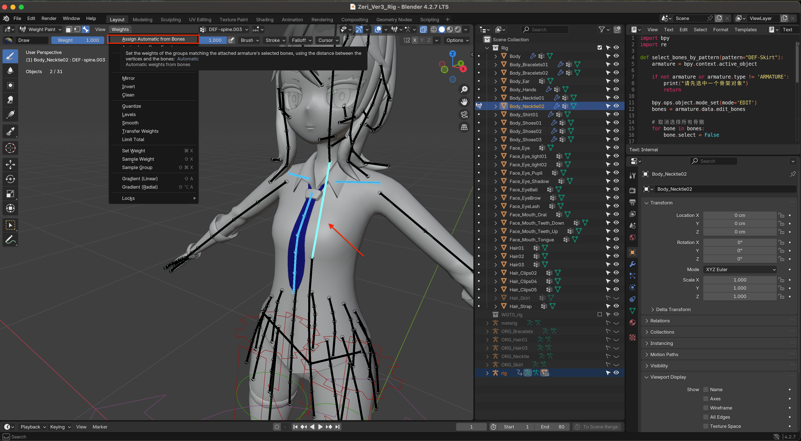
      
3. 区域化清理/添加顶点组（即针对一个区域内所有点，清理“不相干顶点组”，补充“相干顶点组”。例如：骨链`[DEF-SkirtA.001 ~DEF-SkirtA.004]`和骨链`[DEF-SkirtB.001 ~ DEF-SkirtB.004]`之间所有点，也许会受到骨链`[DEF-SkirtC.001 ~ DEF-SkirtC.004]`的影响，但不应该受到骨链`[DEF-SkirtD.001 ~ DEF-SkirtD.004]`的影响，因为距离实在太远，是故应当删除这些“不相干顶点组”。）<br>
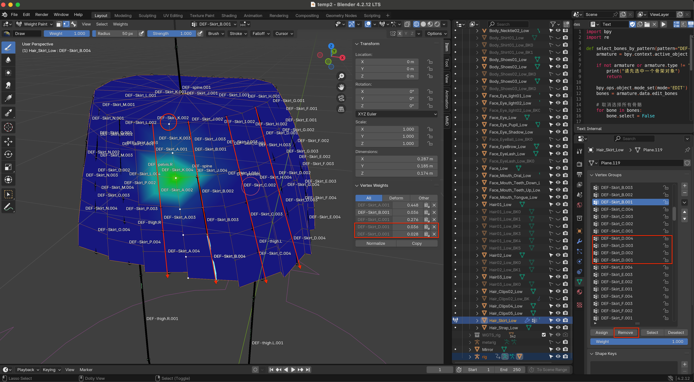
   - 小技巧：在<u>**[权重绘制模式]**</u>只能逐个选取点，可以`Tab`键切换到<u>**[编辑模式]**</u>快速且区域化选择点，然后切换回<u>**[权重绘制模式]**</u>
   - _<u>为什么不使用`Weight » Clean`来一键清理</u>_？`Weight » Clean`的功能是：把小于某个阈值的权重条目直接移除顶点组（而不是归零）。典型用途：自动权重生成之后，有些“尾巴”权重（`0.001`之类），看起来没用，清理掉可减少计算开销（有些游戏引擎要求每个顶点只允许有限个骨骼影响）。存在问题：它按阈值一刀切，可能会误删“虽然权重很小但实际需要存在”的顶点组。在角色裙摆、布料这种“边界受多条骨链轻微影响”的地方，这种误删可能会让边缘变硬，失去自然过渡

4. `Weight » Normalize All`将全部顶点组归一化权重，即每个顶点的权重和均为`1`（举例：如果一个顶点分布在多个组（例如`A=0.3`,`B=0.5`），`Normalize All`会把它们拉伸到 (`A=0.375`,`B=0.625`)，和`=1`。如果一个顶点只在某个组里（例如`A=0.6`），`Blender`不会自动把它调成`1.0`，因为它不去“猜”你想要哪根骨骼来补齐剩下的`0.4`）
   - _<u>“边缘顶点只关联一个组且权重小于`1`”是否会有问题</u>_？如果顶点只跟随一个骨骼，哪怕权重是`0.6`，它也还是会`100%`跟随那根骨骼，只是数值偏小。因为对单骨骼来说，`0.6`和`1.0`没区别，效果是一样的。问题只在于有多个骨骼竞争同一顶点时，才需要归一化到和为`1`。如果想确保所有“单骨骼顶点”都满权（`1.0`），需要在后续修复权重时手动处理
   - 使用脚本[#高亮权重未归一化的点](#高亮权重未归一化的点)检查未归一化顶点

5. 仅使用`Add`、`Subtract`和`Blur`这三种笔刷修复权重，切换到<u>**[线框模式]**</u>以方便观察，笔刷强度推荐设置为`0.1`，切记打开自动权重`options » Auto Normalized`[✔]，关闭`X`轴镜像`Enable Mesh Symmetry in the X axis`[❌]
    - 使用`Paint Mask`设置笔刷遮罩
    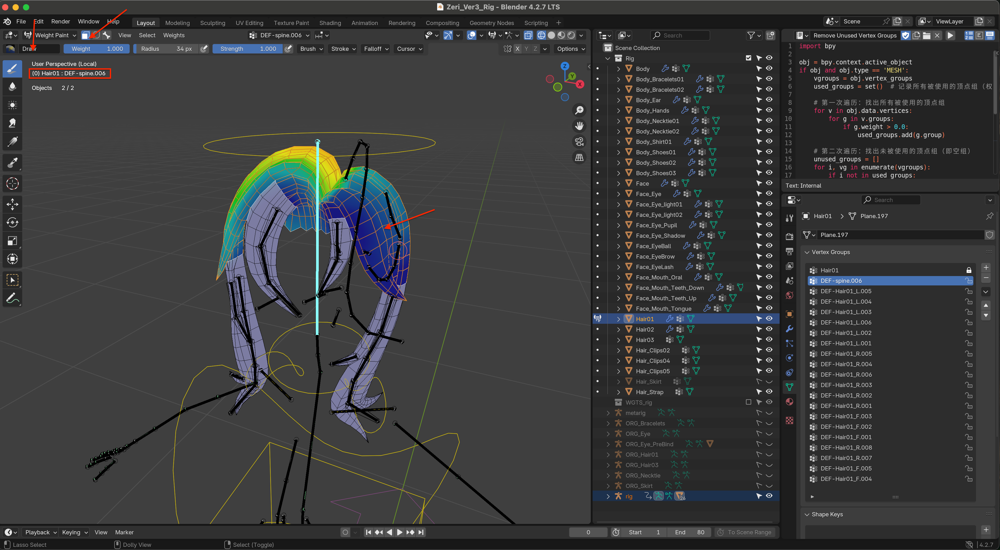
    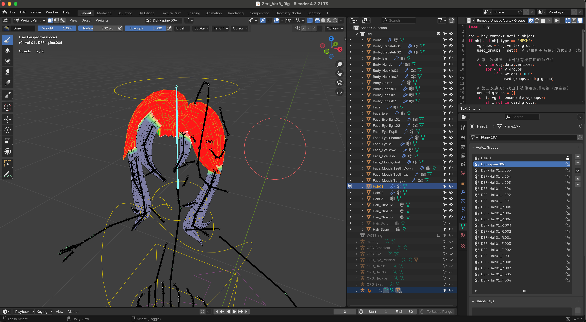
    - 在“极限姿势”下修复权重（对于衣服飘带、尾巴等链式骨骼，全选骨骼🦴并沿本地`X`/`Y`轴旋转，便可以获得飘动姿态）
    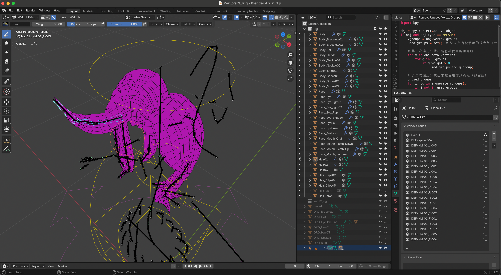
    - _<u>以点为单位修复细节处权重</u>_：从`Bone Selection`模式切换到`Vertex Selection`模式，使用`Add`/`Subtract`笔刷对权重有问题的`点`进行手工修复（例如：腿部与短裤这两个`Mesh`在接缝处的两组点，其在各种极限姿势下应该是重叠的，不可“破面”的。我们可以使用笔刷逐点修复权重错误）
    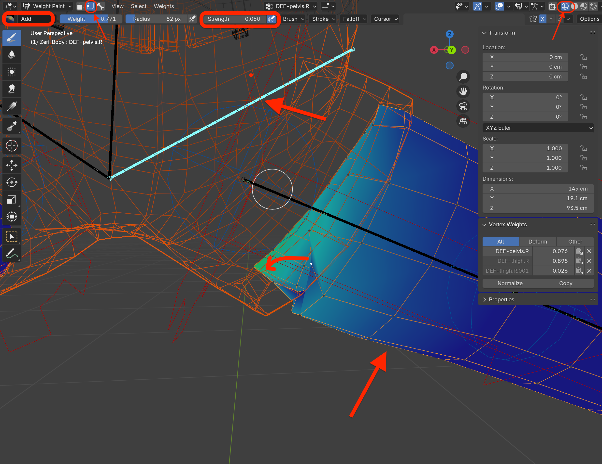
    -  _<u>为什么使用`Blur`笔刷而不使用`Weight » Smooth`</u>_？`Weight » Smooth`是全局操作，不受区域控制，很可能平滑到更远处的点，破坏之前“区域化清理/添加顶点组”的结果。相反，使用`Blur`笔刷手动绘制权重，可以精确地控制区域。

6. 权重绘制完成后，需要进行动作测试，在各种`Pose`下预览并修复剩余问题

#### 遗漏骨骼的补救方法
注意：必须提前预防遗漏骨骼🦴，在`Weight » Assign Automatic From Bones`之前，确保所有应该参与的骨骼🦴都已选中

只为遗漏骨骼添加权重：
* 在`Mesh`上新建顶点组（命名要和骨骼一致，`Blender`才能识别）
* 为新建顶点组分配权重的方式：
  * 切换到<u>**[编辑模式]**</u>，选择顶点并`Assign`到新组
  * 直接使用笔刷绘制权重（务必打开`options » Auto Normalized`[✔]）

#### 脚本
##### 批量选择骨骼
```python
import bpy
import re

def select_bones_by_pattern(pattern="DEF-Skirt"):
  '''通过正则名批量选择骨骼'''
  armature = bpy.context.active_object
  if not armature or armature.type != 'ARMATURE':
      print("请先选中一个骨架对象")
      return
  
  bpy.ops.object.mode_set(mode='EDIT')
  bones = armature.data.edit_bones
  for bone in bones:
      bone.select = False
  
  regex = re.compile(pattern, re.IGNORECASE)
  matched_bones = [bone for bone in bones if regex.search(bone.name)]
  if not matched_bones:
      print(f"没有找到匹配'{pattern}'的骨骼")
      return
  
  for bone in matched_bones:
      bone.select = True
  print(f"已选择 {len(matched_bones)} 个匹配'{pattern}'的骨骼")

select_bones_by_pattern("DEF-Skirt")
```

#### 高亮权重未归一化的点
```python
import bpy

def check_non_normalized_vertices(): # TODO：功能尚不完善
  '''标记所有“权重和 ≠ 1.0”的顶点'''
  obj = bpy.context.object
  if not obj or obj.type != 'MESH':
      print("请先选中一个 Mesh 对象。")
      return
  
  mesh = obj.data
  vg = obj.vertex_groups
  
  bad_vertices = []
  
  for v in mesh.vertices:
      weights = [g.weight for g in v.groups]
      if not weights:
          continue
      total = sum(weights)
      if abs(total - 1.0) > 1e-4:  
          bad_vertices.append(v.index)
  
  for v in mesh.vertices:
      v.select = False
  
  for idx in bad_vertices:
      mesh.vertices[idx].select = True
  
  bpy.ops.object.mode_set(mode='EDIT')
  bpy.ops.mesh.select_mode(type="VERT")
  
  print(f"检查完成，共发现 {len(bad_vertices)} 个权重和≠1 的顶点。    ")

check_non_normalized_vertices()
```

### 权重连续的重要性
---
#### 问题描述
对于两个独立`Mesh`（即使这两个`Mesh`属于同一个`Object`，例如：鞋子和鞋上部件），若两者是`Loose Parts`而非`Connected Mesh`，那么在自动权重后，得到的权重就是不<u>**连续**</u>的，最后在姿态测试或动画制作中，就会出现两个`Mesh`分离的现象
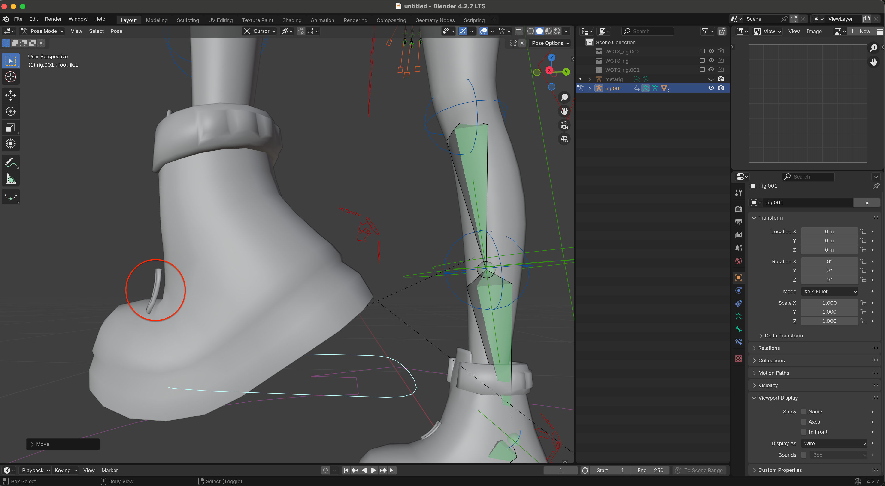

#### 问题解决
注意：“权重传递”的效果可能依旧不理想，应该在拓扑低模时，就尽可能解决`Loose Parts`问题，尽量将“封套”制作为<u>**一个**</u>`Connected Mesh`

使用“权重传递”：
1. 接受权重传递的`Mesh`绑定到骨骼：`control + p » Armature Deform`
2. 选择源对象，选择目标对象，进入<u>**[权重绘制模式]**</u>
3. `Weights » Transfer Weights`[✔]，`Invoke`面板上设置：
   - `Vertex Mapping » Nearest Face Vertex`[✔]
   - `Source Layer » By Name`[✔]
   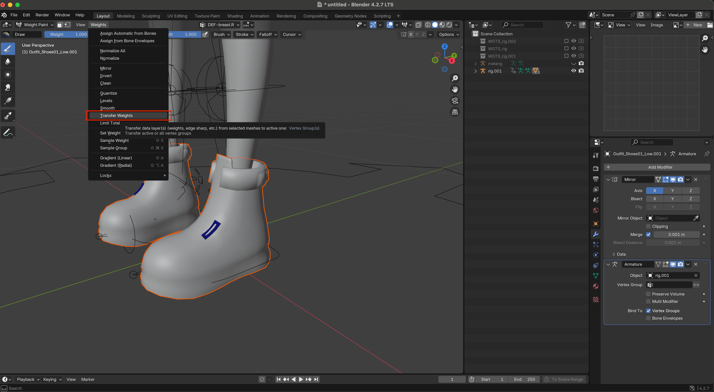
   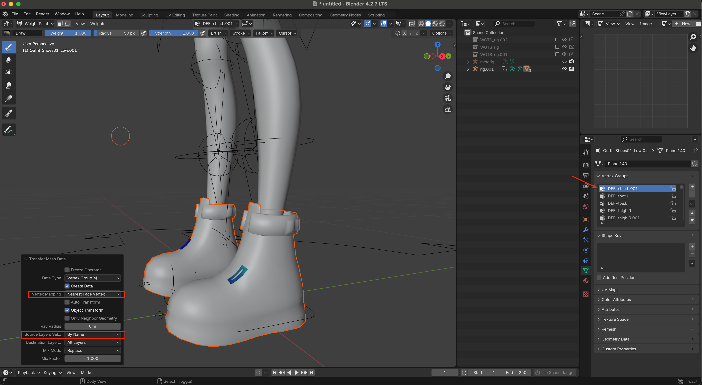

#### 经验之谈
实际建模中，尽量将相邻的、贴合在一起的高模`Mesh`拓扑为一个`Connected Mesh`的低模（例如：贴合鞋面的鞋带，所以只拓扑一个`Connected Mesh`来作为两者的“封套”。至于忽略掉的细节，可以由`Substance 3D Painter`烘焙高低模得到）。将哪些明显突兀的、离散的（例如：鞋带的蝴蝶结）拓扑为一个独立的`Loose Part Mesh`。可以参考的模型有：[绝区零-玲-鞋子]()

### 表情形态键的制作
---
#### 流程及注意事项
1. 在`Data`属性面板中，点击`Shape Keys`下的添加按钮（➕）为`Mesh`添加一个`Basis`默认形态键并将其<u>**锁定**</u>（注意：默认形态键十分重要且不可随意删除，用于存储未形变的默认网格）
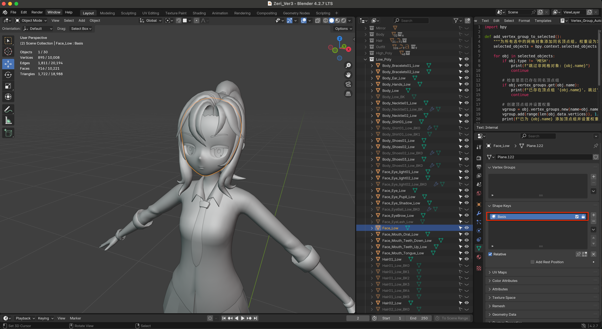
2. 点击添加按钮（➕）为`Mesh`添加一个`Shape Keys Index`用于新的表情形态键，设置为`Active`（即选中该`Index`），`value`值设置为`1`（否则在雕刻时无法同步观察到`Mesh`形变）
3. 对`Mesh`进行雕刻或形变（注意：形态键不支持隐藏或删除`Mesh`的顶点，可以通过将`Mesh`的顶点“塌缩”到同一位置，间接实现隐藏效果）

#### 经验之谈
镜像对称的形态键（例如：眨左眼`Blink_L`和眨右眼`Blink_R`）可以用过`New Shape From Mix`和`Mirror Shape Key`来减少工作量
1. 设置`Blink_L » Value = 1`[✔]，
2. `Shape Keys Special » New Shape From Mix`[✔]：根据当前`Active`的形态键及其`Value`值创建一个新的形态键（`Blink_R`）
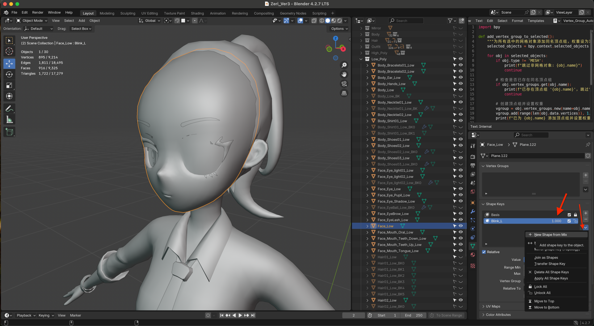
3. 重置`Blink_L » Value = 0`[✔] 
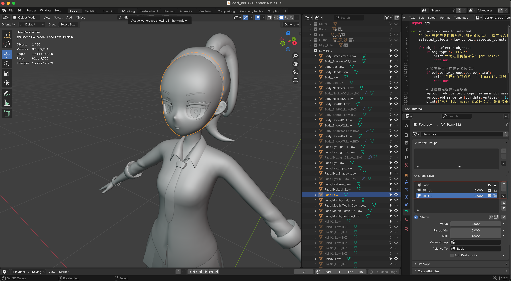
4. 将`Blink_R`设置为`Active`（即选中该`Index`）
5. `Shape Keys Special » Mirror Shape Key`：镜像当前`Active`的形态键，得到真正的“眨右眼”形态键
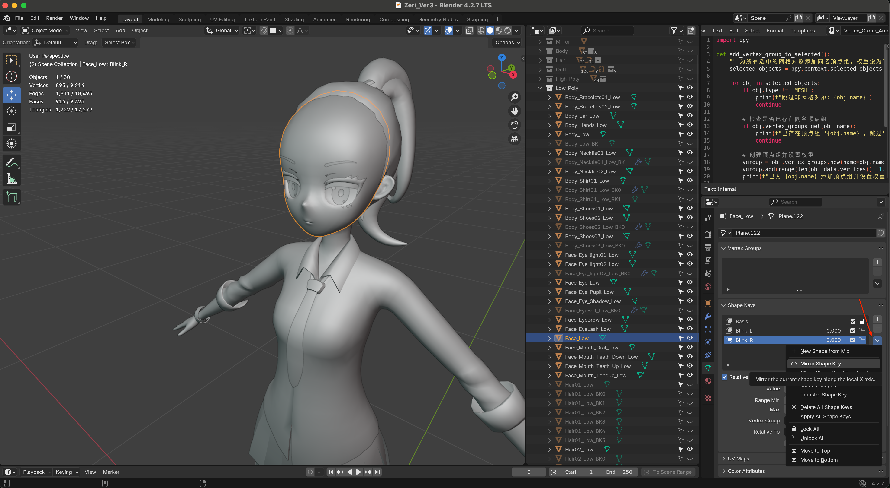

6. 根据上述方法，还可以快速创建“左右眼同时眨眼”的形态键（`Blink`）

#### 参考视频
* [かぐや様は告らせたい 白銀圭 3Dモデリング](https://www.youtube.com/watch?v=ycVqiR2p8mc&t=3869s)

### 动画重定向
---
#### 问题描述
对于动画菜鸟，<u>**重定向**</u>免费或付费的动画可大大降低学习和开发成本

#### 问题解决
使用`Expy Kit`插件来重定向`Mixamo`动画到`Rigify`骨架
1. 下载`Mixamo`动画
   - `Format » FBX Binary(.fbx)`[✔]
   - `Skin » With Skin`[✔]
   - `Frames per second » 30`[✔]
   - `Keyframe Reduction » None`[✔]<br>
   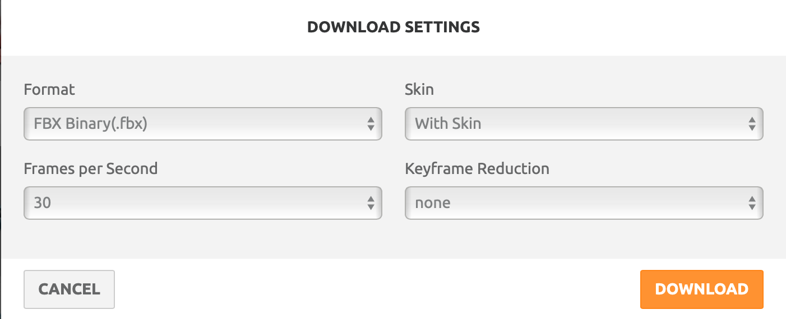<br>
2. 导入`Mixamo`动画,并检查角色的`Rest Pose`是`T Pose`还是`A Pose`
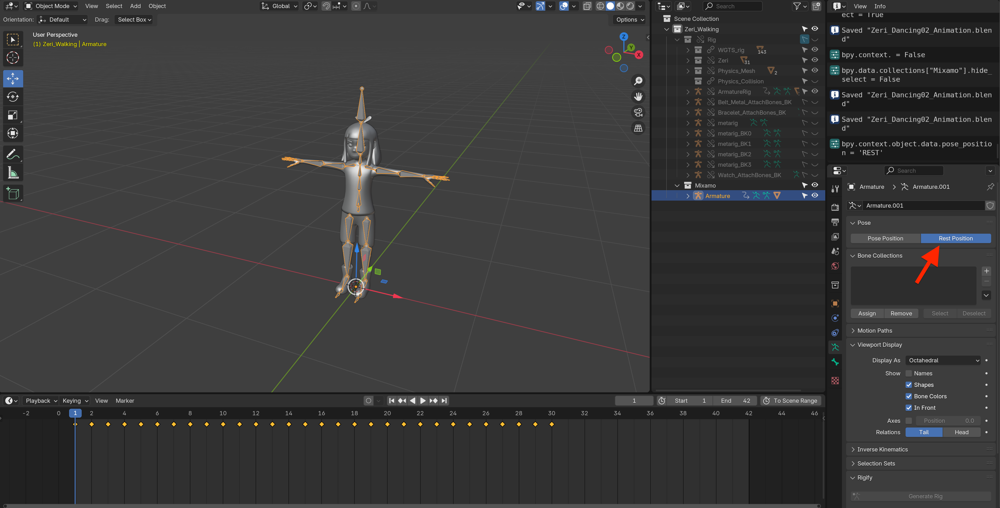
3. 调整`Rig`骨架的`Current Pose`为`T Pose`(目的是确保重定向双方的起始姿势是相同的，避免重定向之后骨骼错误旋转。`Rig`骨架的`Rest Pose`依旧保持`A Pose`)
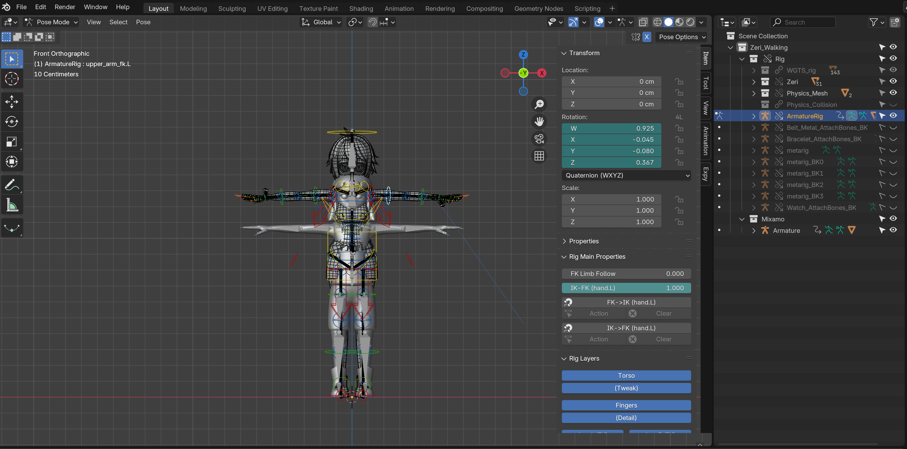
4. `Rig`骨架切换到<u>**[姿态模式]**</u>，设置重定向的“目标”和“源”
   - `Expy Kit » Bind To » Armature("目标")`[✔]
   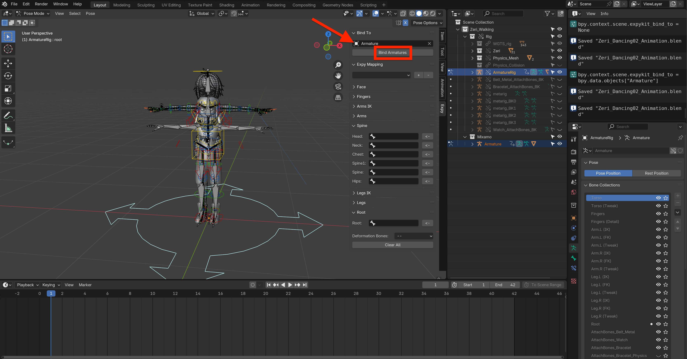
   - `Bind to Active Armature » To Bind » Rigfy_Controls`[✔]
   - `Bind to Active Armature » Bind To » Mixamo`[✔]
   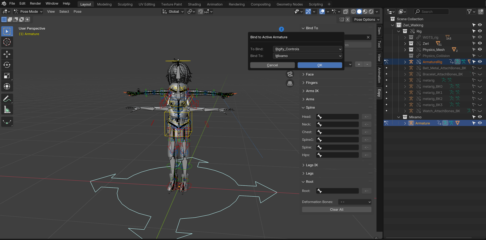
   - 点击`OK`
5. 设置`Bind to Active Armature`面板中的参数
   - `Conversion » Current Pose is target Rest Pose`[✔]
   - `Fit Height » Head`[✔]
   - `Root Animation » Bone`[✔]
   - `Root Animation » mixamorig:Hips`[✔]
   - `Location » Y`[✔]，`Location » X`[❌]，`Location » Z`[❌]：`Root`重定向自`mixamorig:Hips`的`Y`轴，这在大多数情况下可确保`Root Motion`是正确的
   - `Layer » "Retarget Bones"`[✔]：由`Expy Kit`插件为重定向功能生成的骨骼后缀名为`"_RET"`的`Bone Collection`（位于`Mixamo`骨架），可通过调整`"_RET"`骨骼的位置和旋转来修复重定向结果，得到最终动画
   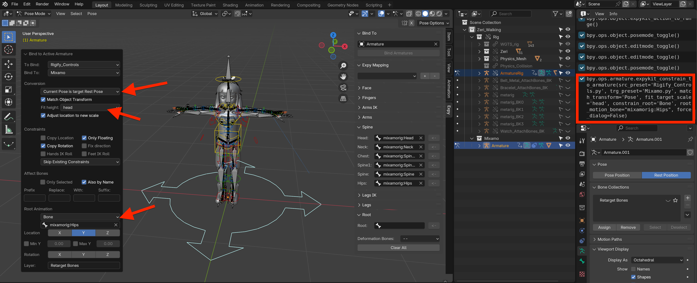
6. 确认无误后，`Mixamo » Pose » Pose Position`[✔]（将`Mixamo`骨架切换回`Current Pose`，播放时间轴即可预览重定向结果）
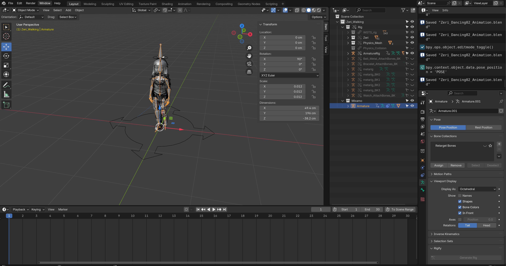
7. 逐帧检查重定向动画是否正确合理，若动画有明显瑕疵，可调整`Mixamo`骨架的`Retarget Bones`集合中的`"_REF"`骨骼🦴来修复（为了方便观察，仅显示`Retarget Bones`集合中的骨骼以及模型，隐藏其他不必要的视窗元素）
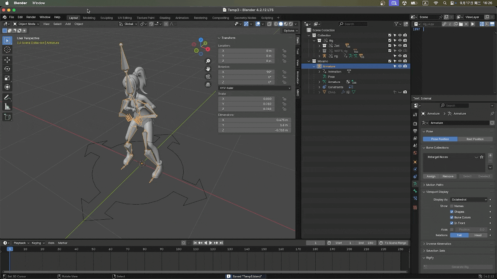
8. 确认无误后，`Rigify`骨架切换到<u>**[姿态模式]**</u>，`w`呼出上下文菜单，`Expy Kit » Animation » Bake Constrainted Actions`[✔]（烘焙动画）
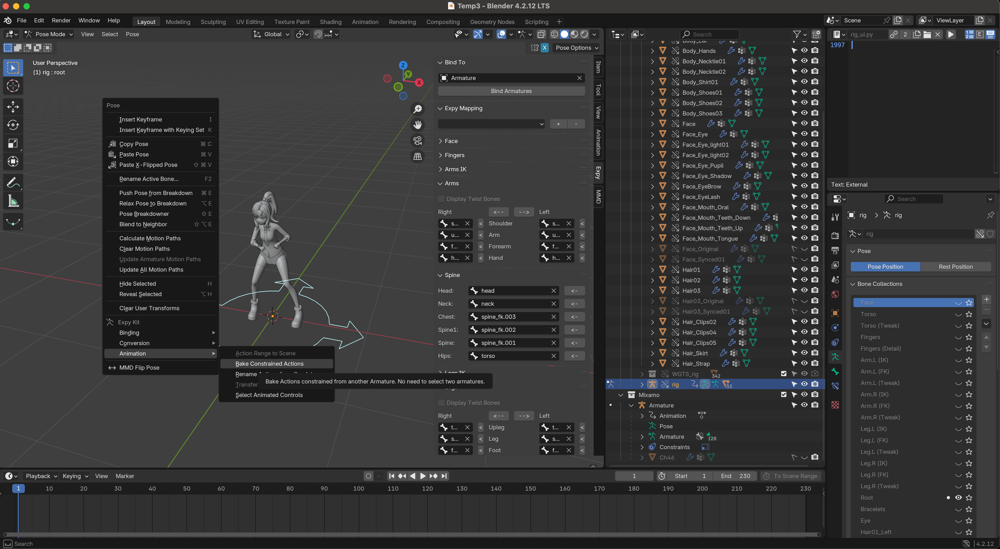
9. 设置`Bake Constrainted Actions`面板中的参数
   - `Baking from Armature to rig » Stash to NLA stack`[❌]
   - `Baking from Armature to rig » Bake and Exit`[✔]
10. 在`Dope Sheet » Action Editor`下查看烘焙得到的`Action`
11. 确认无误后，删除`Mixamo`资源

### 导出`FBX`模型和动画
---
#### 流程及注意事项
1. 选择需要导出的`Action`（对于游戏项目，一个动画文件有且仅有一个`Action`），将场景名称`Scene`更改为`Zeri_dancing01`(/`@Zeri_Walking01`/`@ZeriWalking01`，对应`Unity`中`Animation Clip`的名称，仅在<u>**[导出动画]**</u>时才需要此步骤)
2. `Include`面板：
   - `Limit To » Selected Objects`[✔]
   - `Object Types » Armature`[✔]
   - `Object Types » Mesh`[✔]<br>
   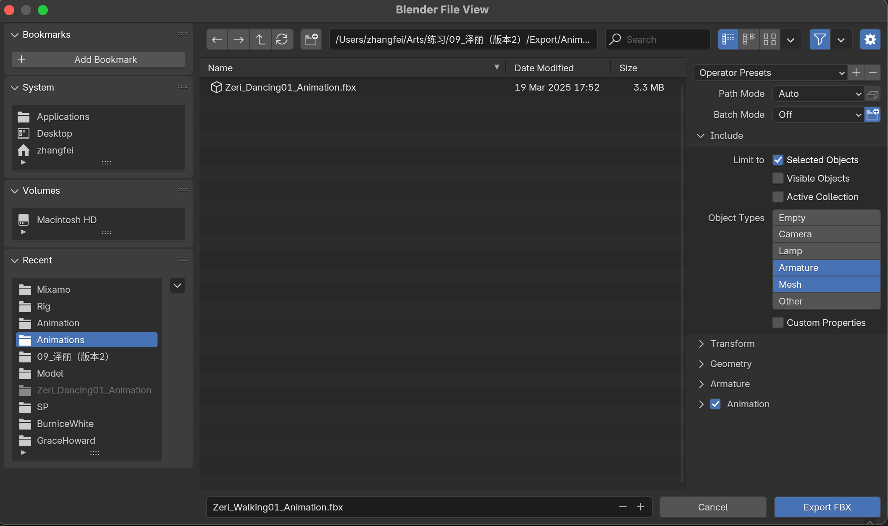<br>
3. `Transform`面板：
   - `Forward » -Y Forward`[✔]
   - `Up » Z Up`[✔]
   - `Apply Space Transform`[❌]<br>
   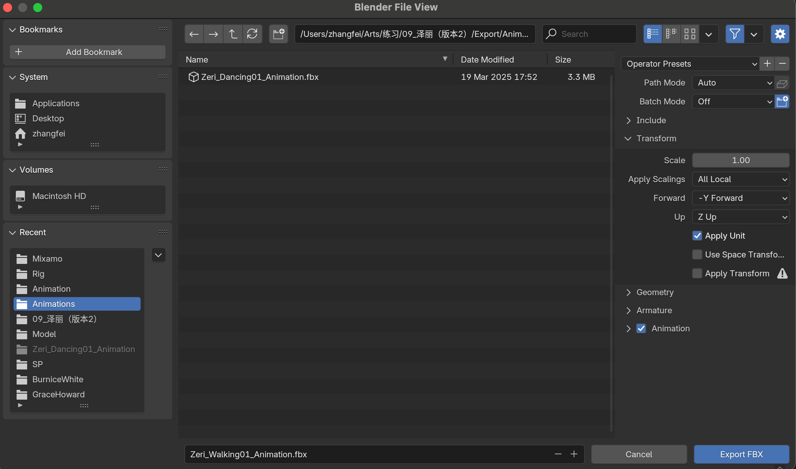<br>
4. `Geometry`面板（保持默认设置）
5. `Armature`面板：
   - `Only Deform Bones`[✔]
   - `Add Leaf Bones`[❌]
   - 其余保持默认设置<br>
   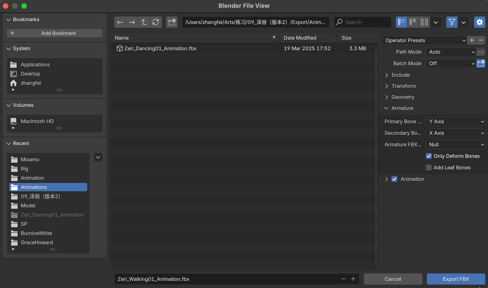<br>
6. `Animation`面板（仅在<u>**[导出动画]**</u>时才需要此设置）：
   - `Key All Bones`[❌]：不需要为所有骨骼在每一帧都生成关键帧
   - `NLA Strips`[❌]
   - `All Actions`[❌]：只导出当前选择的`Action`
   - `Force Start/End Keying`[✔]：在动画的起始帧和结束帧强制插入关键帧，即使这些帧处原本没有关键帧（例如：一段30帧的行走动画第1帧和第30帧）。如果动画需要在游戏引擎中循环播放（例如角色的`Idle`动画），勾选此项可以确保动画的平滑过渡<br>
   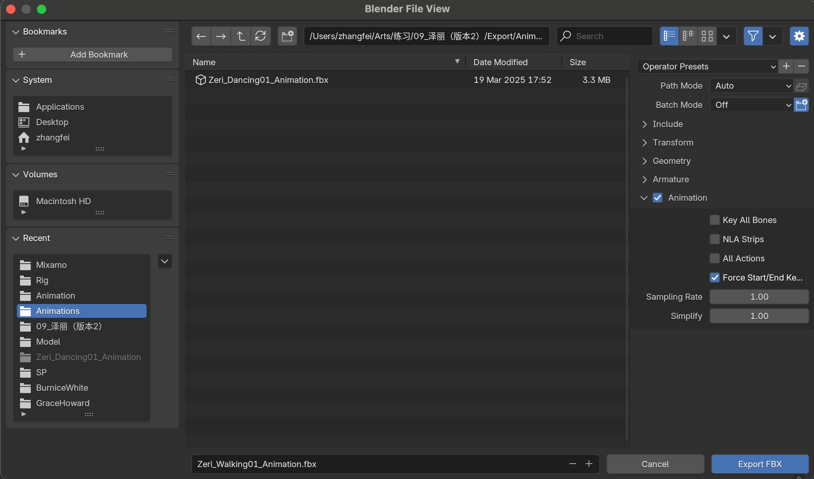<br>
7. TODO：如果游戏需要支持人物各部位换装，那么各部位装扮需要逐个和整个骨架一起导出

### `Unity`导入`FBX`模型和动画
---
#### 1. `Inspector » Model`面板
- `Bake Axis Conversion`[✔]
- `Import Visibility`[❌]
- `Import Camera`[❌]
- `Import Light`[❌]<br>
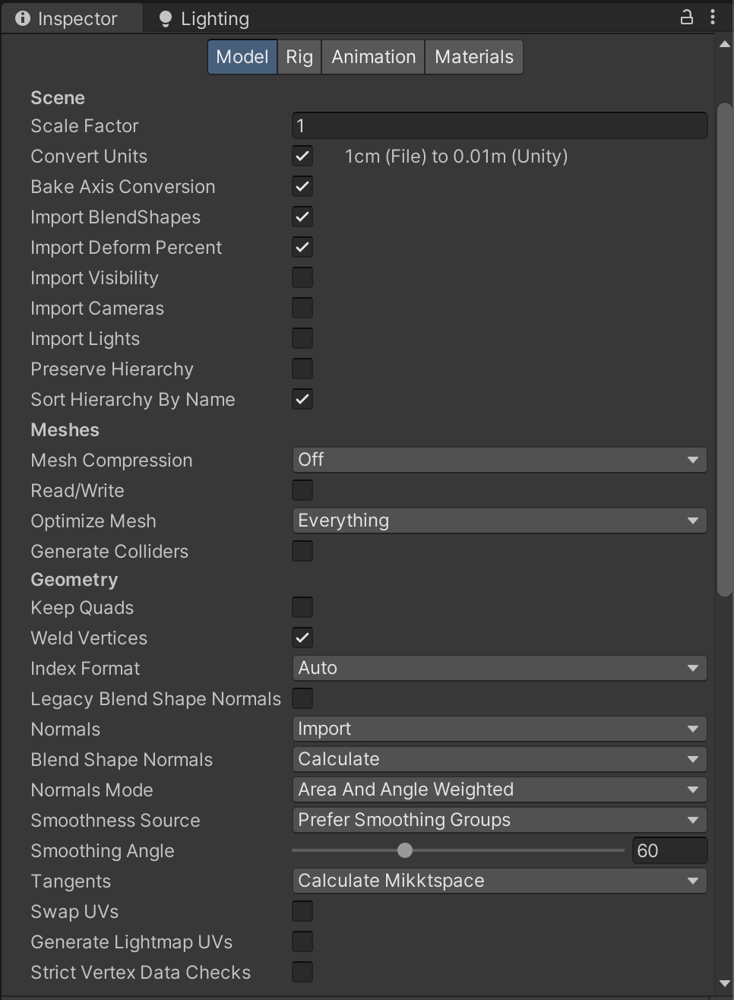<br>

#### 2. `Inspector » Rig`面板
* 导入`FBX`模型
  - `Animation Type » Generic`[✔]：_<u>为何不使用`Humanoid`类型</u>_？因为导入动画时会有`Lower Retargeting Quality`警告，我们也暂时不使用`Humanoid`的动画重定向功能，至于`Humanoid IK`功能也不是必须的，我们可以在`Generic`类型上自定义腿部的`IK`功能
  - `Avatar Definition » Create From This Model`[✔]
  - `Root Node » Armature/Root`[✔]<br>
  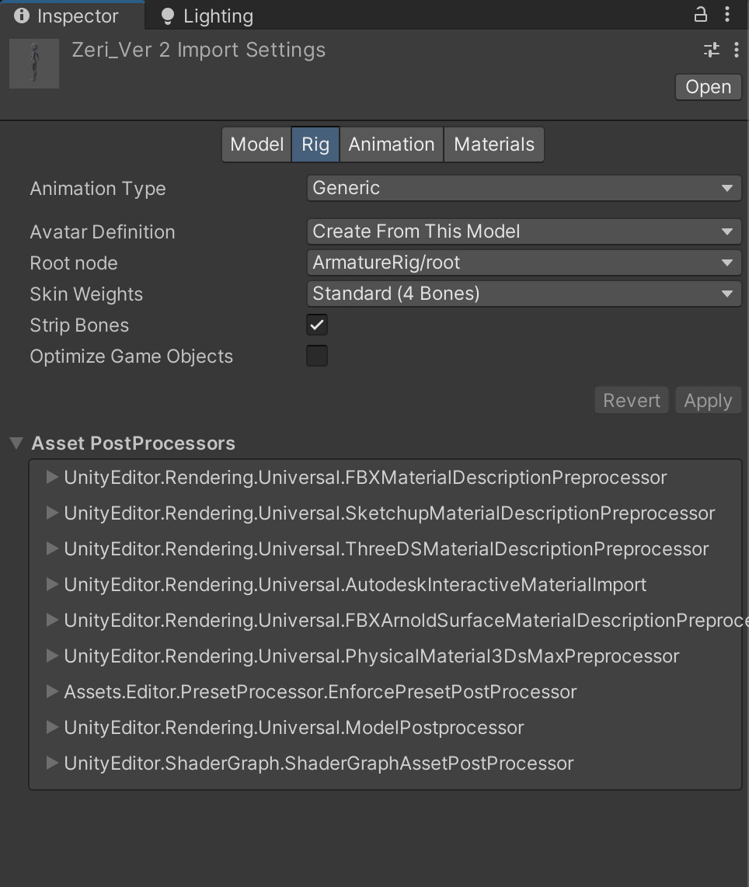<br>
* 导入`FBX`动画
  - `Animation Type » Generic`[✔]
  - `Avatar Definition » Copy From Other Avatar`[✔]
  - `Source » Zeri_Avatar`[✔]<br>
  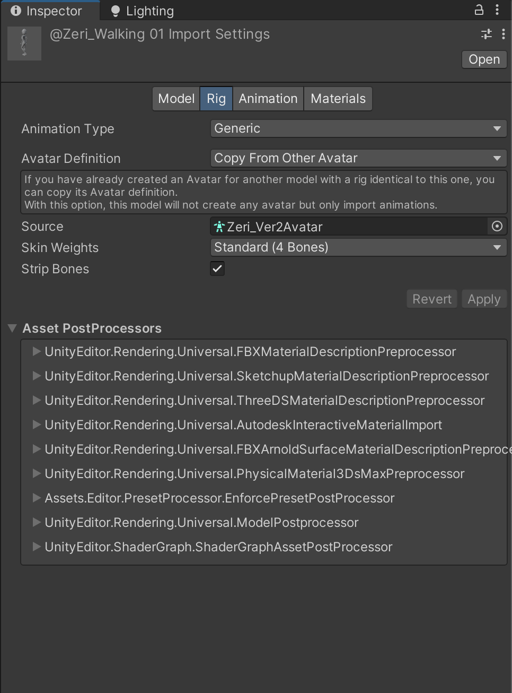<br>

#### 3. `Inspector » Animation`面板
- `Anim Compression » Optimal`：`Unity`会自动选择动画的压缩方式，同时保持较高的动画质量
- `Loop Time`[✔ or ❌]：需要循环播放的动画应该勾选（例如：角色的`Idle`、`Walking`等动画）
- `Loop Pose`[✔ or ❌]：取决于动画的起始帧和结束帧是否一致，当起始帧和结束帧不一致时（例如：角色的`Idle`动画，应该<u>**勾选**</u>以使动画循环平滑过渡）
- `Root Transform Rotation`[✔ or ❌]：参考：[Root Motion Explained (Unity Tutorial)](https://www.youtube.com/watch?v=Xl_5roq4UlI&list=WL&index=24)<br>
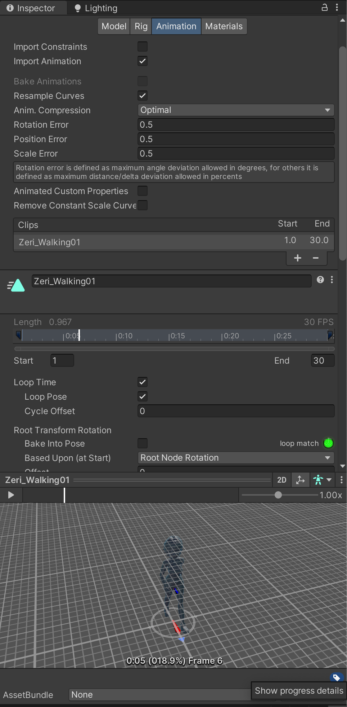<br>

#### 4. `Inspector » Material`面板
- `Material Creation Mode » None`[✔]<br>
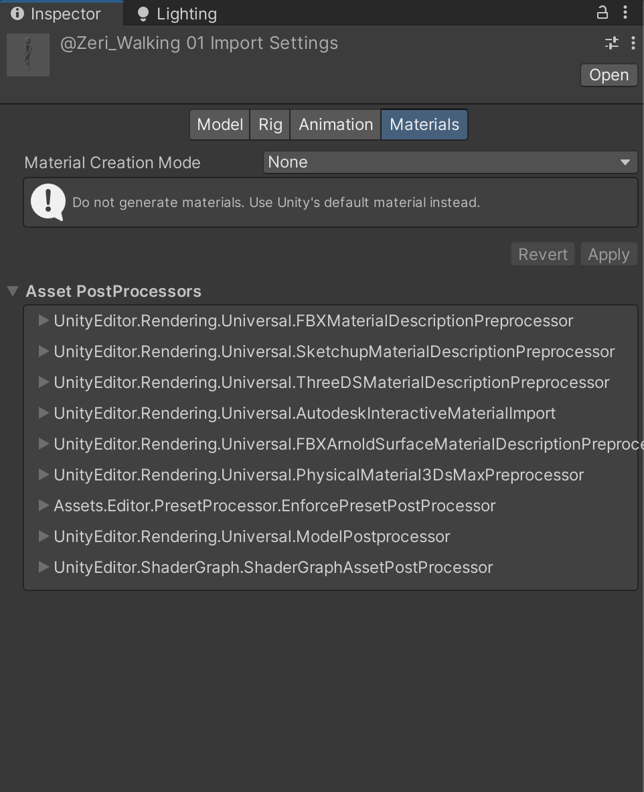<br>

#### `Unity`优化建议
* Optimize your geometry: don’t use any more triangles than necessary, and try to keep the number of UV mapping seams and hard edges (doubled-up vertices) as low as possible. For more information, see [Creating models for optimal performance](https://docs.unity3d.com/2022.3/Documentation/Manual/ModelingOptimizedCharacters.html).
* Use the Level Of Detail system.

### Rigify Game Friendly
---
#### 问题描述
尽管`Blender`导出`FBX`模型时已经勾选`Only Deform Bones`，但是导入游戏引擎之后，骨架中仍然包含控制骨（前缀为`MCH`），我们希望骨架只包含形变骨（前缀为`DEF`）<br>
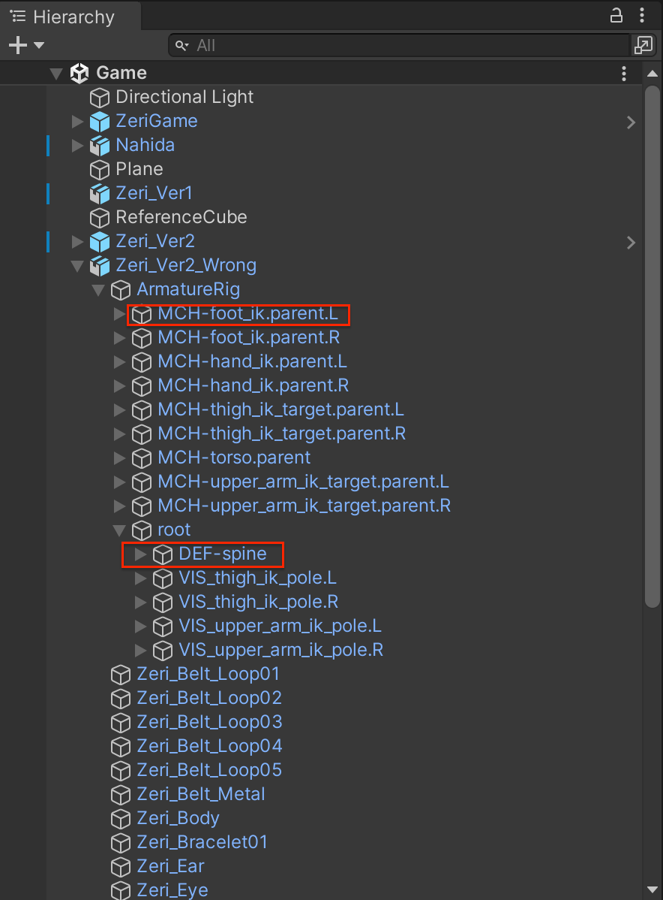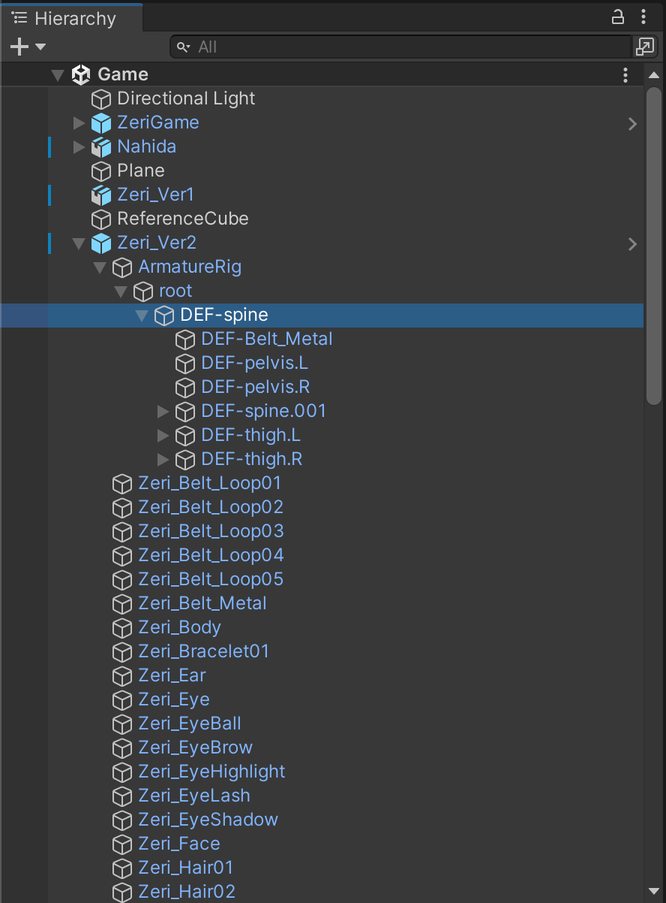<br>

#### 问题解决
在导出`FBX`模型之前，借助`Expy Kit`插件的`Rigify Game Friendly`功能转换骨架。
1. `Rigify`骨架切换到<u>**[姿态模式]**</u>，`w`呼出上下文菜单
2. `Expy Kit » Conversion » Rigify Game Friendly`[✔]<br>
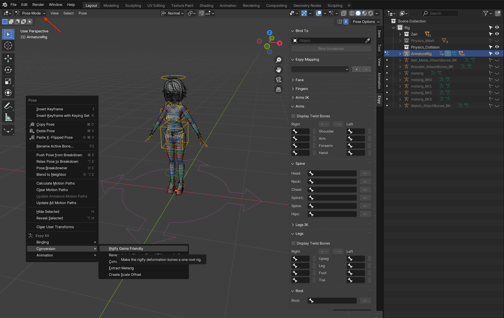

#### 工作流整合
若源骨架`metarig`返工迭代（例如：增加了用于头发物理模拟的骨骼），并通过`Re-Generate Rig`重新生成了`Rig`骨架，可以再次使用`Rigify Game Friendly`转换骨骼（<u>**[风险⚠️]**</u>：骨架变动，可能导致`Rigify Game Friendly`转换得到的新骨架与旧骨架不再相同，进而导致`Link`原(旧)骨架的所有动画文件丢失动画数据，动画出现异常。为了避免这种情况，应该在制作任何动画之前，完成所有骨骼的添加工作，包括：头发、飘带、小物件等，并且<u>**锁定骨骼**</u>不被修改。如果不幸还是遇到这种情况，首先备份相关文件，然后尝试在动画文件中重新关联新骨架）

### 关联文件丢失
---
#### 问题描述
1. 引用丢失：`.blend`文件中的资源文件（例如：`Texture`等）更换了文件路径之后，`.blend`文件会丢失引用
2. 链接丢失：`.blend`文件<u>**或**</u>其`Link`文件更换了文件路径之后，`.blend`文件会提示：`1 libraries and 318 linked data-blocks are missing(...)`
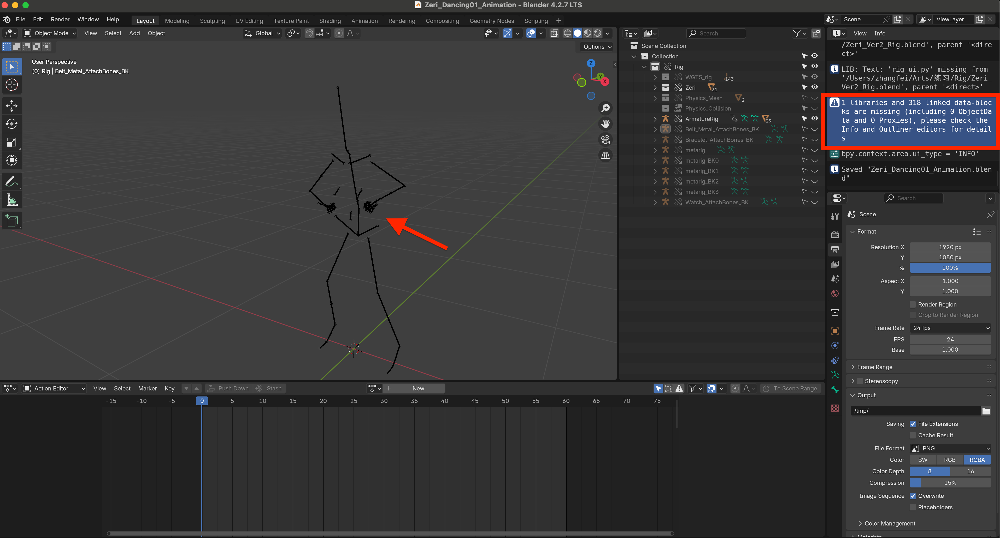

#### 问题解决
1. 对于“引用丢失”，可以选择将资源打包进`.blend`文件：`File » External Data » Pack Resources`[✔]，这样即使资源路径变动，也不会影响`.blend`文件
2. 对于“链接丢失”，可以使用`Outliner » Blender File » Libraries » RMB(鼠标右键) » Relocate`[✔]，为丢失链接的`Library`重新链接
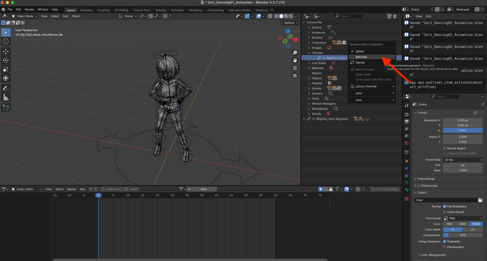

### 物理刚体参数
---
#### mass
`mass`（质量）表示刚体的惯性大小，即它对加速度的抵抗能力
- 加速度响应：施加相同力时，质量越大加速度越小
- 碰撞反应：大质量物体在碰撞时会“推开”小质量物体，而自身几乎不受影（动量守恒）
- 重力效果：质量不会影响下落速度（自由落体加速度恒定），但会影响碰撞击力
- 惯性张量：大质量物体的旋转惯性也更大，转动更难
- `default=1`是一个方便的中性值，用`1`作为基准，其他物体的质量相对它调节

#### friction
`friction`控制的是物体表面与接触面之间的阻力，会影响它在接触面上的动程度
- 数值越高 → 更“粘”，滑动时阻力更大，物体更快停下来
- 数值越低 → 更“滑”，物体更容易在表面滑动很远
- `0`表示完全无摩擦（冰面效果），理论上会无限滑动

混合摩擦公式（`Bullet`默认）：
`friction_total = sqrt(friction_A × friction_B)`，这意味着：
- 两个物体中任意一个摩擦力低，最终摩擦也会低
- 两个物体都高摩擦时，最终摩擦才会大

实际模拟感觉：
- `0.0`：冰面，几乎无限滑动
- `0.2`：很滑的地板，缓慢停下
- `0.5`：普通木地板/桌面摩擦感
- `0.8`：橡胶接触，几乎不滑动
- `>1.0`：极端高摩擦，除非强推几乎不动

注意：
- 只在接触时生效：物体必须和别的表面接触才有摩擦力的计算
- 不是粘性：摩擦只是阻止滑动，不会让物体粘住
- 高摩擦并不意味着不能滑：如果外力足够大（比如强推），物体仍然会滑动

#### bounce
`bounce`控制的是刚体的弹性恢复系数，决定了物体在碰撞后反弹的程度
，它对应物理里的系数`e`（`Coefficient of Restitution`），定义为碰后速度与碰撞前速度的比值，只在法向方向（`normal direction`）生效，和摩擦不同，不影响沿接触面滑动，如果`bounce`很大而且`friction`很低，就会出现“超级弹球”效果
- `0` → 完全非弹性碰撞，碰到就停下（像橡皮泥砸地）
- `1` → 完全弹性碰撞，碰到后反弹回去，速度与高度几乎完全保留（理想化的力球）
- `0~1` → 部分弹性，碰撞时损失一部分能量

数值感受：
- `0.0`：完全不反弹，直接停下
- `0.2`：轻微弹跳
- `0.5`：弹跳一半高度
- `0.8`：弹跳高度接近原高度
- `1.0`：理论完美弹性，能无限弹（数值模拟中还是会有损耗）

#### linear_damping
物体在没有碰撞或外力时，会因为阻力（空气阻力、摩擦等模拟）而逐渐速，这个衰减速率就是由`linear_damping`决定的

直观感受：
- `0.0`：冰上滑行感，物体会一直滑动
- `0.04`（默认）：有轻微空气阻力，物体慢慢停下来
- `0.3`：明显阻力，几秒内就停
- `1.0`：基本立即停下

#### angular_damping
`angular_damping`是刚体物理里控制“旋转速度衰减”的参数，可以理解为旋转方向上的阻力。它和`linear_damping`类似，但作用于角速度而不是线速度。刚体在旋转时，物理引擎会根据`angular_damping`每帧减少它的角速（`rotation speed`）
- 值越大 → 旋转速度衰减越快 → 物体更快停下旋转
- 值为`0` → 无旋转阻力，物体会无限旋转（除非碰撞或摩擦）
- 值为`1` → 旋转速度几乎瞬间衰减到`0`

直观感受：
- `0.0`：旋转像陀螺，几乎不减速
- `0.1`（默认）：稍微阻力，慢慢停转
- `0.3`：旋转明显减速，几秒内停下
- `1.0`：旋转瞬间停下