# blender偏好设置
* 视图切换-自动深度(避免缩放视图很慢):
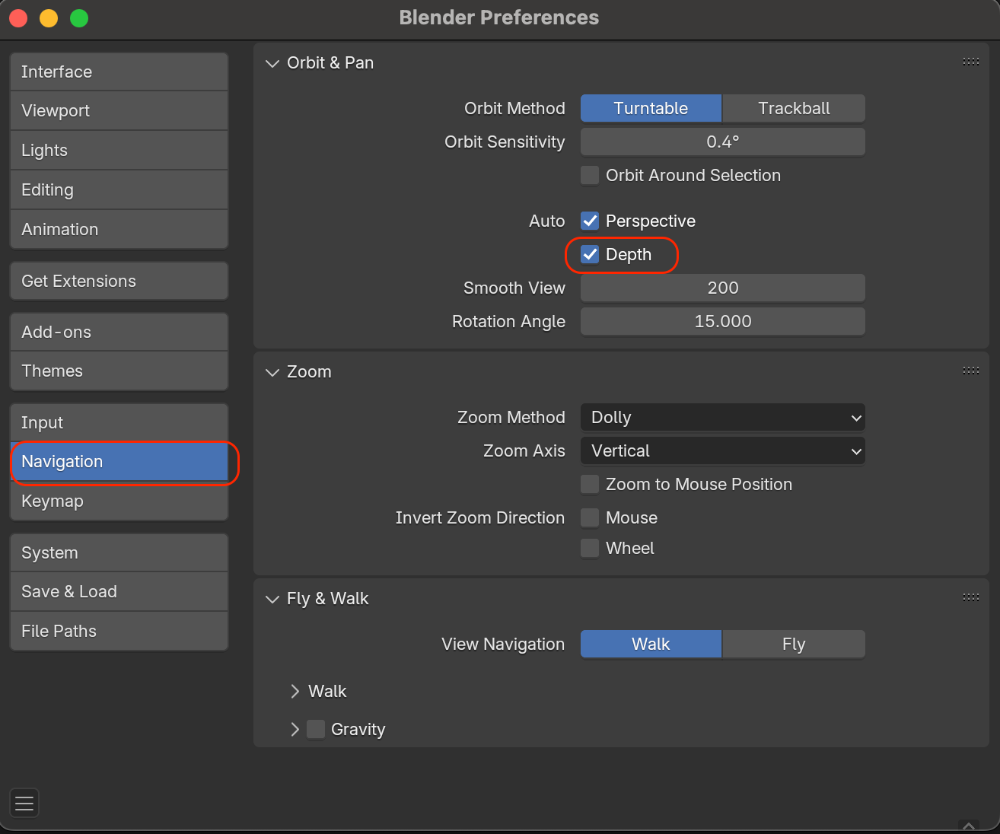
* 右键选择:

* 空格键搜索:
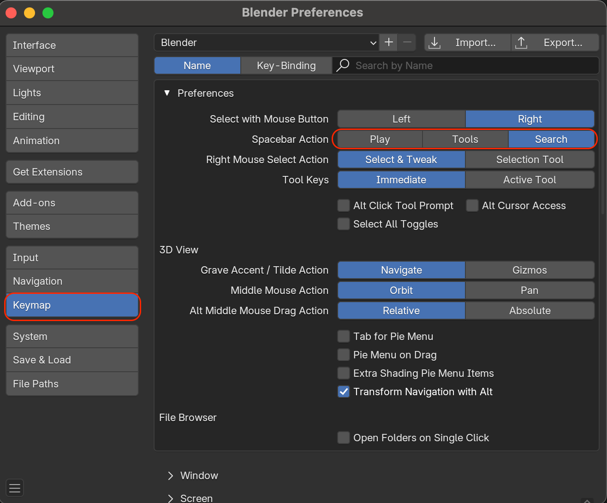
* 鼠标中键视图检视:
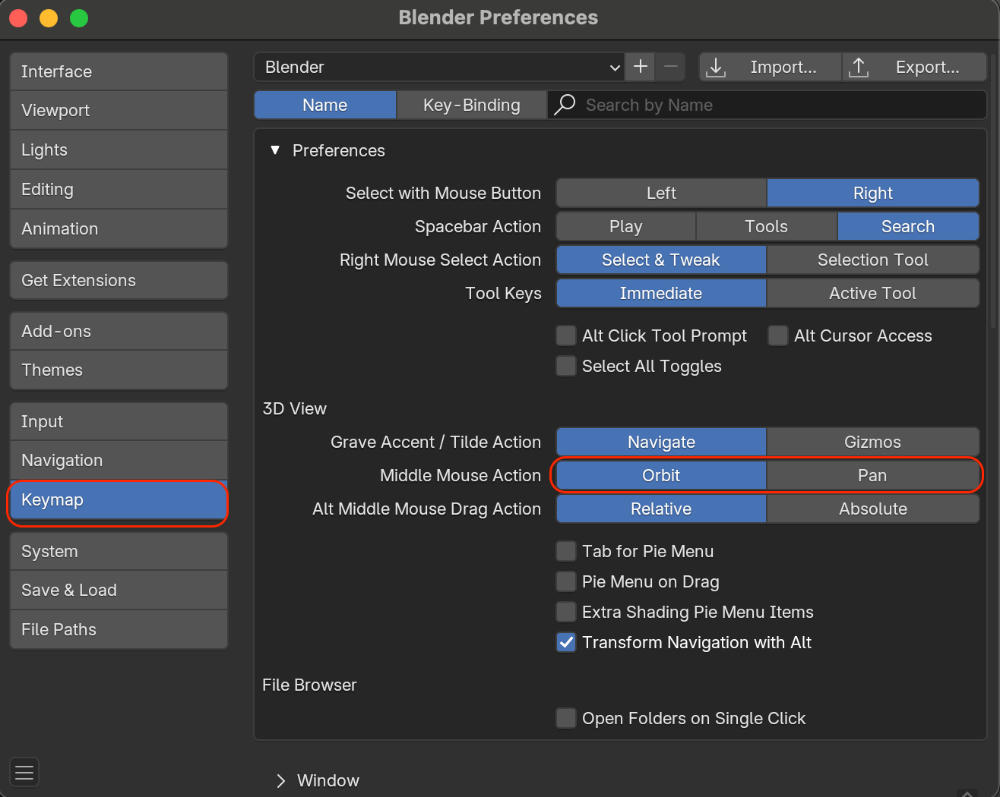

# blender资产库
* 创建blender资产库:
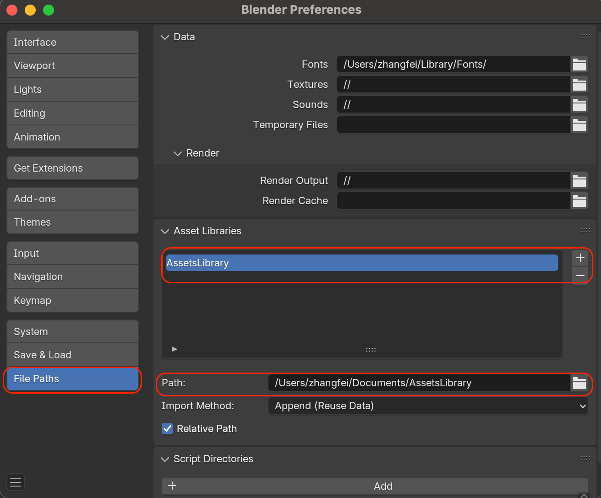

# blender快捷键

* `shift + 鼠标中键`:平移视角
* `shift + s`:游标吸附【菜单】
* `shift + c`:游标至世界原点

### 选择
* `a`:全选所有对象
* `control + 鼠标左键`:选择/取消选择(若选择对象非活动对象，则将对象置为活动对象)
* `[大纲视图] shift + 鼠标左键`:大纲视图内范围选择
* `[编辑模式(边)] select -> select loops -> select loop Inner-region`:选择循环边内部(建议加入Quick菜单)
* `shift + 右键`:选择多个对象
* `shift + cmd + 右键`:取消选择某个对象

### 对象
* `shift + a`:添加对象【菜单】
* `shift + d`:复制对象
* `x -> delete`:删除对象
* `/`:聚焦选中对象/取消聚焦
* `cmd + j`:合并多个对象
* `w`:上下文菜单
* `shift + z`:切换到线框模式
* `h`:隐藏(物体/点/线/面)
* `option + h`:恢复所有隐藏(物体/点/线/面)
* `control + l -> material`:连接(复用)材质

### 变换
* `g`:移动
* `g + x`:x轴移动
* `g + y`:y轴(world)移动
* `g + y + y`:y轴(local)移动
* `g + z`:z轴移动
* `g + shift + y`:沿着xz平面移动
* `[物体模式] option + g`:重置位置
* `s`:缩放
* `s + x`:x轴缩放
* `s + y`:y轴缩放
* `s + z`:z轴缩放
* `option + s`:重置缩放
* `[编辑模式] option + s`:沿法线方向缩放
* `r`:旋转
* `r + x`:x轴旋转
* `r + y`:y轴旋转
* `r + z`:z轴旋转
* `option + r`:重置旋转
* `cmd + a -> 全部变换`:应用所有变换

### 编辑(点/线/面)
* `TAB`:进入编辑模式
* `1`:点选择模式(非数字键盘)
* `2`:边选择模式
* `3`:面选择模式
* `e`:挤出(点/线/面)
* `e + x`:沿x轴方向挤出
* `e + y`:沿y轴方向挤出
* `e + z`:沿z轴方向挤出
* `option + e -> 沿法线方向挤出`:多个面分别沿其法线方向挤出
* `control + 鼠标左键`:挤出到鼠标位置(点/线/面)
* `control + r`:环切
* `control + r + 滚轮Up`:环切并增加切割次数
* `control + r + 滚轮Down`:环切并减少切割次数
* `control + b`:倒角
* `control + b + 滚轮Up`:倒角并增加段数
* `control + b + 滚轮Down`:倒角并减少段数
* `option + 鼠标右键`:选择循环边
* `右键 + control(hold) + 右键`:起点至终点最佳路径(点/线/面)
* `control + i`:反选
* `[编辑模式(面)] c`:刷选
* `[编辑模式(面)] c + 滚轮Up`:刷选并增加刷子直径
* `[编辑模式(面)] c + 滚轮Down`:刷选并减少刷子直径
* `v`:断离(点/线)
* `control + l`:选择所有相邻元素
* `i`:内插面(面)
* `k`:小刀(自定义拓扑结构)
* `Search(空格键) -> 桥接循环边`:桥接两条循环边(需同一个对象)
* `cmd + e -> 桥接循环边`:桥接两条循环边(需同一个对象, cmd + j可以合并对象)
* `g + g`:滑移边线(点/线/面)
* `m -> 到中心`:合并(点/线/面)
* `m -> 按距离`:合并(点/线/面)(可以用来去除重复点)
* `p -> 选中项`:分离(点/线/面)
* `Search(空格键) -> Grid Fill`:网格填充(边需是偶数)
* `cmd + f -> 栅格填充`:网格填充(边需是偶数)
* `f`:快速网格填充
* `shift + n`:重新计算法线方向
* `option + n -> 翻转`:翻转法线方向

### 骨骼
* `control + p -> 保持偏移量`:设置父子关系(骨骼)
* `option + p -> Clear Parent`:清除父子关系(骨骼)
* `control + l`:全选与当前骨骼相连的骨骼链
* `[姿态模式] Pose -> Constraints -> Copy Constraints to select bones`:拷贝活动骨骼的'Constraints'到选择的骨骼

### 动画
* `k -> location & rotation`:插入选中骨骼的关键帧
* `shift + space`:播放动画
* `shift + <-`:跳转到起始帧
* `shift + ->`:跳转到结束帧

### 曲线
* `[曲线编辑模式] e`:挤出新的曲线控制点（control point）
* `[曲线编辑模式] x`:删除曲线控制点（control point）
* `[曲线编辑模式] option + s`:缩放曲线控制点（control point）的半径（radius）
* `[曲线编辑模式] control + t`:缩放曲线控制点（control point）的倾斜角（tilt）

# blender实用技巧、注意事项、问题及解决方案
### UV同步
* 展UV时，在`UV Editing`操作界面下，打开`UV Sync Selection`选项

### UV与游戏表现和性能的相关性
* 展UV时，叠放UV布局(例如对称的左右手)可以充分利用Texture有限的空间，减少Texture数量有助于提升性能。但是会限制艺术表现(例如左右手可能会要求不同的贴花,则不适合叠放UV)。
* 展UV时，游戏中细节多、屏幕占比大的UV孤岛需要尽可能放大,相反被遮挡、细节少、屏幕占比小的UV孤岛需要尽可能缩小。

### 建模、绑定和动画分文件(多人协作开发)
* 将需要共享的对象整理到一个集合，使用`Link`关联文件；使用`Library Overide -> Make -> Select & Content`在关联文件的基础上作修改；使用`Library Overide -> Reset -> Select & Content`放弃修改或更新关联文件；对于关联文件无法支持的修改(例如权重绘制)，使用`ID Data -> Make Local`本地化(会取消关联)；另见:[鸽子老师的Blender教程 第一节](https://www.bilibili.com/video/BV1Md4y1g7qZ/?spm_id_from=333.1387.favlist.content.click)

### UV形变的镜像同步
* 问题描述:镜像对称的对象,更改某一边UV,希望另一边UV镜像同步
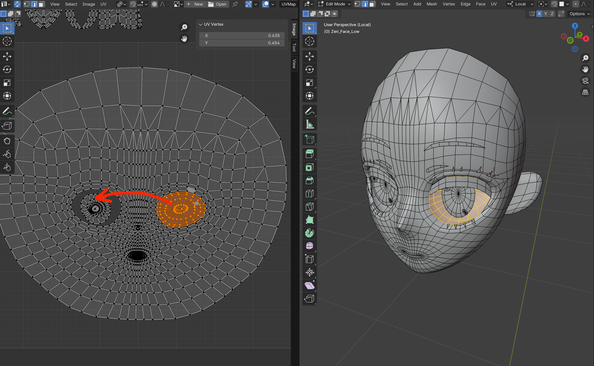
* 解决方案:删除另一边UV,并添加镜像修改器,勾选UV沿轴向对称,最后应用修改器
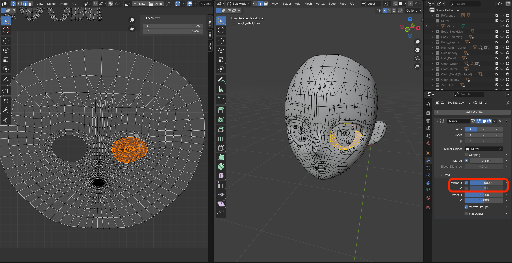

### UV打直
* 问题描述:UV弯曲占用较多Texture空间,打直以更好地布局
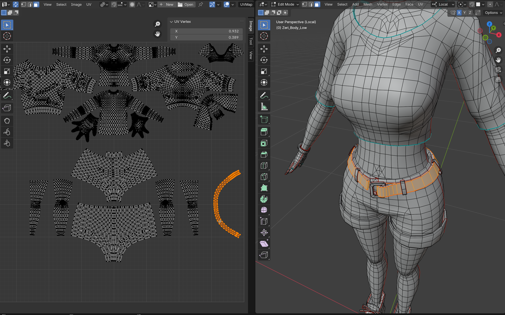
* 问题解决:安装插件[UVToolkit](https://github.com/oRazeD/UVToolkit),取消勾选`UV Sync Selection`,全选弯曲的UV孤岛,使用`Straighten UVs`打直UV
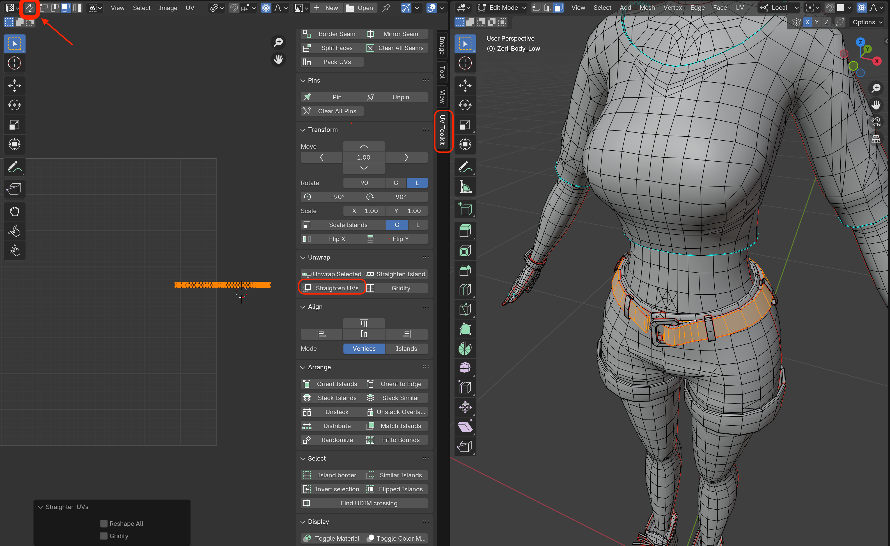

### 权重绘制
* 使用自动权重以减少工作量,然后在常用姿势和极限姿势下进行权重的修缮.
* 必须打开`options -> Auto Normalized`,使权重和为1。只使用三种笔刷:`Add`、`Subtract`和`Blur`。强度最好设置为0.1。
* 细节处权重绘制可以从`骨骼模式`切换到`点模式`,并且将视窗切换到`线框模式`以方便操作;例如:大腿和短裤在接缝处的两组点应该是重叠的,可以对相应点进行`Add`和`Subtract`以修缮权重。
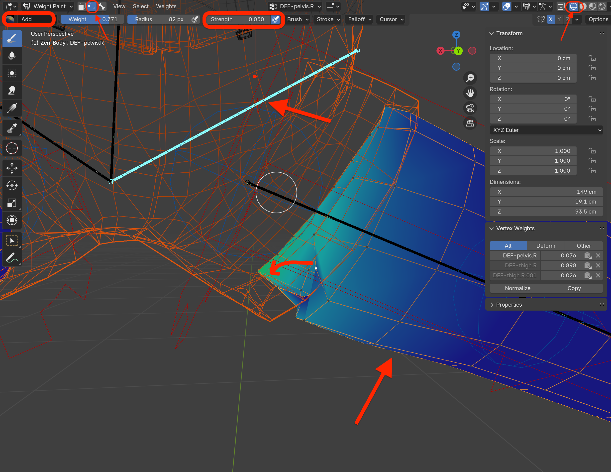

### 绑定和导出的矛盾
* 问题描述:绑定时为了方便,需要保持各个部分的分离；但是导出时，希望作为一个整体(交由后续的动画制作/游戏引擎的导入)，并且如果需求变动仍需要有能力分离为各个部分再次编辑。
* 问题解决:为每个部分添加材质(命名规则`****_Rig`),使用`control + j`合并各个部分为一个整体，执行分离操作时，选择按材质分离即可。注意:材质添加需要在建模文件中完成,然后同步到绑定文件。

### 骨骼的精确定位
* 使用`Shift + s -> Cursor to Selected`将游标定位到精确位置，进入骨架的`Edit Mode`，选择骨骼的`Head`或`Tail`,使用`Shift + s -> Selected To Cursor`将骨骼精确定位到游标位置。

### 在Rigfy上添加自定义骨骼
* 问题描述:人物模型上的许多小挂件(例如:手表、背包等),希望添加专属的额外骨骼与之绑定，而非将小挂件直接绑定到Rigfy人体骨骼上。
* 问题解决:
  1. `Shift + a`添加单个骨骼(属于新骨架),更改`Bone Collection`为`AttachBones_*****`格式。
  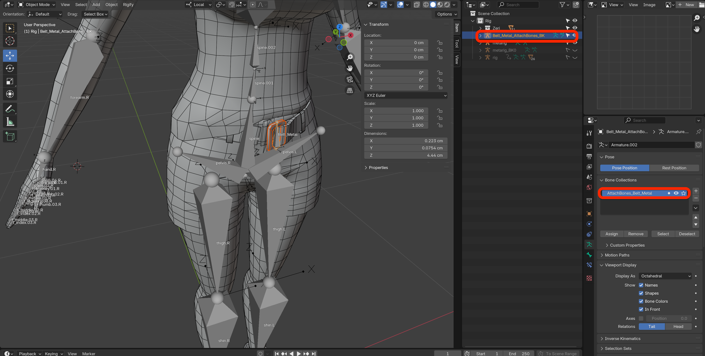
  2. 切换到`Pose Mode`更改相应骨骼的`Rigfy Type`为`basic.super_copy`,勾选`Control`表示会生成`CTRL-***`类型的Rigfy控制骨、通过`Widget`自定义骨骼的形状、勾选`Deform`表示会生成`DEF-***`Rigfy控制骨、`Relink Constraints`对于只有一根骨骼来说暂不需要设置。
  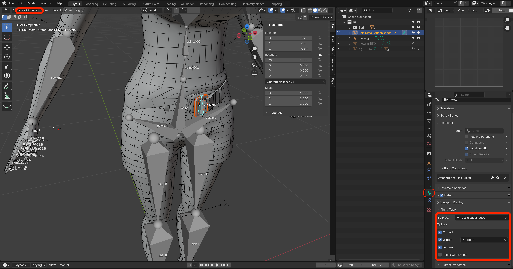
  3. 使用`control + j`合并新增骨架(只有一根骨骼)到Rigfy的原型骨架`metarig`(合并之前记得使骨架`Apply All Transform`),在`metarig`的`骨架`属性页签，设置新增`Bone Collection`的UI位置。
  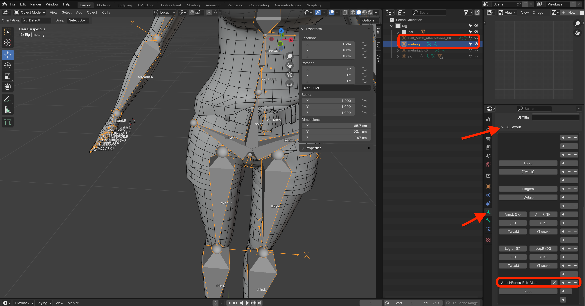
  4. 合并之后的`metarig`切换的`Edit Mode`设置新增骨骼与`Rigfy`原型骨架的骨骼之间的父子关系。
  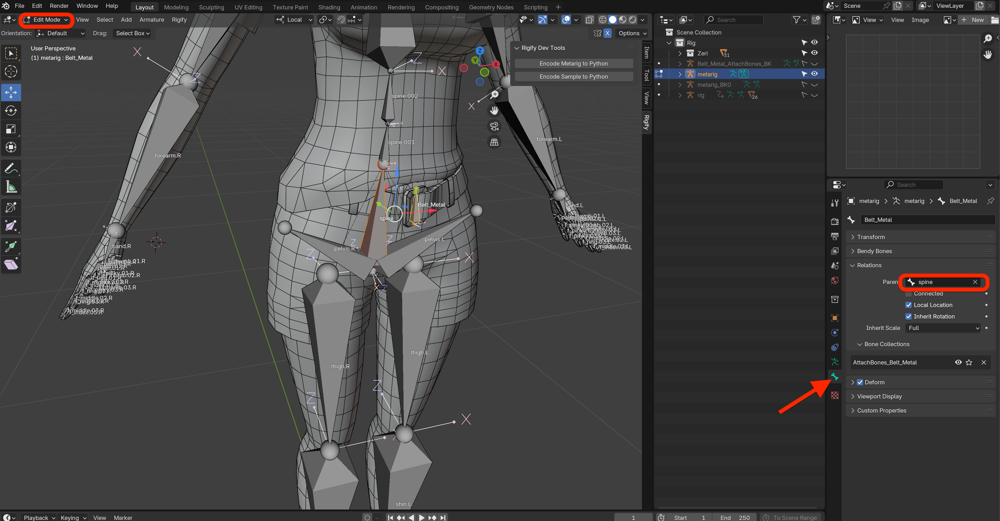
  5. 点击`Re-Generate Rig`重新生成Rigfy骨架`Rig`,依然会保留之前已经绘制好的权重。(重新生成Rig需要保证`Rig`不是隐藏且可选状态)
  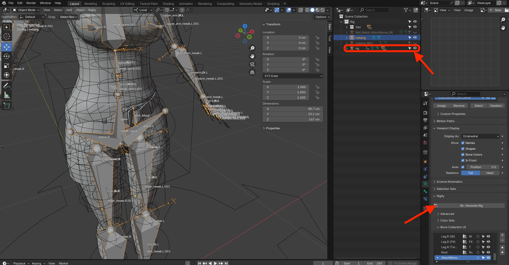
  6. 选择重新生成的`Rig`,切换到`Pose Mode`,检查UI和父子关系是否正确。
  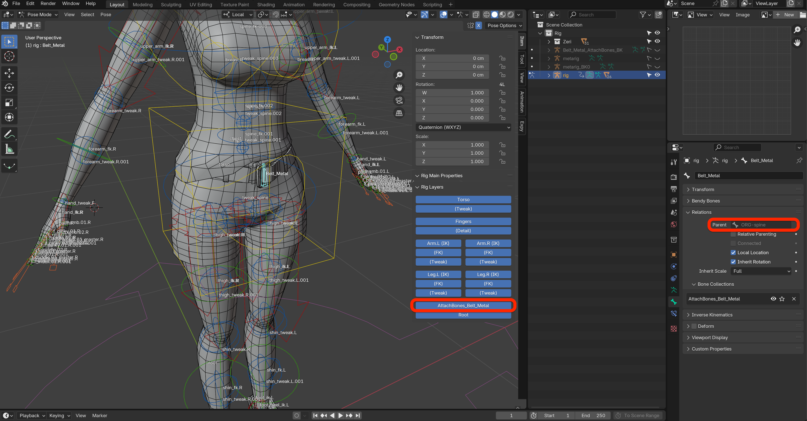
  7. 最后进行权重绘制。
  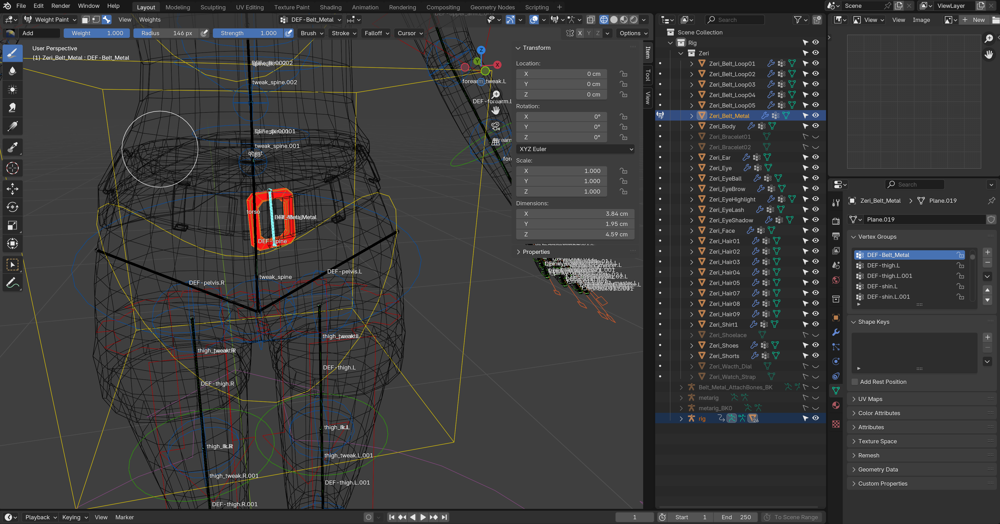
  8. 参考视频:[[Blender 4.0 RIGIFY] ＃6-1: Custom Rigs (theory)](https://www.youtube.com/watch?v=Cq2Vw6EFXy0)
  9. 关于更复杂的(比如:头发的物理模拟如何加入Rigfy骨架)，可参考视频:[blender进阶丨头发和衣服动画物理模拟结算](https://www.bilibili.com/video/BV16G4y1z7BD/?spm_id_from=333.1387.favlist.content.click&vd_source=b9589ad635db7dddd215259c55a8a09c)
  10. 过程中需要注意原始文件`***_AttachBones`和`Metarig`的备份

### 将Mixamo等网站的动画重定向到Rigfy骨架
* 问题描述:对于动画菜鸟的我，充分利用免费或付费的动画可大大降低学习和开发成本。
* 问题解决:使用`Expy Kit`插件来重定向Mixamo动画到Rigfy骨架
  * 下载Mixamo动画,`Format`选择`FBX Binary(.fbx)`,`Skin`选择`With Skin`,`Frames per second`选择`30`，`Keyframe Reduction`选择`None`。
  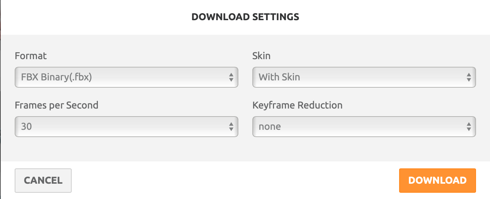
  * 导入Mixamo动画,并检查角色的`Rest Pose`是`T Pose`还是`A Pose`
  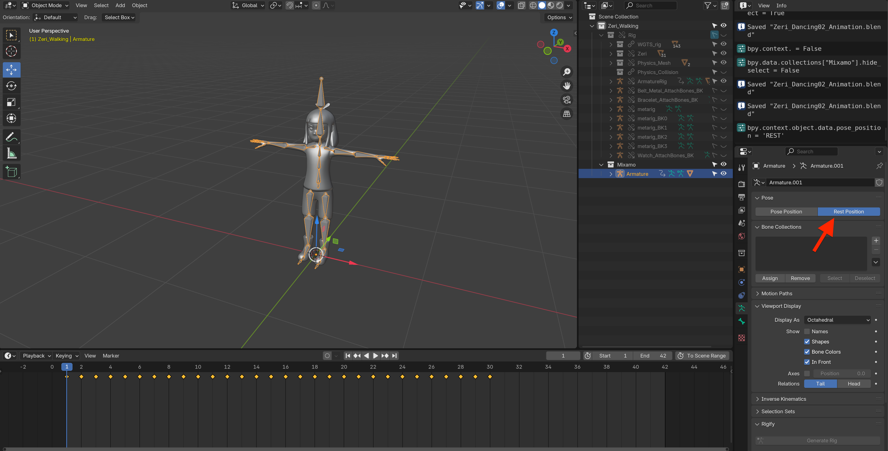
  * 调整关联的Rig对象的当前Pose(`Rest Pose`依旧保持`A Pose`,无需更改)为`T Pose`,此举可保证重定向的两方起始姿势相同，避免重定向过程中骨骼的不正确旋转。
  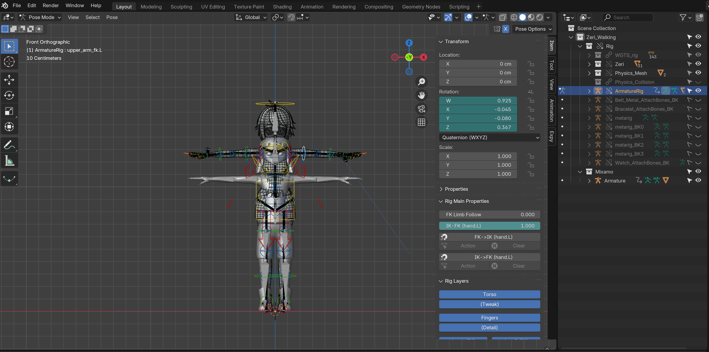
  * 选择需要制作动画的Rig骨架并切换到`Pose Mode`,打开`Expy Kit`面板，设置`Bind To`为导入的Mixamo动画骨骼`Armature`。
  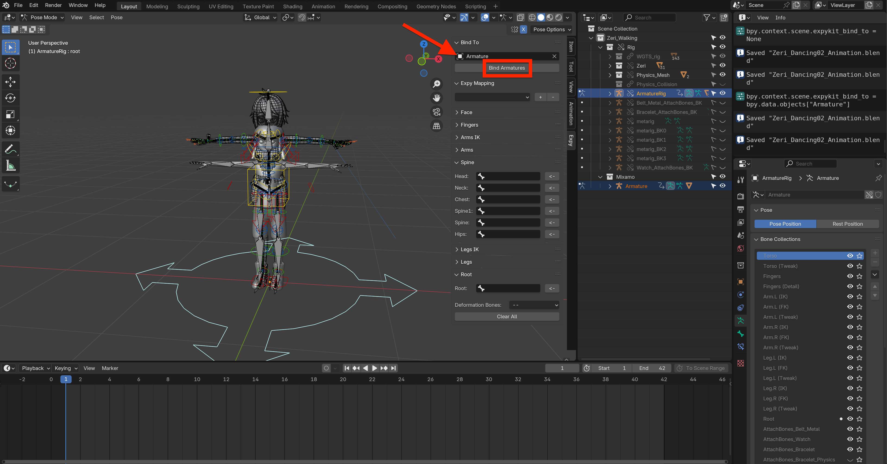
  * 点击`Bind Armature`,设置`To Bind`为`Rigfy_Controls`,设置`Bind To`为`Mixamo`,并点击`OK`
  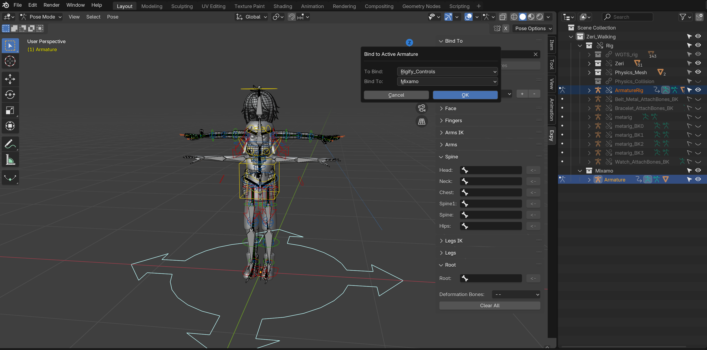
  * 在弹出的`Bind to Active Armature`中设置`Conversion`下拉菜单为`Current Pose is target Rest Pose`。设置`Fit Height`下拉菜单为`Head`。设置`Root Animation`下拉菜单为`Bone`,具体骨骼为`mixamorig:Hips`,只激活骨骼`Location`的`Y`轴（大多数动画的根运动是向前的,例如:走路动画的根运动在Blender中应当向`-Y`轴方向,故将`Root`绑定到`mixamorig:Hips`的Y轴位置可保证根运动重定向的正确）。
  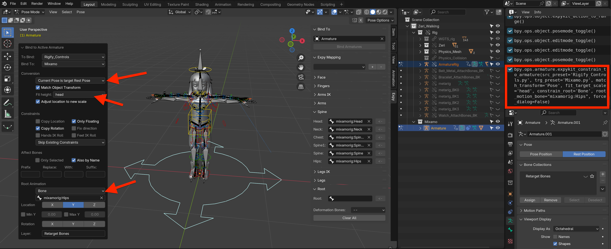
  * 完成重定向的绑定设置之后，将Mixamo动画的骨架切换回`Pose Position`并观察重定向的结果及检查根运动是否正确(`Shift + Space`可播放`Timeline`动画)
  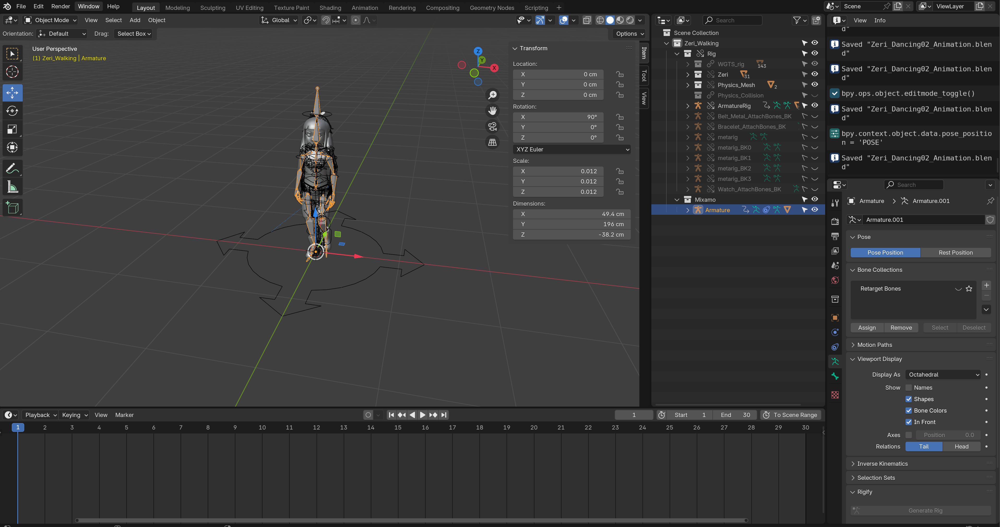
  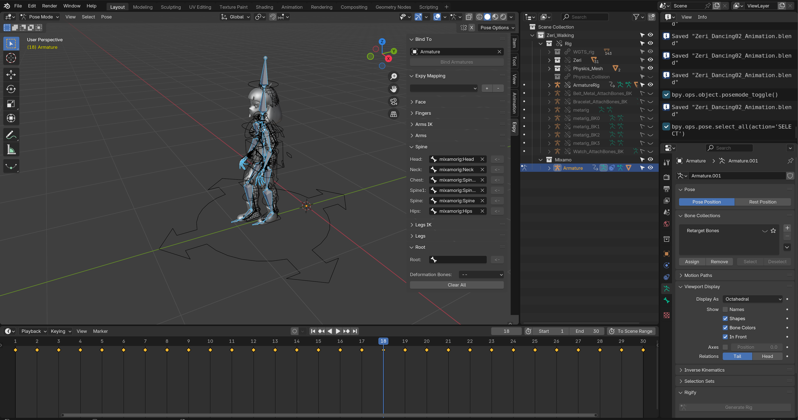
  * 逐帧检查动画重定向的结果是否正确合理，如重定向结果出现偏差，可通过在源骨架(即Mixamo动画的骨架)的`Retarget Bones`层（该层的所有骨骼均由插件为重定向功能自动生成且后缀名均带有`***_RET`），选择出错的骨骼,并调整该骨骼的位置、旋转等使动画重定向结果正确。(为方便观察,请隐藏不必要的视窗信息,仅保留`Retarget Bones`层骨骼和正在制作动画的Rig模型)
  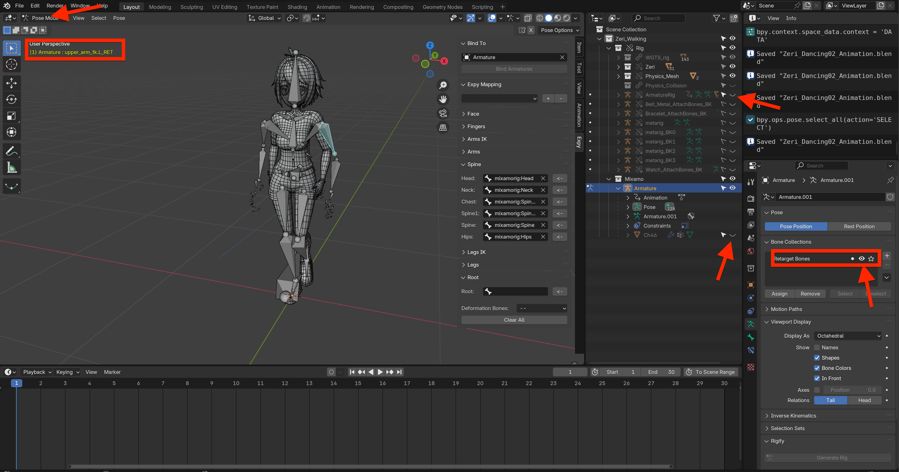
  * 重定向无误之后，选择制作动画的骨骼并切换`Pose Mode`,`w`呼出上下文菜单，在`Expy Kit`工具集中，使用`Animation -> Bake Constrainted Actions`烘焙动画(烘焙动画到形变骨)。
  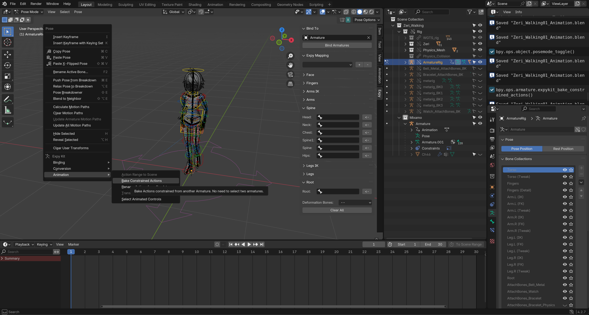
  * 在弹出的`Bake Constrainted Actions`面板中，取消勾选`Stash to NLA stack`,点击`Bake and Exit`完成动画烘焙。
  * 将`Timeline`视窗类型切换到`Dope Sheet`下的`Action Editor`查看相应的`Action`。
  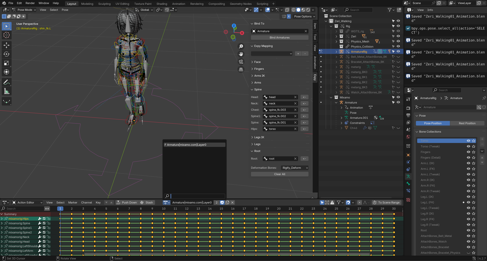

### 重定向得到的动画如何从230帧缩减为60帧
* 问题描述:使用`Expy Kit`重定向`Mixamo`动画到`Rigfy`骨骼后,由于`Mixamo`动画是动捕，有230帧，无法应用到游戏中；需要缩减帧数至少到60帧，甚至30帧(具体不同动作的总帧数有待商榷)。
* 问题解决：将视窗切换到`Text Editor`,输入Python脚本并执行，将当前的`Action`从230帧缩减为60帧。
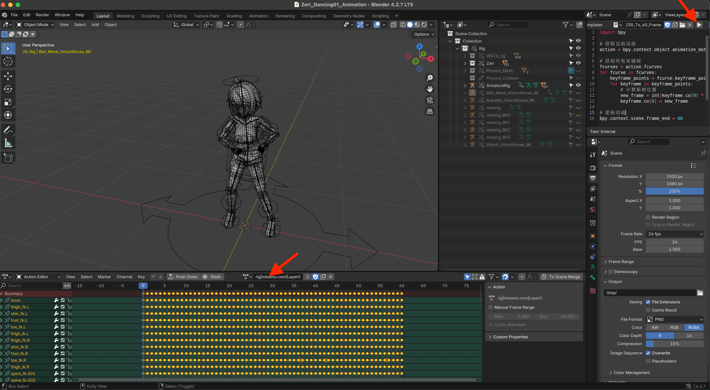
```
import bpy

# 获取当前动画
action = bpy.context.object.animation_data.action

# 获取所有关键帧
fcurves = action.fcurves
for fcurve in fcurves:
    keyframe_points = fcurve.keyframe_points
    for keyframe in keyframe_points:
        # 计算新帧位置
        new_frame = int(keyframe.co[0] * 60 / 230)
        keyframe.co[0] = new_frame

# 更新动画
bpy.context.scene.frame_end = 60
```

### 导出FBX模型文件到游戏引擎
* 另见下文 **导出FBX动画文件到游戏引擎**。不同点在于无需重命名场景，无需导出`Animation`。
* 注意：由于灵活Rig的需求,在权重绘制和动画制作过程中，需要保持各个部分的分离，另见上文 **绑定和导出的矛盾**。所以导出前，需要重新分配各部分的材质并且合并所有分离部分为一个整体(例如：只有一个Mesh，只包含Hair、Face、Body三个材质)。合并前使用`Save As`将当前文件备份(备份文件的命名规则:`****_BK`)。

### 导出FBX动画文件到游戏引擎
* 切换到当前需要导出的Action,并且更改场景名称(导出的FBX文件中，场景名称对应动画切片的名称，命名规则可以形如:`Zeri_Walking01`)
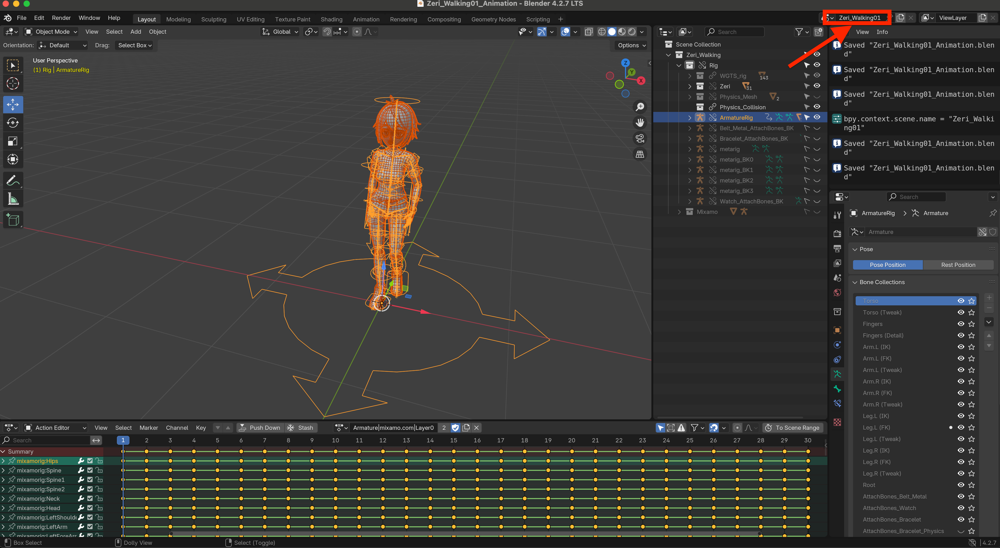
* 导出窗口:`Include`选项卡下，设置`Limit To`为`Selected Objects`、设置`Object Types`为`Armature` + `Mesh`;
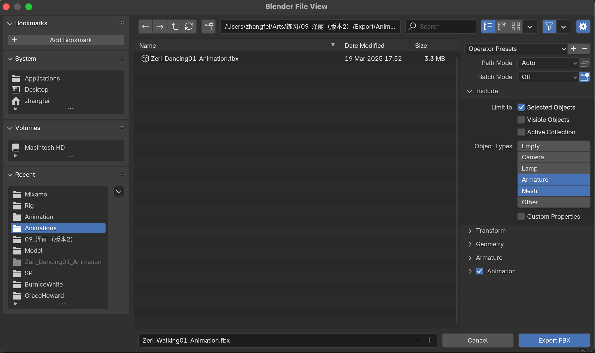
* 导出窗口:`Transform`选项卡下,设置`Forward`为`-Y Forward`,`Up`应该回自动更改为`Z Up`(如果没有，需手动更改)，取消勾选`Apply Space Transform`;
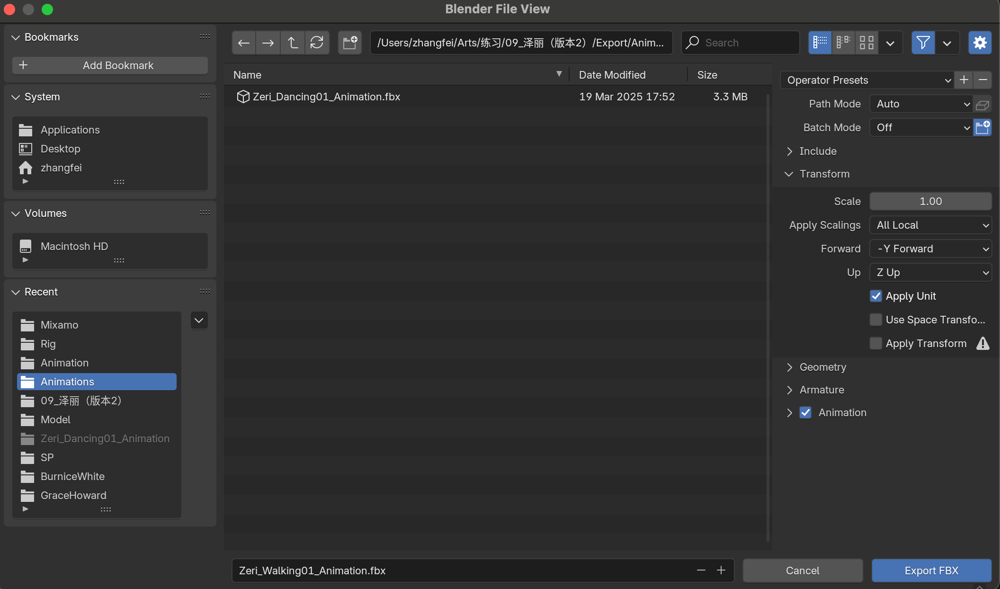
* 导出窗口:`Geometry`选项卡下，保持默认设置
* 导出窗口:`Armature`选项卡下，勾选`Only Deform Bones`,取消勾选`Add Leaf Bones`，其余保持默认设置。

* 导出窗口:`Animation`选项卡下,取消勾选`Key All Bones`（不需要为所有骨骼在每一帧都生成关键帧）,取消勾选`NLA Strips`,取消勾选`All Actions`（只导出当前Action，且由于工程分文件，一个文件只包含一个Action动画）,勾选`Force Start/End Keying`（在动画的起始帧和结束帧强制插入关键帧，即使这些帧原本没有关键帧，例如：一段30帧的行走动画第1帧和第30帧；如果动画需要在游戏引擎中循环播放，例如角色的`Idle`动画，勾选此项可以确保动画的平滑过渡）。
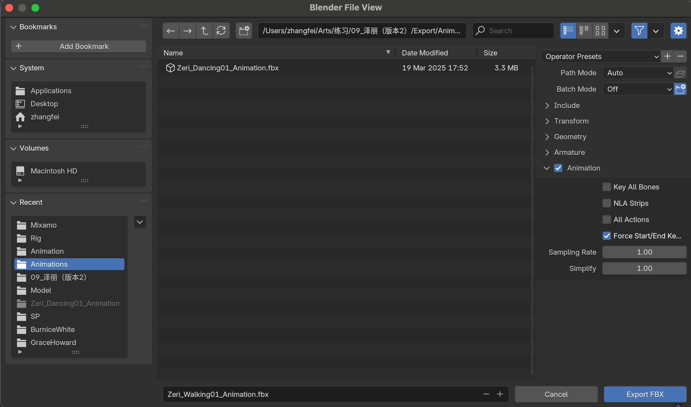
* 导出的FBX动画文件命名规则,可以形如:`@Zeri_Walking01`或`@ZeriWalking01`或`Zeri_Walking01_Animation`
* 如果游戏有换装功能，这里选择导出的骨骼和模型对象会有所不同(后补)

### Unity游戏引擎导入FBX模型文件
* 另见下文 **Unity游戏引擎导入FBX动画文件**，不同点在于导入模型FBX时，在`Rig`选项卡下，需要创建人物的`Avatar`:`Animation Type`下拉菜单选择`Generic`，`Avatar Definition`下拉菜单选择`Create From this Model`,`Root Node`下拉菜单选择根骨骼`Armature/Root`。
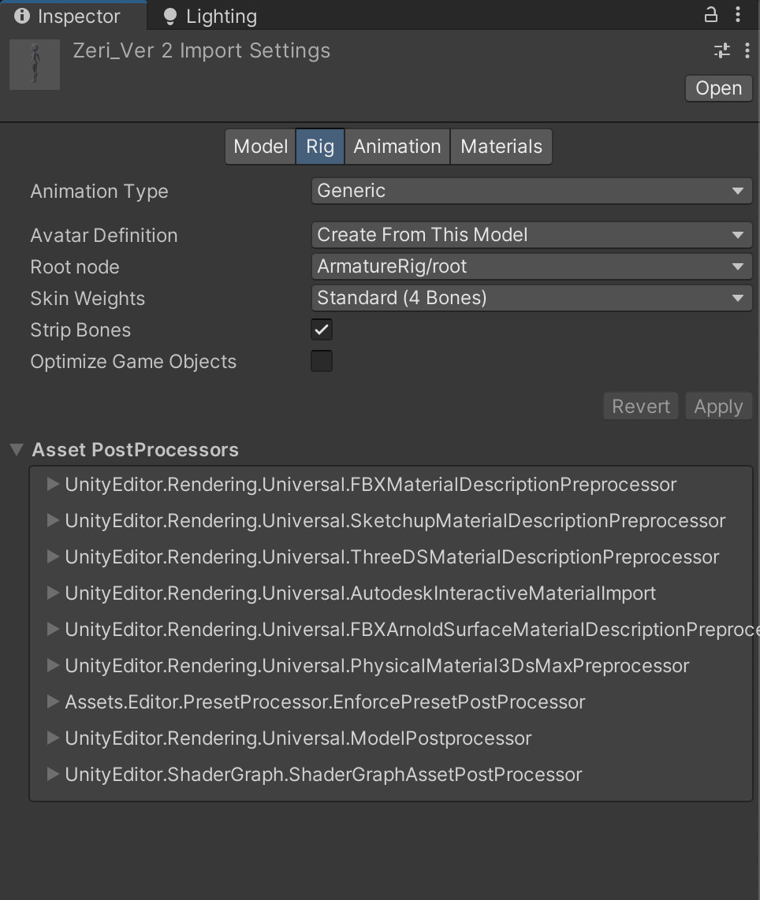

### Unity游戏引擎导入FBX动画文件
* 在FBX的`Inspector`面板中,`Model`选项卡下:勾选`Bake Axis Conversion`，取消勾选`Import Visibility`,取消勾选`Import Camera`，取消勾选`Import Light`；
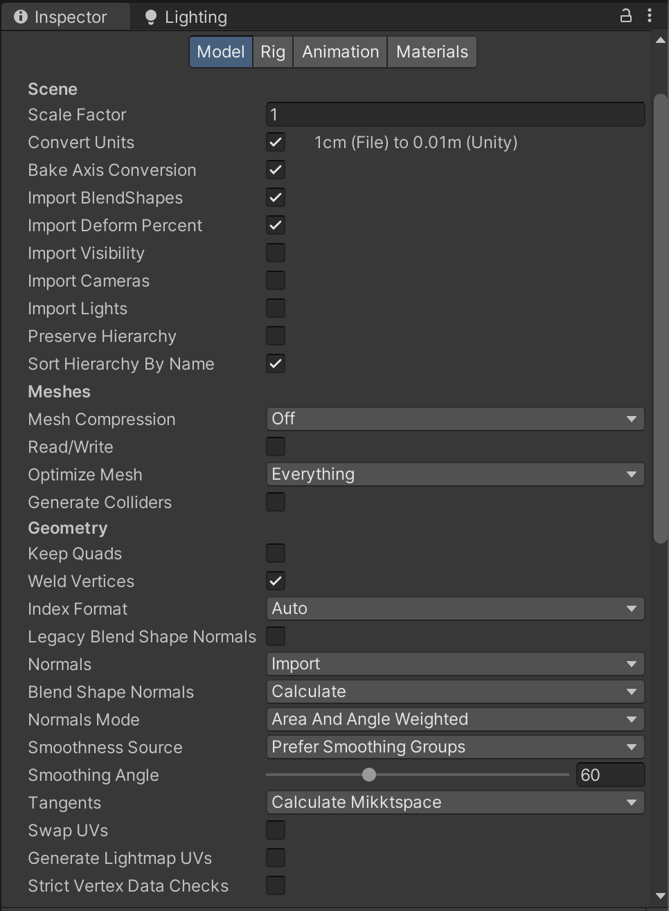
* 在FBX的`Inspector`面板中,`Rig`选项卡下:`Animation Type`下拉菜单选择`Generic`（为何不使用`Humanoid`类型？因为导入动画会有`Lower Retargeting Quality`警告，并且我们暂时不会使用`Humanoid`的动画重定向功能,至于`Humanoid IK`功能也不是必须的，我们在`Generic`类型上自定义脚部的`IK`功能）;`Avatar Definition`下拉菜单选择`Copy From Other Avatar`;`Source`选择对应人物模型所生成的`Avatar`。
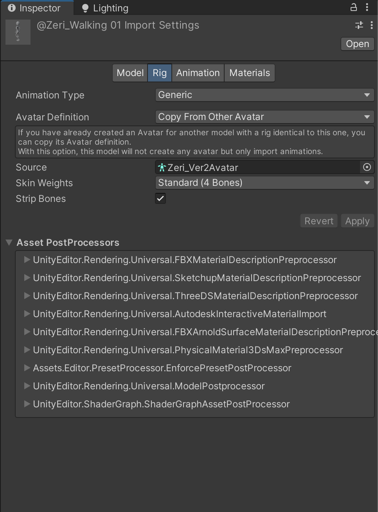
* 在FBX的`Inspector`面板中,`Animation`选项卡下:`Anim Compression`下拉菜单选择`Optimal`(Unity会自动选择动画的压缩方式，同时保持较高的动画质量),对于需要循环播放的动画(例如:Idle、Walking)勾选`Loop Time`，是否需要勾选`Loop Pose`，取决于动画的起始帧和结束帧是否一致，当起始帧和结束帧不一致时(例如角色的Idle动画)，需要勾选`Loop Pose`以使动画循环平滑过渡；关于`Root Transform ***`相关是否勾选，可参考视频: [Root Motion Explained (Unity Tutorial)](https://www.youtube.com/watch?v=Xl_5roq4UlI&list=WL&index=24)

* 在FBX的`Inspector`面板中,`Material`选项卡下:`Material Creation Mode`下拉菜单设置为`None`。
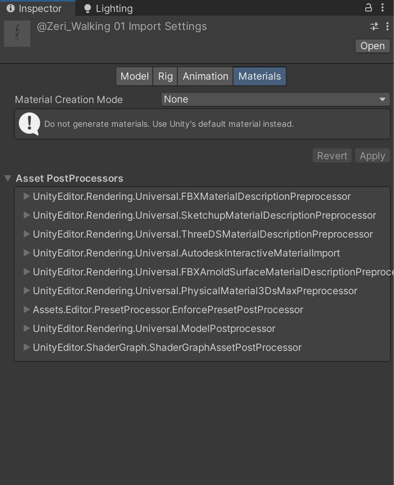

### 游戏引擎导入FBX角色模型文件后，骨骼层级中仍保留有Rigfy的控制骨
* 问题描述:尽管在导出FBX模型文件时已经勾选了`Only Deform Bones`但是导入游戏引擎之后骨架中仍然包含控制骨(前缀为`MCH`),我们希望最后导出的骨架只包含形变骨(前缀为`DEF`)
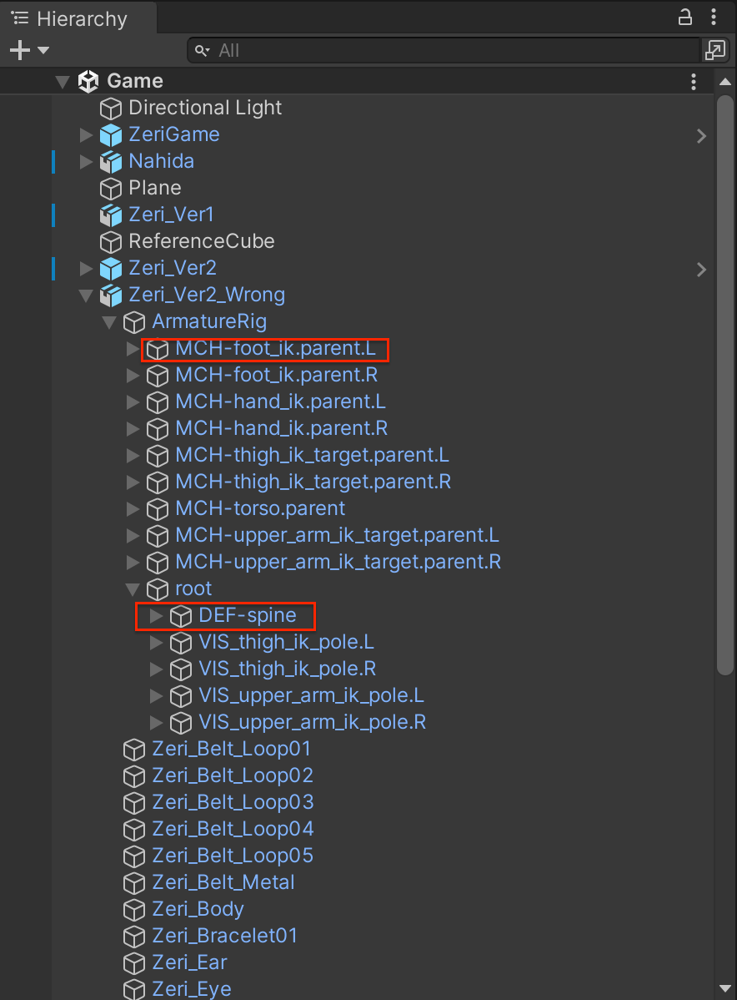
* 问题解决:使用`Expy Kit`插件重新组织骨架骨骼的层级关系，使导出的FBX模型骨架转换为对游戏引擎友好。具体:选择需要转换的骨架并切换到`Pose Mode`,`w`呼出上下文菜单，找到`Expy Kit`工具集的下的`Conversion -> Rigfy Game Friendly`。
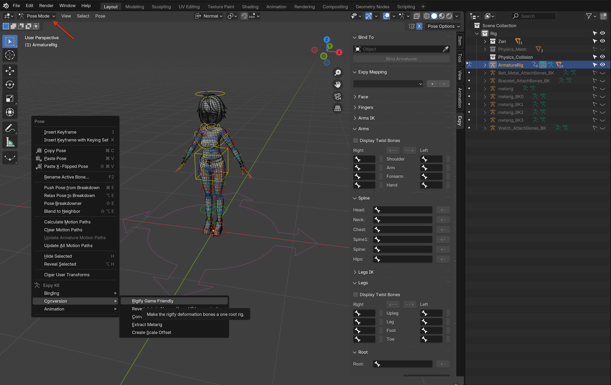
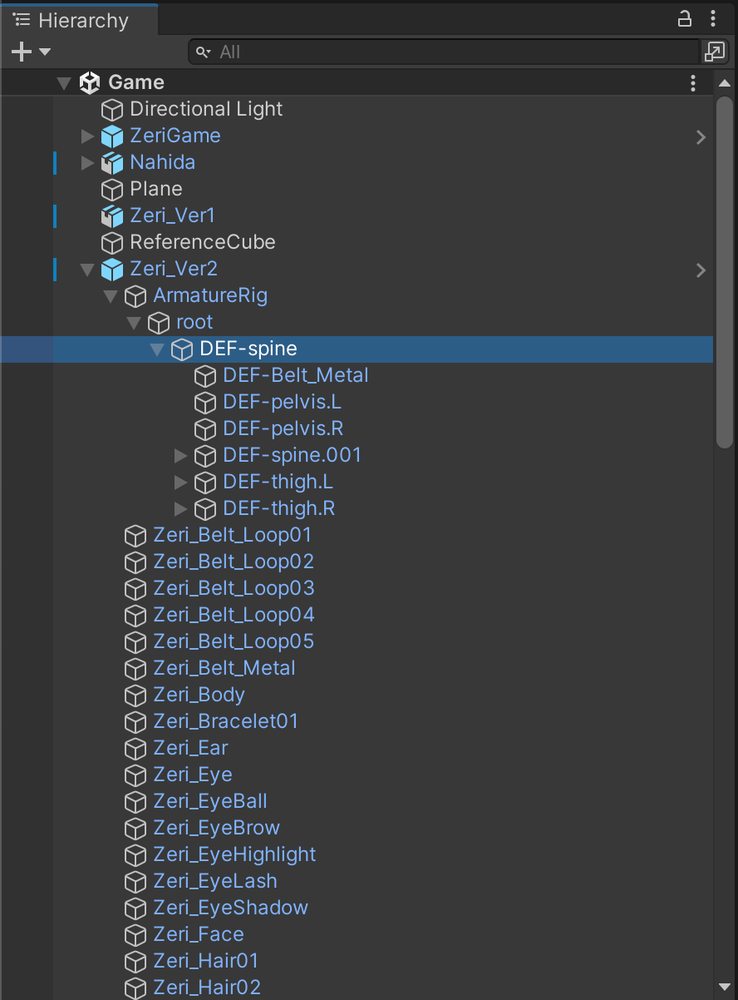
* 注意:即使后续源骨架`metarig`变动(例如：增加了用于头发模拟物理的骨骼)，再通过`metarig`的`Re-Generate Rig`重新生成`Rigfy`骨架，针对这种情况，插件也支持新的`Rigfy`骨架转换为游戏引擎友好。
* 注意:如果更改了Rigfy骨架，则所有关联此骨架制作的动画有可能丢失动画数据（原因可能是骨骼层级和命名变得不匹配）。为了避免这种情况,尽量在制作动画之前将所有物理模拟的骨骼加入Rigfy骨架，在最后导出时再使用`Expy Kit`插件转换骨架为游戏引擎友好。（实际测试时，任何时间点转换骨架，相应的动画文件都不会出问题）为了防止万一的不幸，记得使用`File -> Save As`做好文件的备份。随时使用`File -> Clean Up -> Purge Unused Data`清理不再使用的对象,保持工程文件的简洁(例如:动画重定向完成后，清理Mixamo动画相关)。

### 重新组织文件的目录结构后，导致link关联文件丢失。
* 问题描述：被关联的文件路径未改变，改变了操作关联的文件路径，导致工程出现问题。blender提示“`1 libraries and 318 linked data-blocks are missing(...)`”。
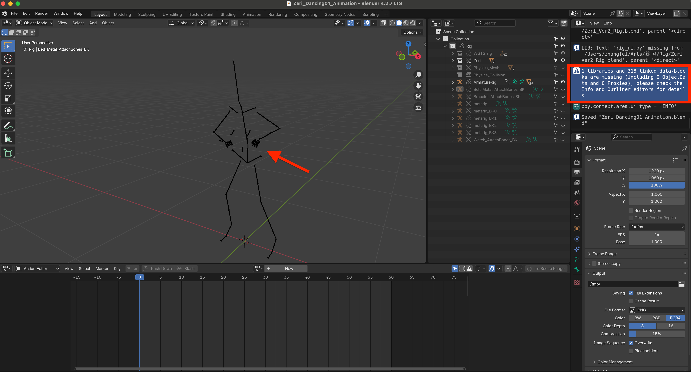
* 问题解决:在`Outliner`视窗将`Dispaly Mode`切换到`Blender File`，找到丢失链接的`Library`,`右键 -> 上下文菜单 -> Relocate`。再次选择需要关联的文件。
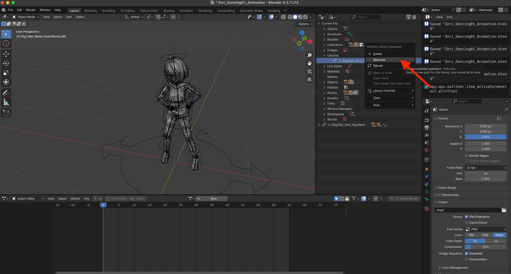
* 注意: 关联文件和被关联文件路径均不可随意变动。

# Unity优化建议
* Optimize your geometry: don’t use any more triangles than necessary, and try to keep the number of UV mapping seams and hard edges (doubled-up vertices) as low as possible. For more information, see [Creating models for optimal performance](https://docs.unity3d.com/2022.3/Documentation/Manual/ModelingOptimizedCharacters.html).
* Use the Level Of Detail system.