# blender偏好设置
* 视图切换-自动深度(避免缩放视图很慢):

* 右键选择:

* 空格键搜索:

* 鼠标中键视图检视:


# blender资产库
* 创建blender资产库:

* 将引用的资源打包进blend文件,避免移动文件之后丢失引用:`File -> External Data -> Pack Resources`.

# blender快捷键

* `shift + 鼠标中键`:平移视角
* `shift + s`:游标吸附【菜单】
* `shift + c`:游标至世界原点

### 选择
* `a`:全选所有对象
* `control + 鼠标左键`:选择/取消选择(若选择对象非活动对象，则将对象置为活动对象)
* `[大纲视图] shift + 鼠标左键`:大纲视图内范围选择
* `[编辑模式(边)] select -> select loops -> select loop Inner-region`:选择循环边内部(建议加入Quick菜单)
* `shift + 右键`:选择多个对象
* `shift + cmd + 右键`:取消选择某个对象

### 对象
* `shift + a`:添加对象【菜单】
* `shift + d`:复制对象
* `x -> delete`:删除对象
* `/`:聚焦选中对象/取消聚焦
* `cmd + j`:合并多个对象
* `w`:上下文菜单
* `shift + z`:切换到线框模式
* `h`:隐藏(物体/点/线/面)
* `option + h`:恢复所有隐藏(物体/点/线/面)
* `control + l -> material`:连接(复用)材质

### 变换
* `g`:移动
* `g + x`:x轴移动
* `g + y`:y轴(world)移动
* `g + y + y`:y轴(local)移动
* `g + z`:z轴移动
* `g + shift + y`:沿着xz平面移动
* `[物体模式] option + g`:重置位置
* `s`:缩放
* `s + x`:x轴缩放
* `s + y`:y轴缩放
* `s + z`:z轴缩放
* `option + s`:重置缩放
* `[编辑模式] option + s`:沿法线方向缩放
* `r`:旋转
* `r + x`:x轴旋转
* `r + y`:y轴旋转
* `r + z`:z轴旋转
* `option + r`:重置旋转
* `cmd + a -> 全部变换`:应用所有变换

### 编辑(点/线/面)
* `TAB`:进入编辑模式
* `1`:点选择模式(非数字键盘)
* `2`:边选择模式
* `3`:面选择模式
* `e`:挤出(点/线/面)
* `e + x`:沿x轴方向挤出
* `e + y`:沿y轴方向挤出
* `e + z`:沿z轴方向挤出
* `option + e -> 沿法线方向挤出`:多个面分别沿其法线方向挤出
* `control + 鼠标左键`:挤出到鼠标位置(点/线/面)
* `control + r`:环切
* `control + r + 滚轮Up`:环切并增加切割次数
* `control + r + 滚轮Down`:环切并减少切割次数
* `control + b`:倒角
* `control + b + 滚轮Up`:倒角并增加段数
* `control + b + 滚轮Down`:倒角并减少段数
* `option + 鼠标右键`:选择循环边
* `右键 + control(hold) + 右键`:起点至终点最佳路径(点/线/面)
* `control + i`:反选
* `[编辑模式(面)] c`:刷选
* `[编辑模式(面)] c + 滚轮Up`:刷选并增加刷子直径
* `[编辑模式(面)] c + 滚轮Down`:刷选并减少刷子直径
* `v`:断离(点/线)
* `control + l`:选择所有相邻元素
* `i`:内插面(面)
* `k`:小刀(自定义拓扑结构)
* `Search(空格键) -> 桥接循环边`:桥接两条循环边(需同一个对象)
* `cmd + e -> 桥接循环边`:桥接两条循环边(需同一个对象, cmd + j可以合并对象)
* `g + g`:滑移边线(点/线/面)
* `m -> 到中心`:合并(点/线/面)
* `m -> 按距离`:合并(点/线/面)(可以用来去除重复点)
* `p -> 选中项`:分离(点/线/面)
* `Search(空格键) -> Grid Fill`:网格填充(边需是偶数)
* `cmd + f -> 栅格填充`:网格填充(边需是偶数)
* `f`:快速网格填充
* `shift + n`:重新计算法线方向
* `option + n -> 翻转`:翻转法线方向
* `s + z + 0`:沿z轴对齐(例如:选中两个点并使其z坐标相同)
* `shift + tab`:开启/关闭吸附功能

### 骨骼
* `control + p -> 保持偏移量`:设置父子关系(骨骼)
* `option + p -> Clear Parent`:清除父子关系(骨骼)
* `control + l`:全选与当前骨骼相连的骨骼链
* `[姿态模式] Pose -> Constraints -> Copy Constraints to select bones`:拷贝活动骨骼的'Constraints'到选择的骨骼

### 动画
* `k -> location & rotation`:插入选中骨骼的关键帧
* `shift + space`:播放动画
* `shift + <-`:跳转到起始帧
* `shift + ->`:跳转到结束帧

### 曲线
* `[曲线编辑模式] e`:挤出新的曲线控制点（control point）
* `[曲线编辑模式] x`:删除曲线控制点（control point）
* `[曲线编辑模式] option + s`:缩放曲线控制点（control point）的半径（radius）
* `[曲线编辑模式] control + t`:缩放曲线控制点（control point）的倾斜角（tilt）

# blender实用技巧、注意事项、问题及解决方案

### 雕刻边沿
* 问题描述：在雕刻鞋子时，希望雕刻出鞋底和鞋面的边沿并使鞋底平整。
* 问题解决：使用`Draw Sharp`雕刻工具勾勒出边沿,使用`Smooth`和`Mask`雕刻工具削平鞋底。
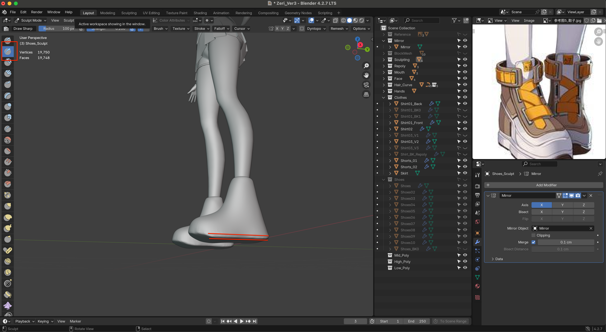

### 雕刻时的遮罩和限制轴向
* 问题描述：在制作“编制手环”时,我们需要对单个"编织绳"进行`抓取`，并固定x轴，使雕刻只能在y和z轴上进行。
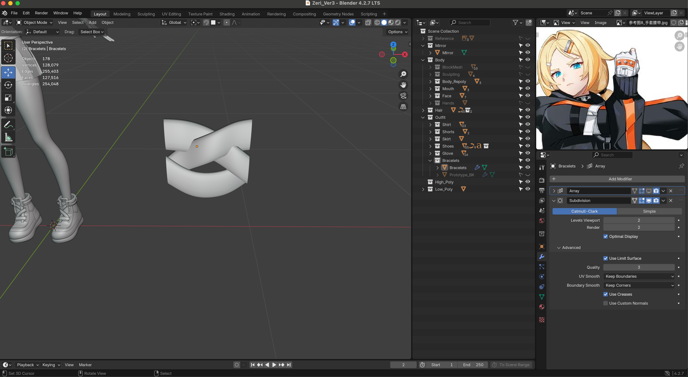
* 问题解决：使用`Face Sets -> Initialize Face Sets -> By Loose Parts`;打开并勾选`Auto-Masking`下的`Face Sets`以及`Mesh Boundary`;打开`Symmetry`并固定x轴；
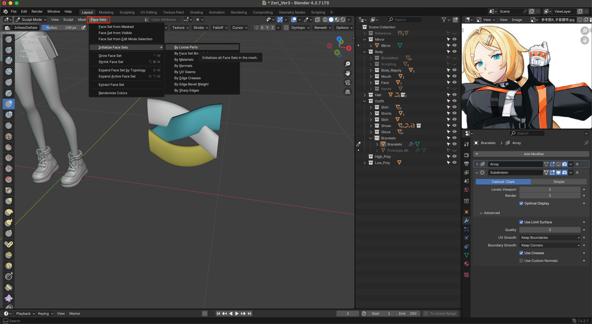
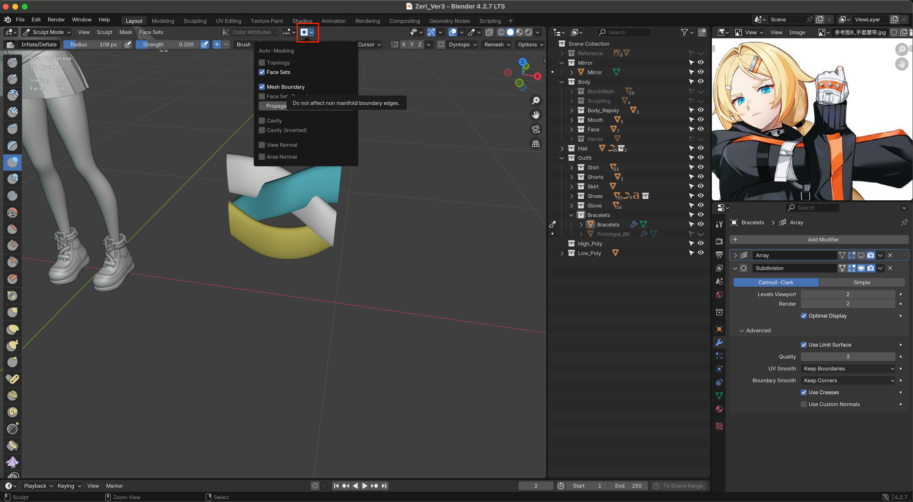
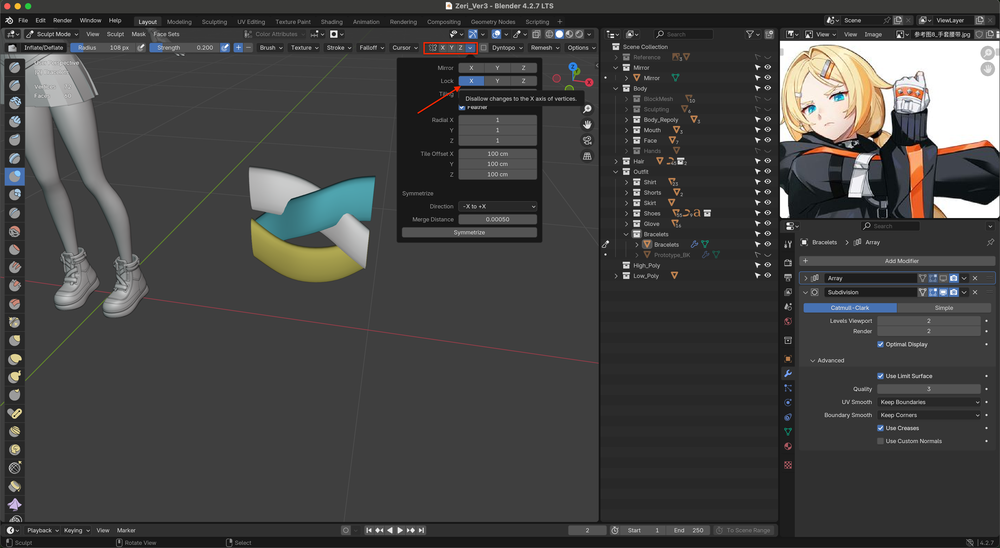

### 面吸附无法准确吸附到最近的面
* 问题描述:在对耳朵部分进行拓扑时，点应当吸附到"耳朵"上而非"头部"
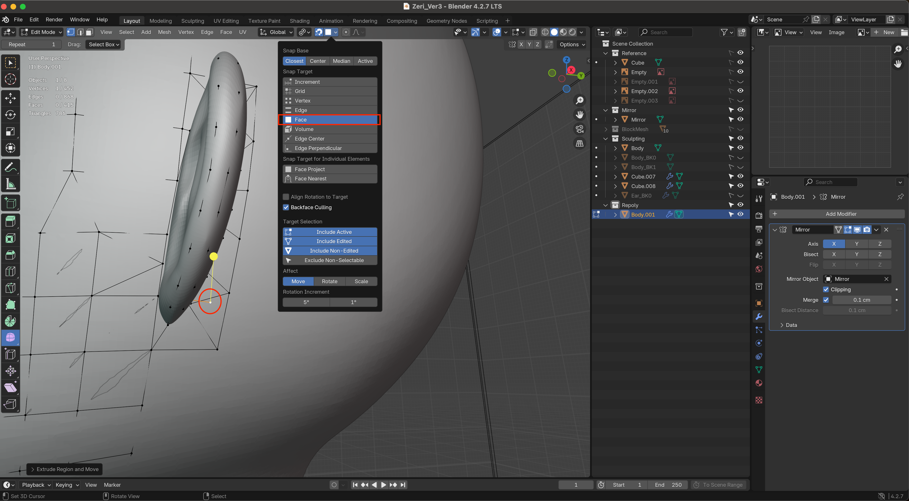
* 问题解决:更改吸附规则为`Face Project`,并确保启用`Backface Culling`。
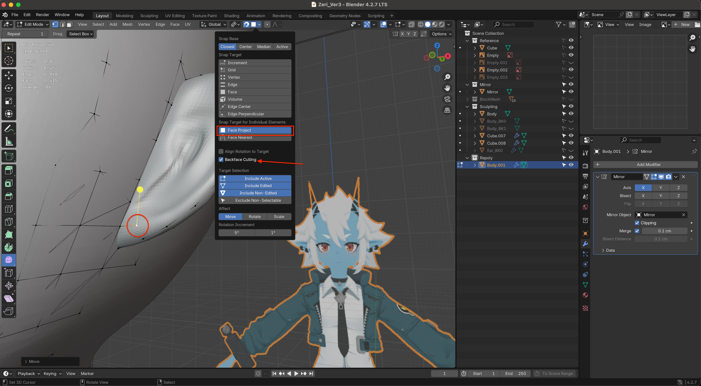

### 挤出的点自动吸附到表面
* 问题解决:更改吸附规则为`Face Nearest`,并确保开启`Backface Culling`。在使用`e`挤出顶点之后,再使用`g`移动顶点（移动时会自动吸附）。

### UV同步
* 展UV时，在`UV Editing`操作界面下，打开`UV Sync Selection`选项

### UV与游戏表现和性能的相关性
* 展UV时，叠放UV布局(例如对称的左右手)可以充分利用Texture有限的空间，减少Texture数量有助于提升性能。但是会限制艺术表现(例如左右手可能会要求不同的贴花,则不适合叠放UV)。
* 展UV时，细节多、屏幕占比大的UV孤岛需要尽可能放大；相反被遮挡、细节少、屏幕占比小的UV孤岛需要尽可能缩小。
* 展UV时，可能遇到“整个UV孤岛”应当尽可能缩小，即细节较少（例如：人物腿部几乎是纯皮肤色）；但是“UV”孤岛中的一些区域应当尽可能放大，因为细节较多（例如：腿部有贴纸，希望高分辨率展示）。则此时可以单独挖出拥有细节的区域并放大该部分区域的UV,其余对称的区域仍然可进行UV叠放。（参考自米哈游模型的做法）
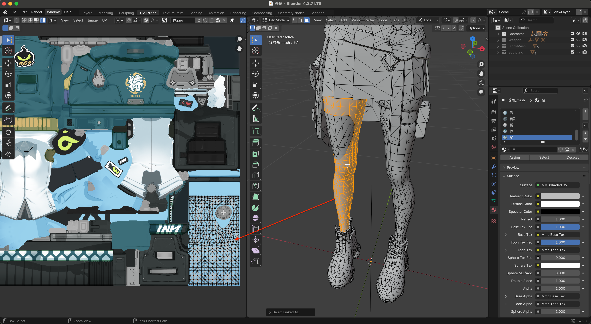
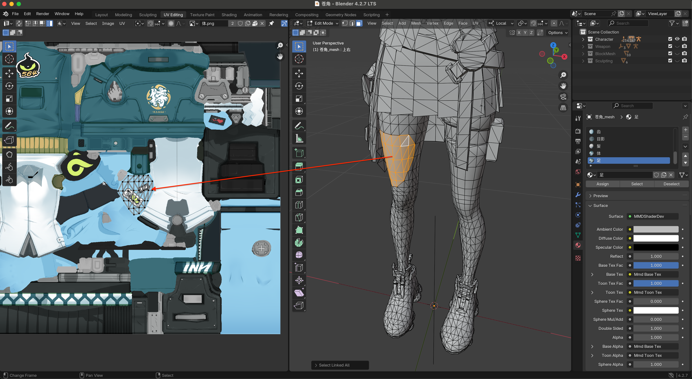
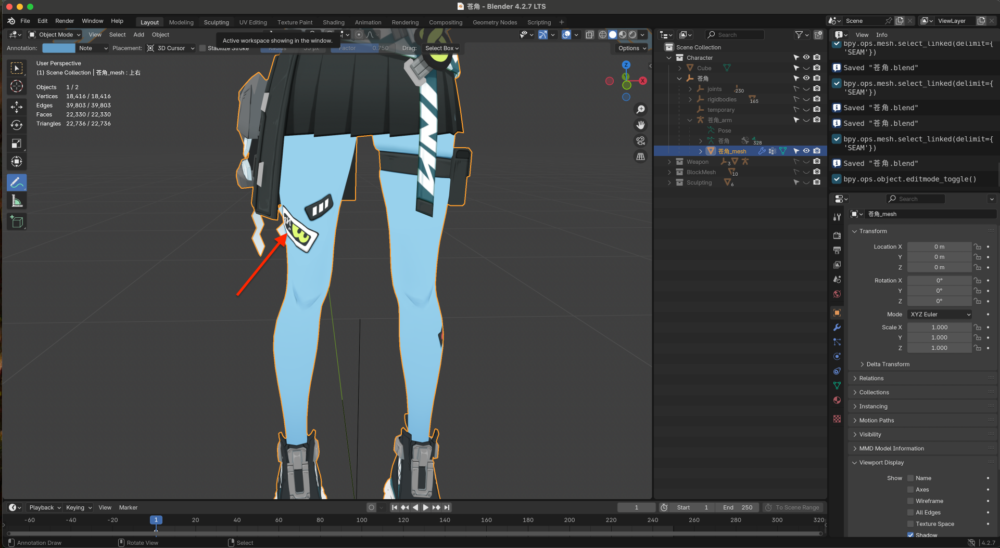
* 导入Unity游戏引擎后，制作Prefab时选择`Prefab -> Unpack`而非`Prefab -> UnPack Completely`。

### 百褶裙的双面渲染

### 关于外来模型的UVMap
* 导入的外来模型可能已有自定义的`UVMap`,与`Blender`默认的`UVMap`不在一个UV坐标通道，如果不处理或者忘记检查，则最后在导入游戏引擎后，外来模型（背包）与本地自建模型（人物）会分布在不同的`纹理坐标通道`(例如：一个在`TEXCOORD0`通道，另一个在`TEXCOORD1`通道)，进而会导致渲染代码采样UV坐标时结果错误。故导入外来模型之后，需要确保所有的对象在同一UV通道。例如:默认的`UVMap`。
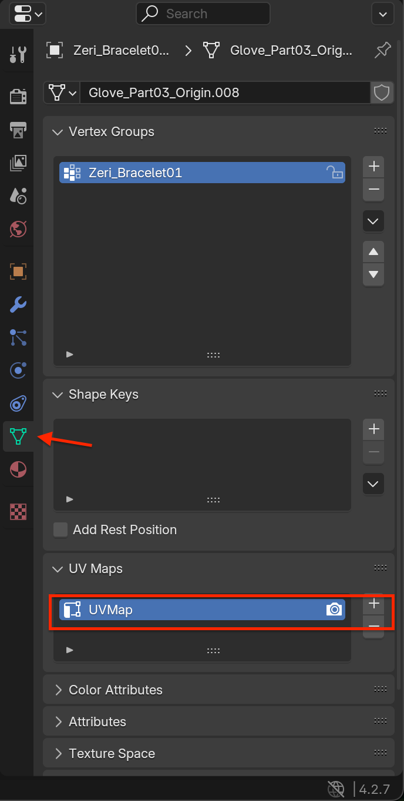
* 在建模过程中，可能需要拷贝模型的UVMap，方法如下:`选择源物体` -> `选择目标物体` -> `control + l -> Copy UV Maps`.

### 建模、绑定和动画分文件(多人协作开发)
* 将需要共享的对象整理到一个集合，使用`Link`关联文件；使用`Library Overide -> Make -> Select & Content`在关联文件的基础上作修改；使用`Library Overide -> Reset -> Select & Content`放弃修改或更新关联文件
* 对于关联文件无法支持的修改(例如权重绘制)，使用`ID Data -> Make Local`本地化(会取消关联)(或者在导入时使用`Append`)；在执行`Make Local`后可能遇到`Object`已经本地化，但是相关联的`Mesh Data`以及`Material`仍然是关联状态,导致`Object`依旧不支持编辑,可使用如下脚本将选中的对象本地化:

```
import bpy

# 获取所有链接对象
linked_objects = [obj for obj in bpy.data.objects if obj.library]

for obj in linked_objects:
    # 本地化 Object
    obj.make_local()
    
    # 本地化 Mesh 数据（如果存在）
    if obj.data and obj.data.library:
        obj.data.make_local()
    
    # 本地化 Material 数据（遍历所有材质槽）
    for slot in obj.material_slots:
        if slot.material and slot.material.library:
            slot.material.make_local()

print("所有对象及其关联数据已本地化！")
```

### UV形变的镜像同步
* 问题描述:镜像对称的对象,更改某一边UV,希望另一边UV镜像同步

* 解决方案:删除另一边UV,并添加镜像修改器,勾选UV沿轴向对称,最后应用修改器


### UV打直
* 问题描述:UV弯曲占用较多Texture空间,打直以更好地布局

* 问题解决:安装插件[UVToolkit](https://github.com/oRazeD/UVToolkit),取消勾选`UV Sync Selection`,全选弯曲的UV孤岛,使用`Straighten UVs`打直UV


### UV对齐
* 问题描述:在叠放镜像UV时，可能会遇到大部分顶点对齐，部分顶点不对齐的场景；
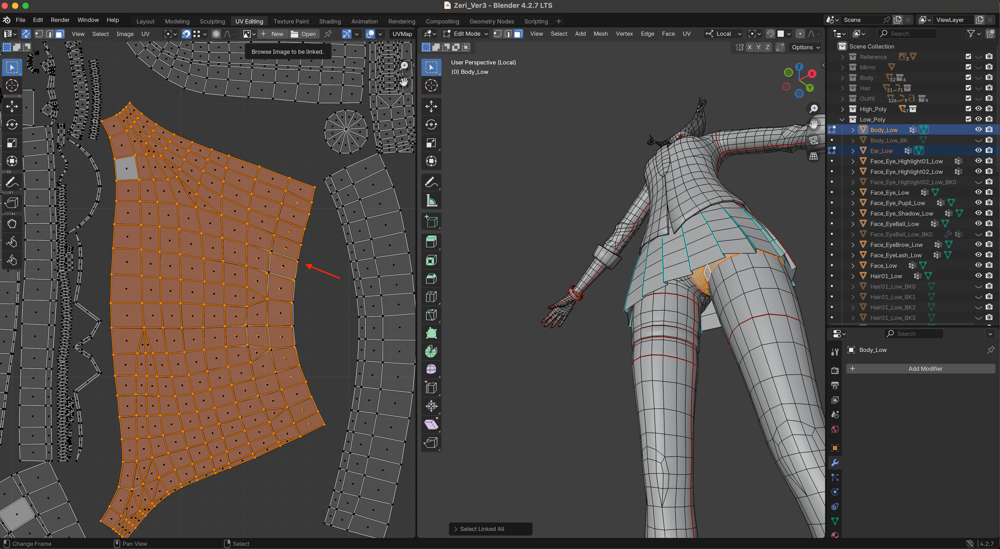
* 问题解决：打开顶点吸附,关闭`UV Sync Selection`并切换到`点模式`，选择顶点，移动并吸附。
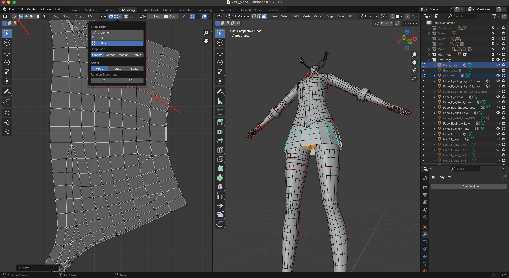
* 问题解决【进阶】：如果顶点过多,那么一个一个手动操作是十分浪费时间的!对于这种明显的重复劳动，我们可以使用脚本来操作（**重要前提**：两个镜像的UV已经尽可能地叠放在一起，顶点都尽可能地接近,关闭`UV Sync Selection`，并且确保只选择相关顶点。更保险的方式是进行备份）。脚本如下:
```
import bpy
import bmesh

# 获取当前UV编辑器选中的顶点
obj = bpy.context.active_object
bm = bmesh.from_edit_mesh(obj.data)
uv_layer = bm.loops.layers.uv.active

# 设置吸附阈值（根据需求调整）
SNAP_THRESHOLD = 0.001

# 收集所有选中的UV顶点
selected_uvs = []
for face in bm.faces:
    for loop in face.loops:
        if loop[uv_layer].select:
            selected_uvs.append(loop[uv_layer])

# 批量吸附：将距离小于阈值的顶点合并到第一个顶点的位置
for i, uv in enumerate(selected_uvs):
    for j, other_uv in enumerate(selected_uvs[i+1:], i+1):
        distance = (uv.uv - other_uv.uv).length
        if distance < SNAP_THRESHOLD:
            other_uv.uv = uv.uv  # 将other_uv吸附到uv的位置

# 更新网格
bmesh.update_edit_mesh(obj.data)
```
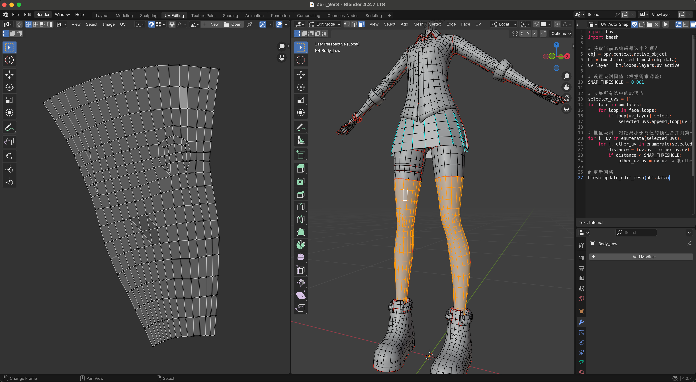

### 骨骼的精确定位
* 使用`Shift + s -> Cursor to Selected`将游标定位到精确位置，进入骨架的`Edit Mode`，选择骨骼的`Head`或`Tail`,使用`Shift + s -> Selected To Cursor`将骨骼精确定位到游标位置。

### 在Rigfy上添加自定义骨骼
* 问题描述:人物模型上的许多小挂件(例如:手表、背包等),希望添加专属的额外骨骼与之绑定，而非将小挂件直接绑定到Rigfy人体骨骼上。
* 问题解决:
  1. `Shift + a`添加单个骨骼(属于新骨架),更改`Bone Collection`为`AttachBones_*****`等格式。
  
  2. 切换到`Pose Mode`更改相应骨骼的`Rigfy Type`为`basic.super_copy`(只需要生成控制骨应当设置为：`basic.row_copy`),勾选`Control`表示会生成`CTRL-***`类型的Rigfy控制骨、通过`Widget`自定义骨骼的形状、勾选`Deform`表示会生成`DEF-***`Rigfy形变骨、`Relink Constraints`暂不需要设置。
  
  3. 使用`control + j`合并骨架到Rigfy的原型骨架`metarig`(合并之前记得使骨架`Apply All Transform`，注意备份骨架),在`metarig`的`骨架`属性页签，设置新增`Bone Collection`的UI位置。
  
  4. 合并之后的`metarig`切换的`Edit Mode`设置新增骨骼与`Rigfy`原型骨架的骨骼之间的父子关系【**这一步很容易忘记**】。
  
  5. 点击`Re-Generate Rig`重新生成Rigfy骨架`Rig`,依然会保留之前已经绘制好的权重。(重新生成Rig需要保证`Rig`不是隐藏且可选状态)
  
  6. 选择重新生成的`Rig`,切换到`Pose Mode`,检查UI和父子关系是否正确。
  
  7. 进行权重绘制。
  
  8. 参考视频:[[Blender 4.0 RIGIFY] ＃6-1: Custom Rigs (theory)](https://www.youtube.com/watch?v=Cq2Vw6EFXy0)
  9. 关于更复杂的(比如:头发的物理模拟如何加入Rigfy骨架)，可参考视频:[blender进阶丨头发和衣服动画物理模拟结算](https://www.bilibili.com/video/BV16G4y1z7BD/?spm_id_from=333.1387.favlist.content.click&vd_source=b9589ad635db7dddd215259c55a8a09c)(注意：我们仅参考视频里的“FK”与“Physics”隔离的方式以及将骨骼物理模拟合并到`Rigfy`骨架中的方法，但是物理模拟不建议使用视频中“跟随布料”的方式，而应使用基于“Rigidbody”的插件，例如：<del>[Wiggle2](https://github.com/shteeve3d/blender-wiggle-2)</del>、[Swingy Bone Physics v1.8.0](https://superhivemarket.com/products/swingy-bone-physics))
  10. 插件`Swingy Bone Physics`用法的参考视频：[Swingy Bone 物理学骨骼链物理模拟Blender插件V1.8.0版](https://www.bilibili.com/video/BV1yo76z7EAs/?spm_id_from=333.337.search-card.all.click&vd_source=b9589ad635db7dddd215259c55a8a09c)（注意：该插件大部分操作以`Bone Chain`为单元进行，避免“全选”后进行操作）
  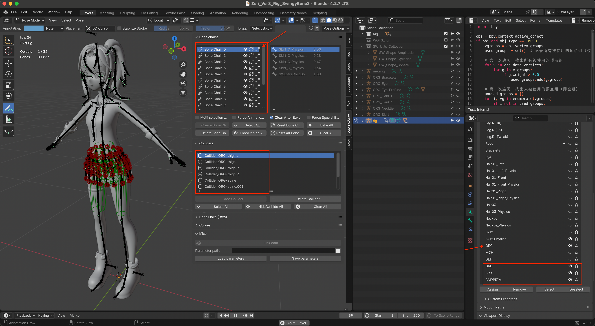
  
  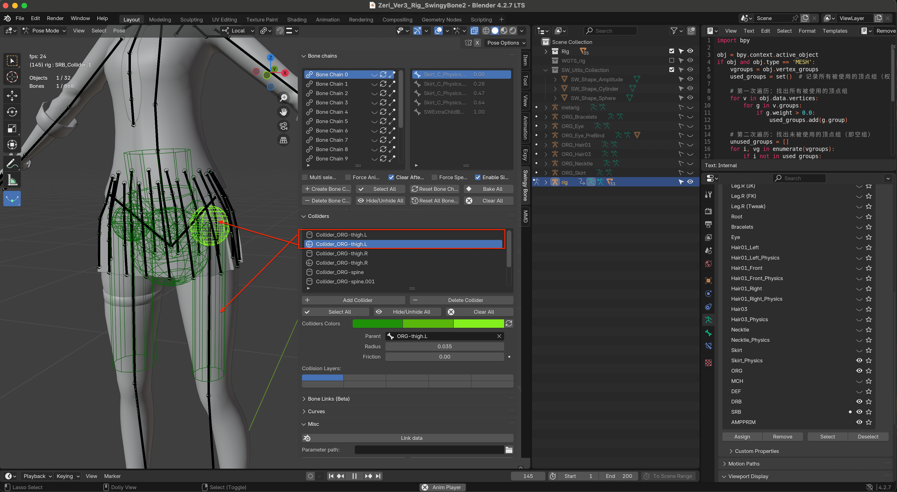
  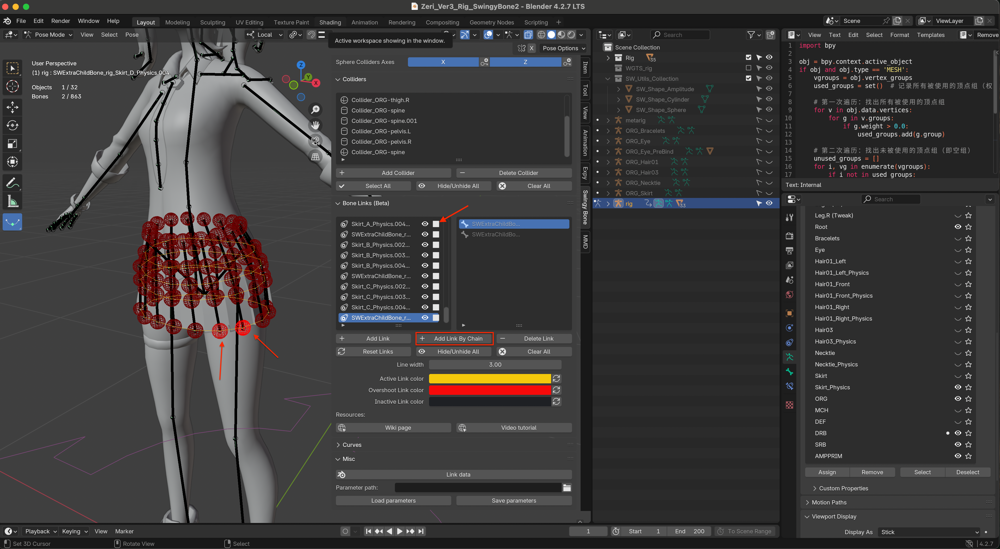

### 权重绘制
* 以“部件”为单位，使用`自动权重`逐一绑定!(注意这里的“部件”不一定是单个部件，更多情况是由多个“部件”组成，需要视具体情况而定，目的是寻找最高效率、最合理的绑定方式)。例如：脸部(Face)与脖子(Body)可以先合并，并使用`Merge by Distance`合并“接缝”处顶点，这样`自动权重`给到的权重是“连续”的！大大方便之后权重的修缮。绘制完权重之后再分离“Face”与“Body”网格，则分离后“接缝”处的两组顶点权重就是相同！在动画中便不会“破面”(分离后需要重新确认与“部件”同名的顶点组是否正确，另见下文：**绑定与导出的矛盾**)。
* 绘制权重时，切换到`线框模式`以方便观察，且必须打开`options -> Auto Normalized`,使权重和为1。只使用三种笔刷:`Add`、`Subtract`和`Blur`。强度最好设置为0.1。(也可以借助`Weights -> Smooth`来平滑权重)
* 细节处权重绘制可以从`骨骼模式`切换到`点模式`,并且将视窗切换到`线框模式`以方便操作;例如:大腿和短裤在接缝处的两组点应该是重叠的,可以对相应点进行`Add`和`Subtract`以修缮权重。

* 在权重修缮过程中，如果遇到不合理的拓扑结构需要及时修正，例如：遇到平滑着色器下的明显硬边，应当换一种三角形切分方式，因为这里不影响拓扑和UV，故可在“建模文件”和“绑定文件“分别修改。
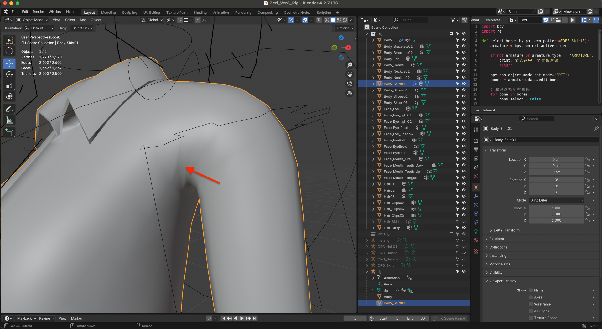
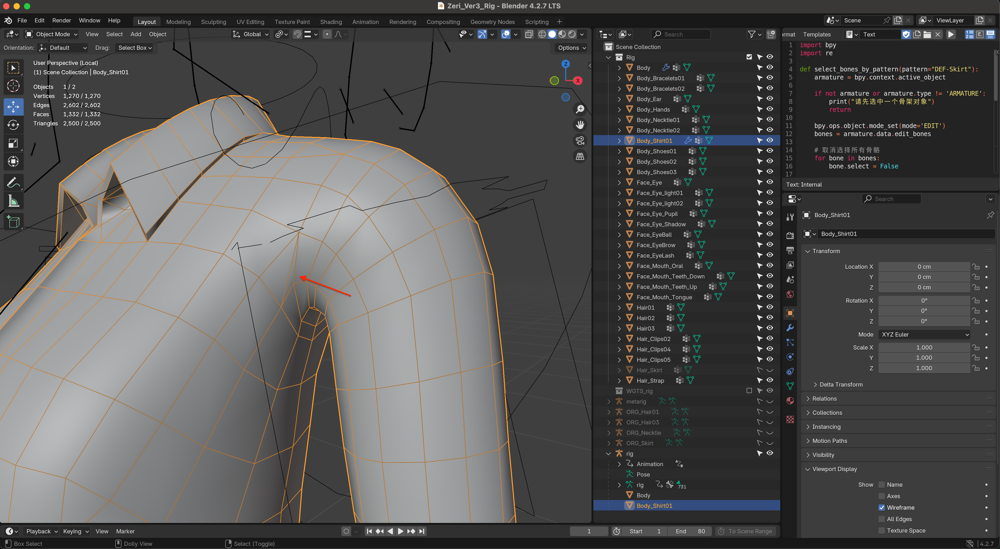
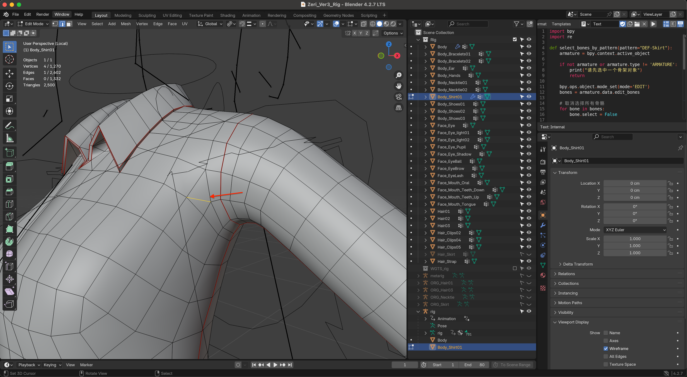
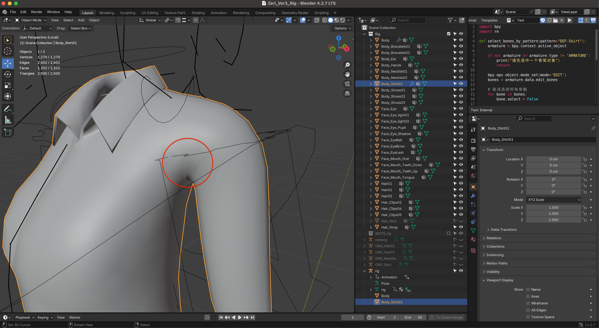
但是，有些不合理拓扑的修改涉及到增删顶点以及UV改动，那么此时“绑定文件”就必须从“建模文件”同步修改对象，并且将旧对象的权重传递给新同步的对象，此时可以使用`Data Transfer`修改器,勾选`Vertex Data`及`Vertex Groups`，并点击`Generate Data Layers`，最后应用修改器。检查顶点组权重没有问题之后，使用`Armature Deform`来将新同步的对象绑定到骨骼。(上述流程也适用于形态键改动)
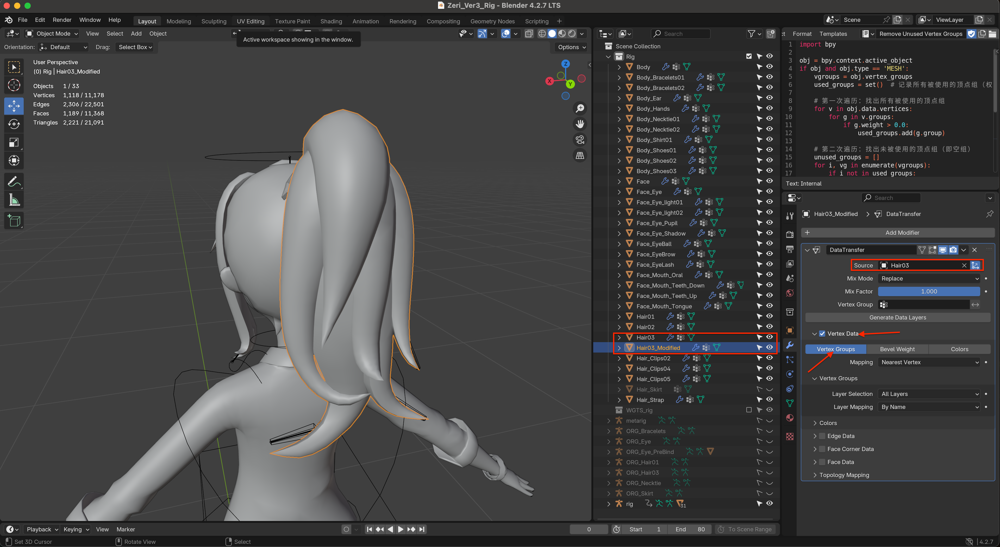
* 绘制权重时，可以使用`Paint Mask`来设置笔刷的遮罩。
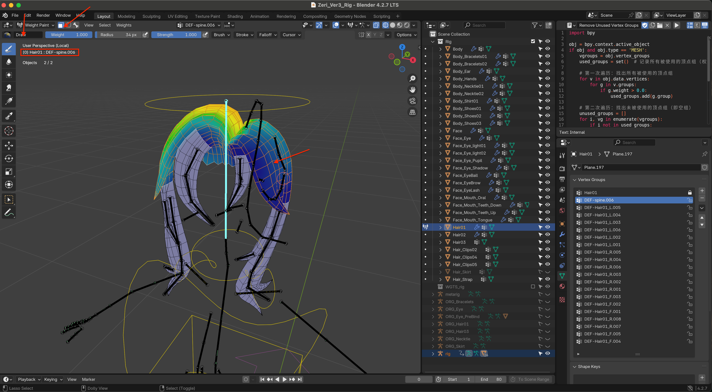
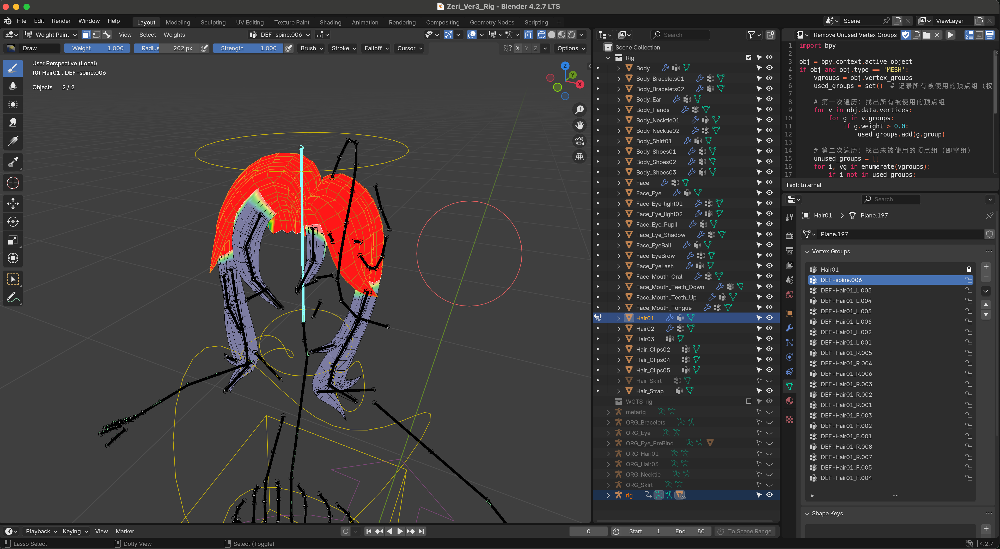
* 绘制权重时，需要结合骨骼的各种“极限姿势”。对于链式骨骼（衣服飘带、尾巴等）可以使用`r + x + x（沿本地X轴旋转）`来创建链式骨骼的姿势。此时不必考虑物理模拟，而必须保证形变骨(`Deform`)权重的正确性!
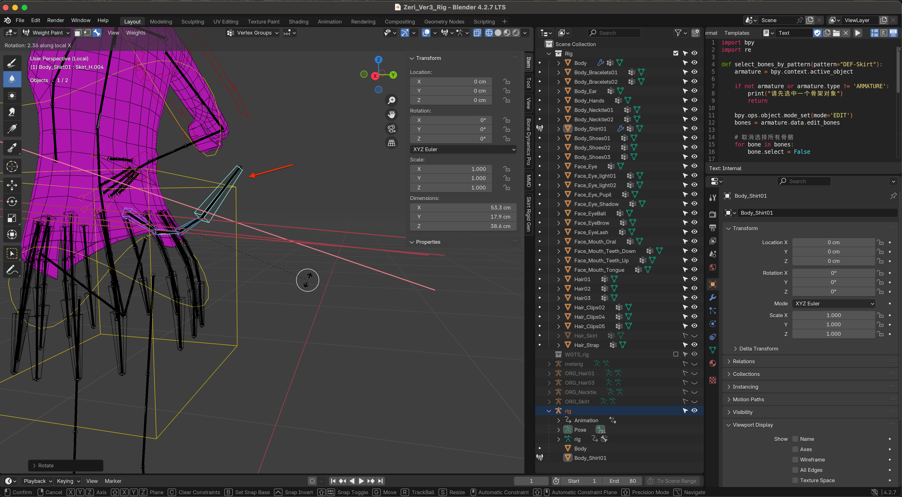
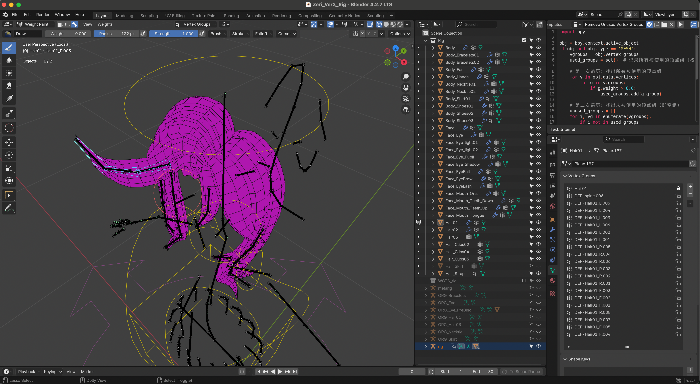
* 如果在权重已经修缮完成之后，再次<del>使用`Armature Deform -> with empty groups`</del>使用`Armature Deform`(避免产生冗余顶点组，另见下文：**自动权重的清理和修缮**)，此举并不会覆盖已经绘制好的权重！

### 自动权重的清理和修缮
* 问题描述：使用自动权重后，“部件”网格可能受到不必要骨骼的权重影响。如果需要去除不必要骨骼影响，需要额外的大量检查工作。
* 问题解决：1、将`Bone Selection`模式切换为`Vertex Selection`模式，选择一个顶点，然后在`Item`页签中的`Vertex Weights`标签下可以查看该顶点的`Vertex Groups`有哪些。2、使用 [Weights -> Clean](https://swingy-bone-physics.github.io/wiki/performance/#clean-model-weights) 功能将那些可以忽略不计但不完全=0的权重清理掉。3、可以删除某顶点的不相关顶点组，防止`Auto Normalized`为该顶点分配错误权重到不相关顶点组，删除不相关顶点组之后一定需要使用`Weights -> Normalize`来使该顶点的权重归一化。（如果顶点很多，需要使用脚本来批量操作）
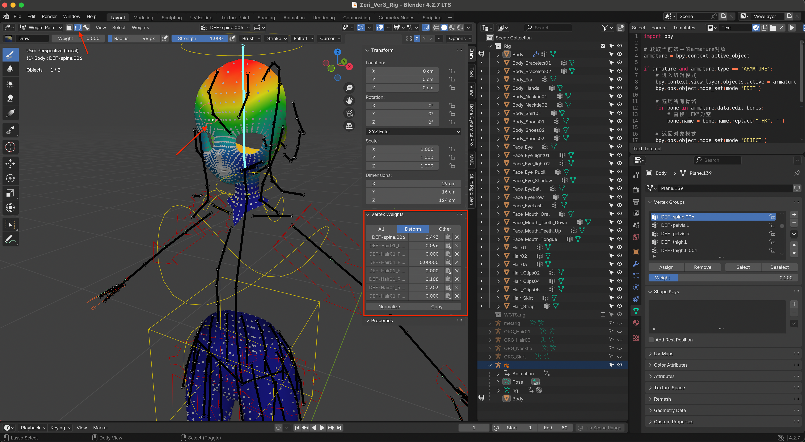
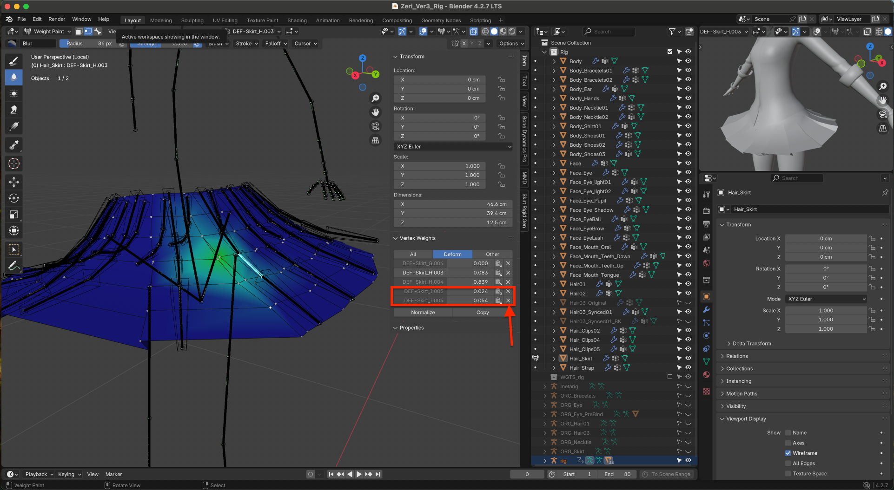
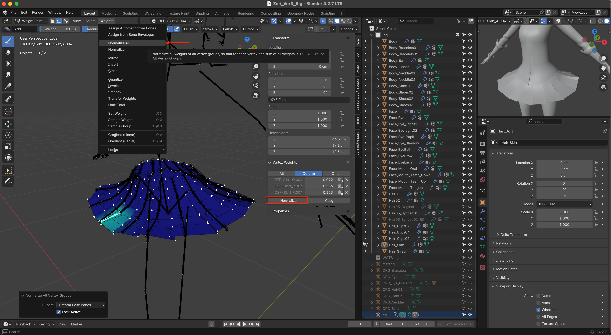
* **问题解决 PLUS**：在将网格绑定到骨架时，不再使用`Armature Deform -> with automatic weights`来一步创建自动权重，因为这种方式会将所有标记为`Deform`的骨骼纳入权重绘制的考量中，这样就不可避免地存在距离“当前部件”较近的且应当属于“其它部件”的骨骼参与“当前部件”权重分配！因此，我们需要明确地指出哪些骨骼应当参与“当前部件”的自动权重分配。方法如下：在将网格绑定到骨架时，<del>使用`Armature Deform -> with empty groups`只创建所有骨骼的空顶点组,</del>使用`Armature Deform`只执行绑定，不自动创建所有骨骼的空顶点组（**避免冗余顶点组**，即未被使用的、所有权重=0的组，冗余顶点组对游戏引擎的内存和性能仅有细微影响,但可能会使团队协作混淆；且冗余顶点组过多，不利于调试，也会使权重错误隐藏很深不被发现）；然后进入权重绘制，选择需要参与“当前部件”权重分配的所有骨骼，使用`Weights -> Assign Automatic From Bones`来给选定的骨骼创建自动权重（只会添加被选择骨骼的顶点组，无关骨骼不会被添加顶点组，即不产生冗余顶点组）。如果没使用正确工作流，产生了冗余顶点组，或者是外部模型导入，可通过脚本来批量删除冗余顶点组!
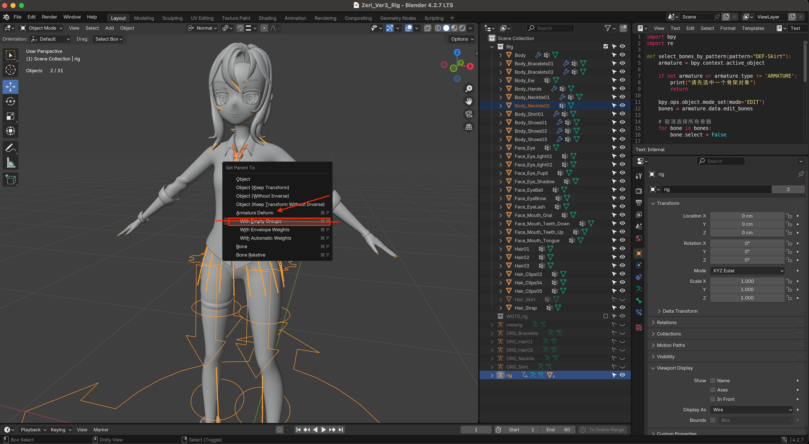   
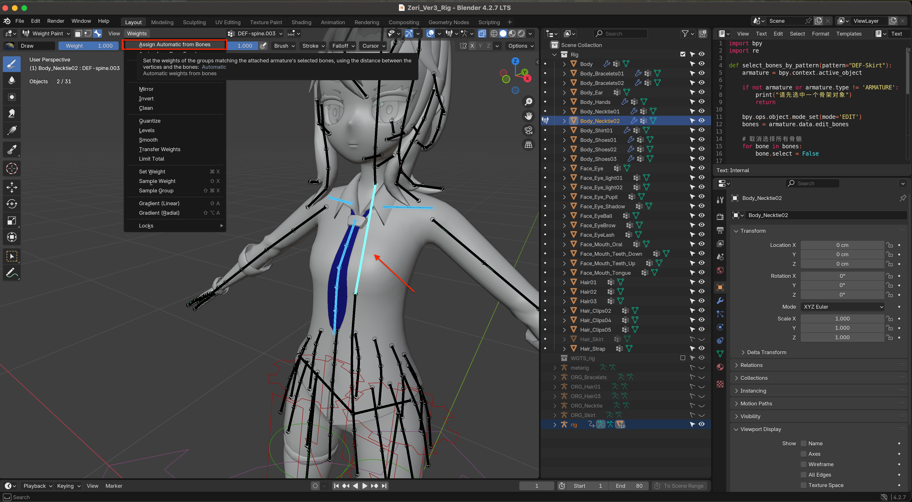
* 批量选择骨骼的脚本如下: 
```
import bpy
import re

def select_bones_by_pattern(pattern="DEF-Skirt"):
    armature = bpy.context.active_object
    
    if not armature or armature.type != 'ARMATURE':
        print("请先选中一个骨架对象")
        return
    
    bpy.ops.object.mode_set(mode='EDIT')
    bones = armature.data.edit_bones
    
    # 取消选择所有骨骼
    for bone in bones:
        bone.select = False
    
    # 使用正则表达式匹配
    regex = re.compile(pattern, re.IGNORECASE)  # 忽略大小写
    matched_bones = [bone for bone in bones if regex.search(bone.name)]
    
    if not matched_bones:
        print(f"没有找到匹配'{pattern}'的骨骼")
        return
    
    for bone in matched_bones:
        bone.select = True
    
    print(f"已选择 {len(matched_bones)} 个匹配'{pattern}'的骨骼")

# 示例用法：
select_bones_by_pattern("DEF-Skirt")  # 选择所有包含DEF-Skirt的骨骼
# select_bones_by_pattern("^DEF-Skirt")  # 选择以DEF-Skirt开头的骨骼
# select_bones_by_pattern("DEF-Skirt.*$")  # 选择以DEF-Skirt开头的骨骼
```
* 批量删除冗余顶点组的脚本如下：（注意：使用脚本删除“冗余顶点组”之后，错误骨骼一览无余！可再做一次检查和修正，修正时务必**关闭“X轴镜像”且打开`Auto Normalized`**，使用权重为0的`Draw`笔刷，去除冗余顶点组的权重，然后再运行一次脚本。当然最佳操作应当是按照正确工作流，避免冗余顶点组产生！）
```
import bpy

obj = bpy.context.active_object
if obj and obj.type == 'MESH':
    vgroups = obj.vertex_groups
    used_groups = set()  # 记录所有被使用的顶点组（权重>0）
    
    # 第一次遍历：找出所有被使用的顶点组
    for v in obj.data.vertices:
        for g in v.groups:
            if g.weight > 0.0:
                used_groups.add(g.group)
    
    # 第二次遍历：找出未被使用的顶点组（即空组）
    unused_groups = []
    for i, vg in enumerate(vgroups):
        if i not in used_groups:
            unused_groups.append(i)
    
    # 从高到低删除，避免索引错乱
    for i in sorted(unused_groups, reverse=True):
        vgroups.remove(vgroups[i])
    
    print(f"已删除 {len(unused_groups)} 个空顶点组")
else:
    print("未选中有效网格物体")
```
* 运行脚本之后：
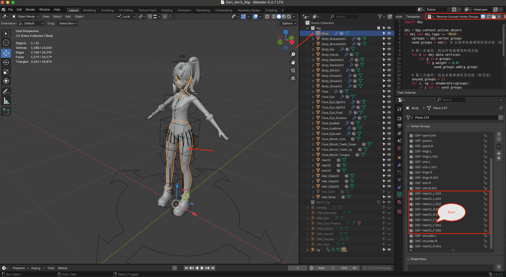

### 权重传递
* 问题描述:两个独立网格(即使两个Mesh属于同一个Object，例如:鞋子和其上的装饰、鞋带等)使用自动权重后，分配的权重不连续，导致独立的相互独立的Mesh形变程度不一致，最终出现`分离`的现象。
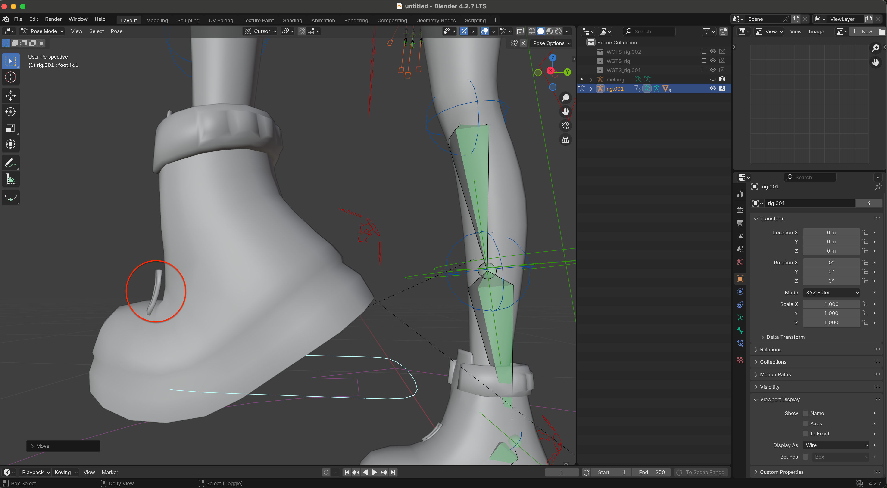
* 原因分析：因为是独立的Mesh，所以即使属于同一个Object，但是其顶点不是连续的，那么`自动权重`给到的权重就不可能是连续的，就会出现上述现象。
* 问题解决(使用权重传递，效果可能不理想):
  1. 模型绑定到骨骼，选择`with empty groups`；
  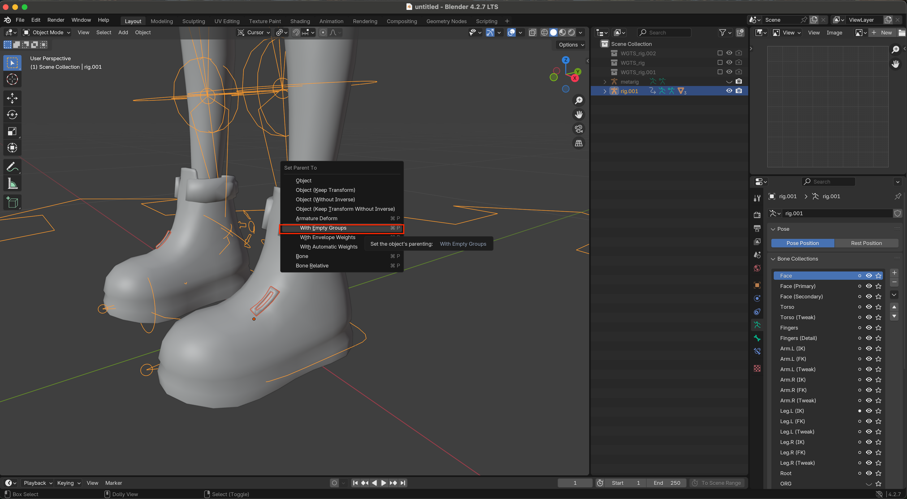
  2. 先点选鞋子(已绘制权重),后点选鞋带(未有权重)，进入`weight paint`模式,使用`weights -> transfer weights`，在弹出的`Transfer Mesh Data`设置面板中，设置`Vertex Mapping`为`Nearest Face Vertex`,设置`Source Layer`为`By Name`。
  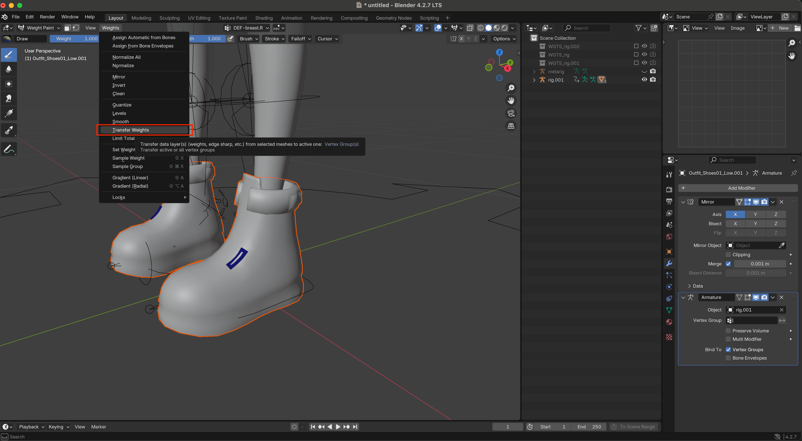
  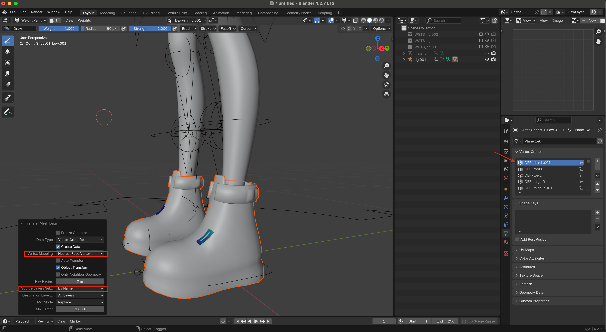
* 问题解决(建议方案)：低模拓扑时，尽量拓扑为一个整体的`封套`，即顶点连续的一个Mesh(参考模型：`绝区零-哲`,`绝区零-安比`,`绝区零-妮可`)。
* 问题解决：若拓扑为一个`封套`过于复杂，可采用手动绘制权重，确保多个Mesh权重的连续性（参考模型:`绝区零-玲`,`绝区零-哲`,`绝区零-安比`，`绝区零-妮可`）。
* 问题总结：实际建模中，多是混合上述方案，尽量将相邻的、贴合的部分拓扑为一个`封套`（例如：鞋带贴合鞋面的部分），将哪些明显突兀的、离散的（例如：鞋带的蝴蝶结部分）独立出一个Mesh。
* 建议：可以导出高低模到Substance Painter中，使用默认封套距离，观察低模拓扑是否可改进。

### 绑定和导出的矛盾
* 问题描述:绑定时为了方便,需要保持各个部分的分离；但是导出时，希望作为一个整体(导入到游戏引擎)。
* 问题解决:为每个部分添加`顶点组`,在使用`control + j`合并后，如果需求变动，仍可以通过`顶点组`方便地分离对象。
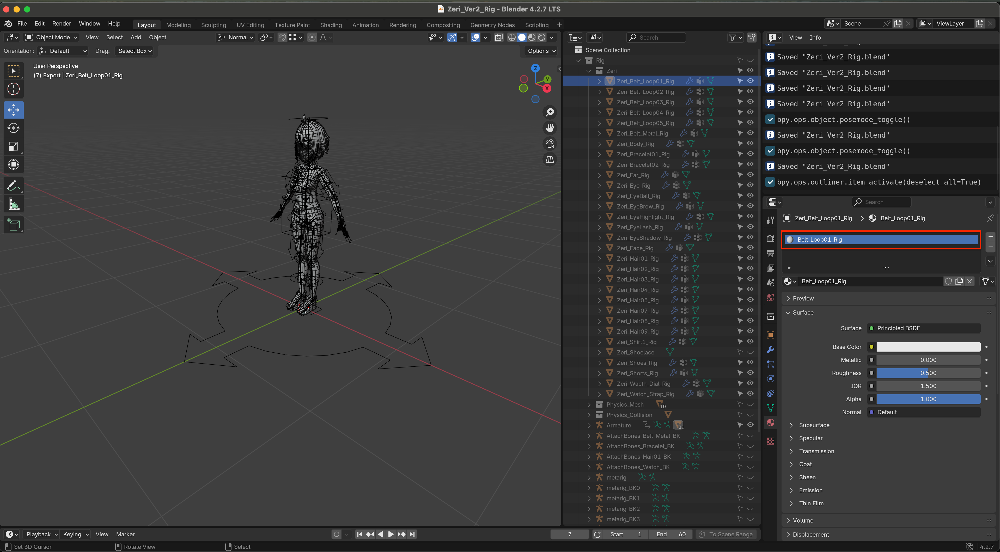
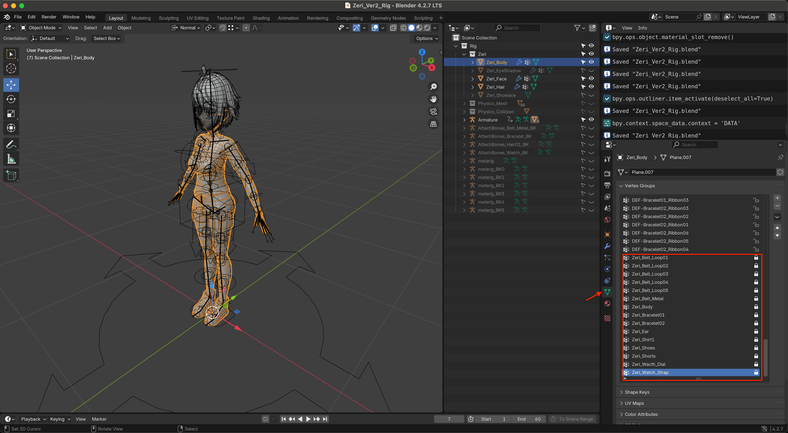
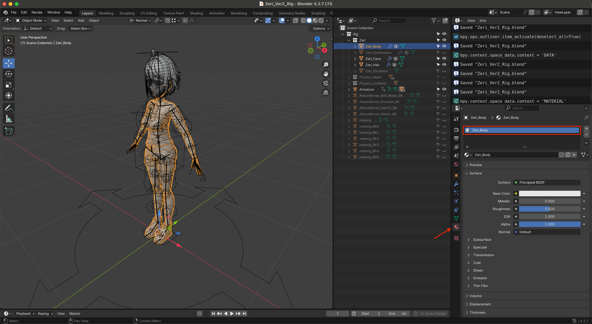
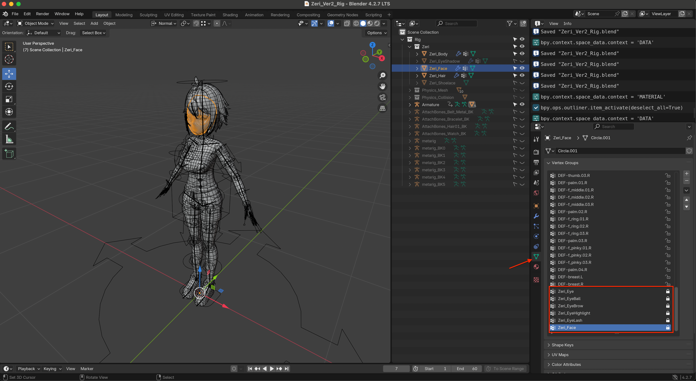
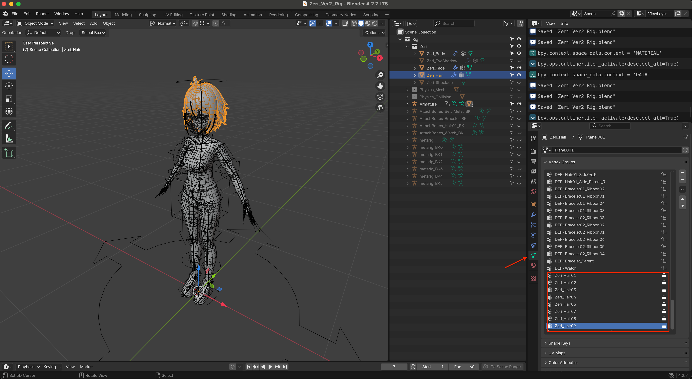
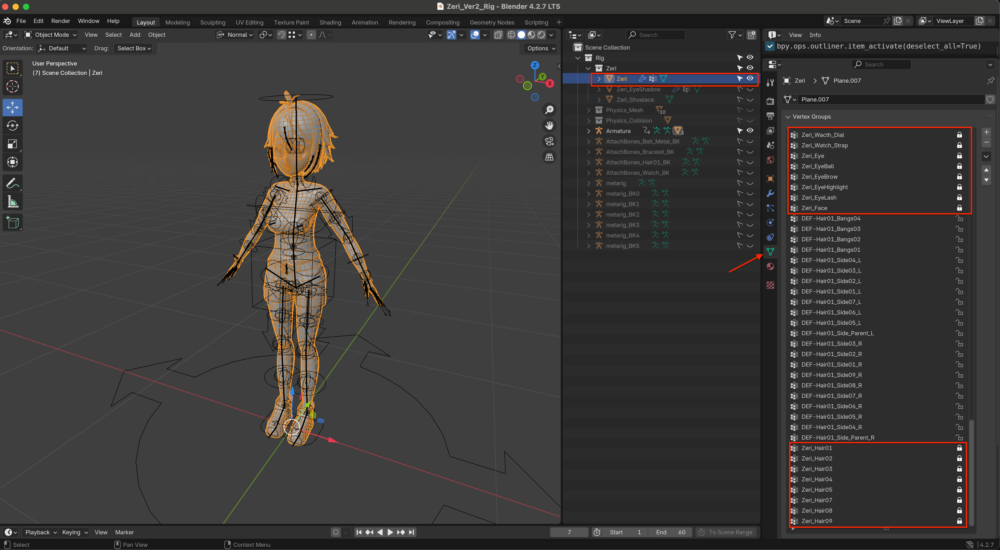
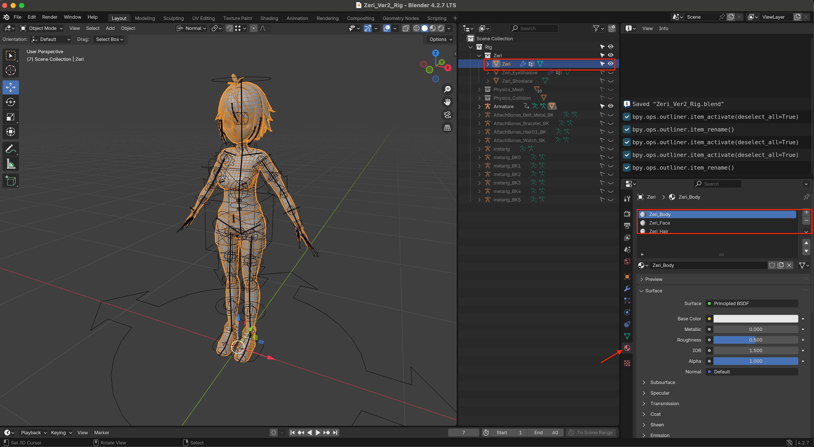
* 注意：当对象很多时，务必使用脚本批量为选中对象添加顶点组，脚本如下:
```
import bpy

def add_vertex_group_to_selected():
    """为所有选中的网格对象添加同名顶点组，权重设为1.0"""
    selected_objects = bpy.context.selected_objects
    
    for obj in selected_objects:
        if obj.type != 'MESH':
            print(f"跳过非网格对象: {obj.name}")
            continue
        
        # 检查是否已存在同名顶点组
        if obj.vertex_groups.get(obj.name):
            print(f"已存在顶点组 '{obj.name}'，跳过")
            continue
        
        # 创建顶点组并设置权重
        vgroup = obj.vertex_groups.new(name=obj.name)
        vgroup.add(range(len(obj.data.vertices)), 1.0, 'REPLACE')
        print(f"已为 {obj.name} 添加顶点组并设置权重=1")

    print("操作完成")

# 执行函数
add_vertex_group_to_selected()
```
* 相应删除这些顶点组的脚本如下（可能会使用到）：
```
import bpy

def remove_vertex_groups_by_object_name():
    """删除选中对象中与对象同名的顶点组"""
    selected_objects = bpy.context.selected_objects
    
    for obj in selected_objects:
        if obj.type != 'MESH':
            print(f"跳过非网格对象: {obj.name}")
            continue
        
        # 查找与对象同名的顶点组
        vgroup = obj.vertex_groups.get(obj.name)
        if vgroup:
            obj.vertex_groups.remove(vgroup)
            print(f"已从 {obj.name} 删除顶点组 '{obj.name}'")
        else:
            print(f"对象 {obj.name} 无同名顶点组，跳过")

    print("删除操作完成")

# 执行函数
remove_vertex_groups_by_object_name()
```

### 表情形态键的制作
* 在`Object Data Properties`页签中，点击`Shape Keys`下的`加号➕`增加一个`Basis`默认基础形态键并将其锁定（此形态键十分重要且不可随意删除，存储未形变的默认网格）。如果需要增加新的形态键,首先需要点击`加号➕`添加一个`Shape Keys Index`并且选中这个“Index”（即设置为`Active`），将新建形态键的`value`值设置为`1`，否则无法观察到变化！之后才能对网格进行变形/雕刻。（注意不可删除/隐藏顶点）
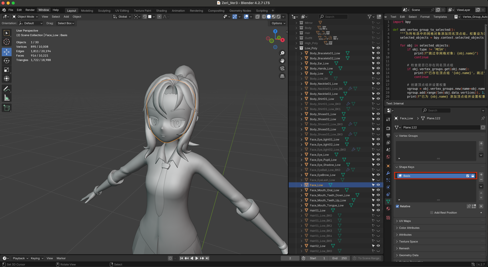
[参考视频：かぐや様は告らせたい 白銀圭 3Dモデリング【Timelapse】](https://www.youtube.com/watch?v=ycVqiR2p8mc&t=3869s)- Facial Expression
* 对称模型可通过镜像形态键减少工作量,例如：左眼眨眼(Blink_L)可镜像到右眼(Blink_R)。
  * 将`Blink_L`的值=1，然后找到`Shape Keys Special`下的`New Shape From Mix`来按照当前的形变创建一个新的形态键索引(`Shape Keys Index`),将新的形态键索引命名为`Blink_R`并重置`Blink_L`的值=0。
  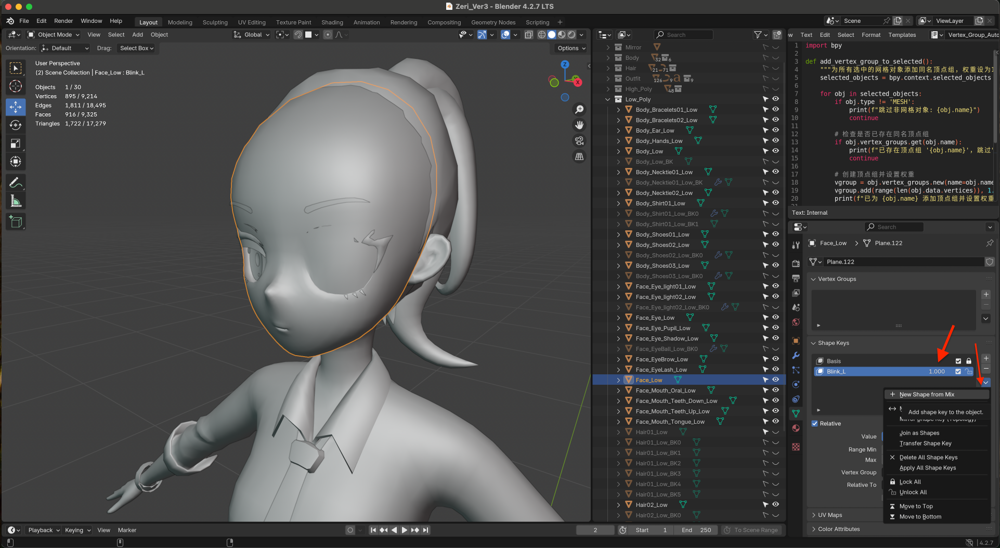
  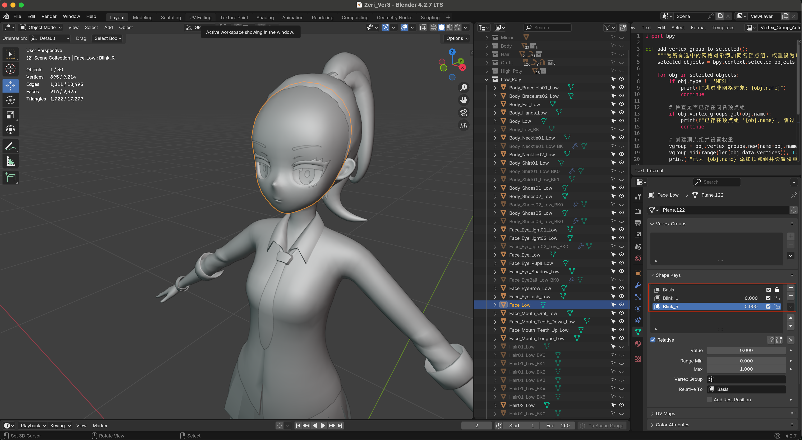
  * 点击新形态键`Blink_R`使其为`Active`状态，找到`Shape Keys Special`下的`Mirror Shape Key`来镜像当前形态键,得到镜像的“右眼眨眼”形态键。
  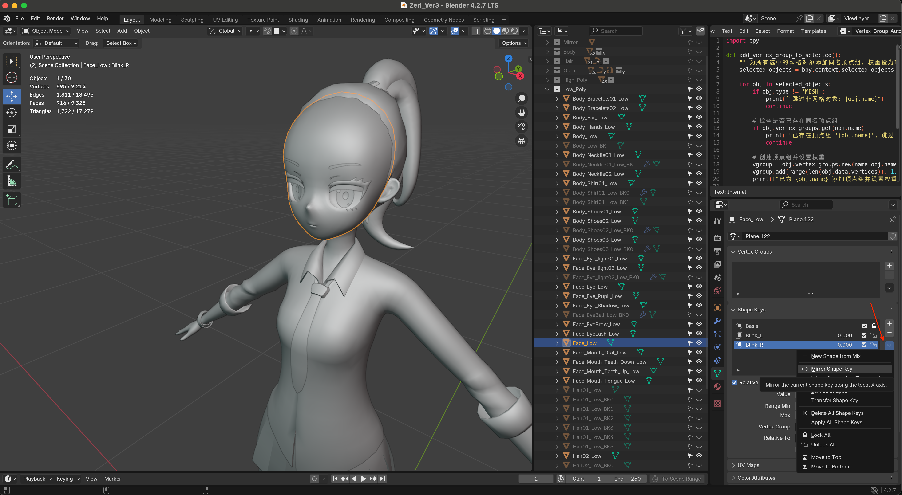
  
  * 依照上述方法，还可以得到“两眼同时眨眼”的形态键。

### 将Mixamo等网站的动画重定向到Rigfy骨架
* 问题描述:对于动画菜鸟的我，充分利用免费或付费的动画可大大降低学习和开发成本。
* 问题解决:使用`Expy Kit`插件来重定向Mixamo动画到Rigfy骨架
  * 下载Mixamo动画,`Format`选择`FBX Binary(.fbx)`,`Skin`选择`With Skin`,`Frames per second`选择`30`，`Keyframe Reduction`选择`None`。
  
  * 导入Mixamo动画,并检查角色的`Rest Pose`是`T Pose`还是`A Pose`
  
  * 调整Rig对象的`当前`Pose(`Rest Pose`依旧保持`A Pose`,无需更改)为`T Pose`,此举可保证重定向的两方起始姿势相同，避免重定向过程中骨骼的不正确旋转。
  
  * 选择需要制作动画的Rig骨架并切换到`Pose Mode`,打开`Expy Kit`面板，设置`Bind To`为导入的Mixamo动画骨骼`Armature`。
  
  * 点击`Bind Armature`,设置`To Bind`为`Rigfy_Controls`,设置`Bind To`为`Mixamo`,并点击`OK`
  
  * 在弹出的`Bind to Active Armature`中设置`Conversion`下拉菜单为`Current Pose is target Rest Pose`。设置`Fit Height`下拉菜单为`Head`。设置`Root Animation`下拉菜单为`Bone`,具体骨骼为`mixamorig:Hips`,只激活骨骼`Location`的`Y`轴（大多数动画的根运动是向前的,例如:走路动画的根运动在Blender中应当向`-Y`轴方向,故将`Root`绑定到`mixamorig:Hips`的Y轴位置可保证根运动重定向的正确）。
  
  * 完成重定向的绑定设置之后，将Mixamo动画的骨架切换回`Pose Position`并观察重定向的结果及检查根运动是否正确(`Shift + Space`可播放`Timeline`动画)
  
  
  * 逐帧检查动画重定向的结果是否正确合理，如重定向结果出现偏差，可通过在源骨架(即Mixamo动画的骨架)的`Retarget Bones`层（该层的所有骨骼均由插件为重定向功能自动生成且后缀名均带有`***_RET`），选择出错的骨骼,并调整该骨骼的位置、旋转等使动画重定向结果正确。(为方便观察,请隐藏不必要的视窗信息,仅保留`Retarget Bones`层骨骼和正在制作动画的Rig模型)
  
  * 重定向无误之后，选择制作动画的骨骼并切换`Pose Mode`,`w`呼出上下文菜单，在`Expy Kit`工具集中，使用`Animation -> Bake Constrainted Actions`烘焙动画。
  
  * 在弹出的`Bake Constrainted Actions`面板中，取消勾选`Stash to NLA stack`,点击`Bake and Exit`完成动画烘焙。
  * 将`Timeline`视窗类型切换到`Dope Sheet`下的`Action Editor`查看相应的`Action`。
  

### 导出FBX模型文件到游戏引擎
* 另见下文 **导出FBX动画文件到游戏引擎**。不同点在于无需重命名场景，无需导出`Animation`。

### 导出FBX动画文件到游戏引擎
* 切换到当前需要导出的Action,并且更改场景名称(导出的FBX文件中，场景名称对应动画切片的名称，命名规则可以形如:`Zeri_Walking01`)

* 导出窗口:`Include`选项卡下，设置`Limit To`为`Selected Objects`、设置`Object Types`为`Armature` + `Mesh`;

* 导出窗口:`Transform`选项卡下,设置`Forward`为`-Y Forward`,`Up`应该会自动更改为`Z Up`(如果没有，需手动更改)，取消勾选`Apply Space Transform`;

* 导出窗口:`Geometry`选项卡下，保持默认设置
* 导出窗口:`Armature`选项卡下，勾选`Only Deform Bones`,取消勾选`Add Leaf Bones`，其余保持默认设置。

* 导出窗口:`Animation`选项卡下,取消勾选`Key All Bones`（不需要为所有骨骼在每一帧都生成关键帧）,取消勾选`NLA Strips`,取消勾选`All Actions`（只导出当前Action，且由于工程分文件，一个文件只包含一个Action动画）,勾选`Force Start/End Keying`（在动画的起始帧和结束帧强制插入关键帧，即使这些帧处原本没有关键帧，例如：一段30帧的行走动画第1帧和第30帧。如果动画需要在游戏引擎中循环播放，例如角色的`Idle`动画，勾选此项可以确保动画的平滑过渡）。

* 导出的FBX动画文件命名规则,可以形如:`@Zeri_Walking01`或`@ZeriWalking01`或`Zeri_Walking01_Animation`
* 如果游戏有换装功能，这里选择导出的骨骼和模型对象会有所不同(后补)

### Unity游戏引擎导入FBX模型文件
* 另见下文 **Unity游戏引擎导入FBX动画文件**，不同点在于导入模型FBX时，在`Rig`选项卡下，需要创建人物的`Avatar`:`Animation Type`下拉菜单选择`Generic`，`Avatar Definition`下拉菜单选择`Create From this Model`,`Root Node`下拉菜单选择根骨骼`Armature/Root`。


### Unity游戏引擎导入FBX动画文件
* 在FBX的`Inspector`面板中,`Model`选项卡下:勾选`Bake Axis Conversion`，取消勾选`Import Visibility`,取消勾选`Import Camera`，取消勾选`Import Light`；

* 在FBX的`Inspector`面板中,`Rig`选项卡下:`Animation Type`下拉菜单选择`Generic`（为何不使用`Humanoid`类型？因为导入动画会有`Lower Retargeting Quality`警告，并且我们暂时不会使用`Humanoid`的动画重定向功能,至于`Humanoid IK`功能也不是必须的，我们可以在`Generic`类型上自定义脚部的`IK`功能）;`Avatar Definition`下拉菜单选择`Copy From Other Avatar`;`Source`选择对应人物模型所生成的`Avatar`。

* 在FBX的`Inspector`面板中,`Animation`选项卡下:`Anim Compression`下拉菜单选择`Optimal`(Unity会自动选择动画的压缩方式，同时保持较高的动画质量),对于需要循环播放的动画(例如:Idle、Walking)勾选`Loop Time`，是否需要勾选`Loop Pose`，取决于动画的起始帧和结束帧是否一致，当起始帧和结束帧不一致时(例如角色的Idle动画)，需要勾选`Loop Pose`以使动画循环平滑过渡；关于`Root Transform ***`相关是否勾选，可参考视频: [Root Motion Explained (Unity Tutorial)](https://www.youtube.com/watch?v=Xl_5roq4UlI&list=WL&index=24)

* 在FBX的`Inspector`面板中,`Material`选项卡下:`Material Creation Mode`下拉菜单设置为`None`。


### 游戏引擎导入FBX角色模型文件后，骨骼层级中仍保留有Rigfy的控制骨
* 问题描述:尽管在导出FBX模型文件时已经勾选了`Only Deform Bones`但是导入游戏引擎之后骨架中仍然包含控制骨(前缀为`MCH`),我们希望最后导出的骨架只包含形变骨(前缀为`DEF`)

* 问题解决:使用`Expy Kit`插件重新组织骨架骨骼的层级关系，使导出的FBX模型骨架转换为对游戏引擎友好。具体:选择需要转换的骨架并切换到`Pose Mode`,`w`呼出上下文菜单，找到`Expy Kit`工具集的下的`Conversion -> Rigfy Game Friendly`。


* 注意:若后续源骨架`metarig`变动(例如：增加了用于头发模拟物理的骨骼)，再通过`metarig`的`Re-Generate Rig`重新生成`Rigfy`骨架，再次使用插件的骨骼转换功能也是可行的(但存在风险:由于骨架骨骼变动,所以可能导致新的`Rigfy`骨架经过插件的骨骼变换之后，新骨架的层级关系可能和旧骨架的层级关系不再相同，进而导致关联此Rig的动画文件的动画出现异常,丢失动画数据;为了避免这种情况，应该在制作动画之前,完成所有骨骼的添加工作,包括：头发、飘带、小物件等，并且锁定骨骼不被修改。如果不幸还是遇到这种情况,首先请做好文件的备份，然后尝试在动画文件中重新关联新骨架。)

### 重新组织文件的目录结构后，导致link关联文件丢失。
* 问题描述：被关联的文件路径未改变，改变了操作关联的文件路径，导致工程出现问题。blender提示“`1 libraries and 318 linked data-blocks are missing(...)`”。

* 问题解决:在`Outliner`视窗将`Dispaly Mode`切换到`Blender File`，找到丢失链接的`Library`,`右键 -> 上下文菜单 -> Relocate`。再次选择需要关联的文件。

* 注意: 关联文件和被关联文件路径均不可随意变动。

# Unity优化建议
* Optimize your geometry: don’t use any more triangles than necessary, and try to keep the number of UV mapping seams and hard edges (doubled-up vertices) as low as possible. For more information, see [Creating models for optimal performance](https://docs.unity3d.com/2022.3/Documentation/Manual/ModelingOptimizedCharacters.html).
* Use the Level Of Detail system.