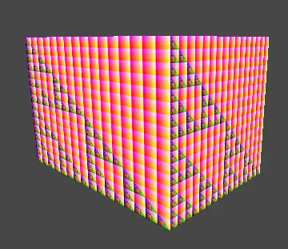

> ### **前言**
Compute Shader和其他Shader一样是运行在GPU上的，但是它是**独立于渲染管线之外**的。我们可以利用它实现**大量且并行**的GPGPU算法，用来加速我们的游戏。

在Unity中，我们在Project中右键，即可创建出一个Compute Shader文件：  


生成的文件属于一种Asset文件，并且都是以 **.compute**作为文件后缀的。

我们来看下里面的默认内容：

```
#pragma kernel CSMain

RWTexture2D<float4> Result;

[numthreads(8,8,1)]
void CSMain (uint3 id : SV_DispatchThreadID)
{
    Result[id.xy] = float4(id.x & id.y, (id.x & 15)/15.0, (id.y & 15)/15.0, 0.0);
}
```

本文的主要目的就是让和我一样的萌新能够看懂这区区几行代码的含义，学好了基础才能够看更牛的代码。

> ### **语言**

Unity使用的是DirectX 11的HLSL语言，会被自动编译到所对应的平台。

> ### **kernel**

然后我们来看看第一行：

```
#pragma kernel CSMain
```

CSMain其实就是一个函数，在代码后面可以看到，而kernel是内核的意思，这一行即把一个名为CSMain的函数声明为内核，或者称之为核函数。这个核函数就是最终会在GPU中被执行。

一个Compute Shader中**至少要有一个kernel才能够被唤起**。声明方法即为：  
#pragma kernel functionName

我们也可用它在一个Compute Shader里声明多个内核，此外我们还可以再该指令后面定义一些预处理的宏命令，如下：  
#pragma kernel KernelOne SOME\_DEFINE DEFINE\_WITH\_VALUE=1337  
#pragma kernel KernelTwo OTHER\_DEFINE

我们不能把注释写在该命令后面，而应该换行写注释，例如下面写法会造成编译的报错：  
#pragma kernel functionName // 一些注释

> ### **RWTexture2D**

接着我们再来看看第二行：

```
RWTexture2D<float4> Result;
```

看着像是声明了一个和纹理有关的变量，具体来看一下这些关键字的含义。

RWTexture2D中，RW其实是**Read**和**Write**的意思，Texture2D就是二维纹理，因此它的意思就是**一个可以被Compute Shader读写的二维纹理**。

如果我们只想读不想写，那么可以使用Texture2D的类型。

我们知道纹理是由一个个像素组成的，每个像素都有它的下标，因此我们就可以通过像素的下标来访问它们，例如：Result\[uint2(0,0)\]。

同样的每个像素会有它的一个对应值，也就是我们要读取或者要写入的值。这个值的类型就被写在了<>当中，通常对应的是一个RGBA的值，因此是float4类型。通常情况下，我们会在Compute Shader中处理好纹理，然后在FragmentShader中来对处理后的纹理进行采样。

这样我们就大致理解这行代码的意思了，声明了一个名为Result的可读写二维纹理，其中每个像素的值为float4。

在Compute Shader中可读写的类型除了**RWTexture**以外还有**RWBuffer**和**RWStructuredBuffer**，后面会介绍。

[RWTexture2D - Win32 apps](https://link.segmentfault.com/?enc=q0rER7EsCA3VTzKTvKBEnQ%3D%3D.a9UrdPKMTvEG65E4noa9JX95i756XVHc2dmfgsARWVsd3ZzGqNooBxW%2FrThek8d871lMxw0%2BKt0EXwR549UoMs1Pg%2BNyN2uzOpm1lkMVTeHzdRVada1TVl5VPgqYugHQ)

> ### **numthreads**

然后是下面一句（很重要！）：

```
[numthreads(8,8,1)]
```

又是num，又是thread的，肯定和线程数量有关。没错，它就是定义**一个线程组（Thread Group）中可以被执行的线程（Thread）总数量**，格式如下：  
numthreads(tX, tY, tZ)  
注：X，Y，Z前加个t方便和后续Group的X，Y，Z进行区分

其中tX*tY*tZ的值即线程的总数量，例如numthreads(4, 4, 1)和numthreads(16, 1, 1)都代表着有16个线程。那么为什么不直接使用numthreads(num)这种形式定义，而非要分成tX、tY、tZ这种三维的形式呢？看到后面自然就懂其中的奥秘了。

**每个核函数前面我们都需要定义numthreads**，否则编译会报错。

其中tX，tY，tZ三个值也并不是可以随便乱填的，比如来一刀tX=99999暴击一下，这是不行的。它们在不同的版本里有如下的约束：  


在Direct11中，可以通过**ID3D11DeviceContext::Dispatch(gX,gY,gZ)**方法创建gX*gY*gZ个线程组，一个线程组里又会包含多个线程（数量即numthreads定义）。

注意顺序，**先numthreads定义好每个核函数对应线程组里线程的数量（tX*tY*tZ），再用Dispatch定义用多少线程组（gX*gY*gZ）来处理这个核函数**。其中每个线程组内的线程都是并行的，不同线程组的线程可能同时执行，也可能不同时执行。一般一个GPU同时执行的线程数，在1000-10000之间。

接着我们用一张示意图来看看线程与线程组的结构，如下图：  


上半部分代表的是线程组结构，下半部分代表的是单个线程组里的线程结构。因为他们都是由（X,Y,Z）来定义数量的，因此就像一个三维数组，下标都是从0开始。我们可以把它们看做是表格一样：**有Z个一样的表格，每个表格有X列和Y行**。例如线程组中的（2,1,0），就是第1个表格的第2行第3列对应的线程组，下半部分的线程也是同理。

搞清楚结构，我们就可以很好的理解下面这些与单个线程有关的参数含义：  


这里需要注意的是，不管是Group还是Thread，它们的**顺序都是先X再Y最后Z**，用表格的理解就是先行（X）再列（Y）然后下一个表（Z），例如我们tX=5，tY=6那么第1个thread的SV\_GroupThreadID=(0,0,0)，第2个的SV\_GroupThreadID=(1,0,0)，第6个的SV\_GroupThreadID=(0,1,0)，第30个的SV\_GroupThreadID=(4,5,0)，第31个的SV\_GroupThreadID=(0,0,1)。Group同理，搞清顺序后，SV\_GroupIndex的计算公式就很好理解了。

再举个例子，比如SV\_GroupID为（0,0,0）和（1,0,0）的两个Group，它们内部的第1个Thread的SV\_GroupThreadID都为（0,0,0）且SV\_GroupIndex都为0，但是前者的SV\_DispatchThreadID=(0,0,0)而后者的SV\_DispatchThreadID=(tX,0,0)。

好好理解下，它们在核函数里非常的重要。  
[numthreads - Win32 apps](https://link.segmentfault.com/?enc=niaIx7G6MvtK%2F8Y8P0oKUg%3D%3D.PJEGfGEha3iX2%2BwxPeq90kqfwGMB3LwOw4A6t4Fnenk62rADdVNuhRsUyFhP9cQMoTDTzQW%2BkFTEG6g6yyLzGurDTH0%2BGFRgI%2FDuc%2FiROtQHL9DKS42r%2FUp4dfiY8hUq)

> ### **核函数**

```
void CSMain (uint3 id : SV_DispatchThreadID)
{
    Result[id.xy] = float4(id.x & id.y, (id.x & 15)/15.0, (id.y & 15)/15.0, 0.0);
}
```

最后就是我们声明的核函数了，其中参数SV\_DispatchThreadID的含义上面已经介绍过了，除了这个参数以外，我们前面提到的几个参数都可以被传入到核函数当中，根据实际需求做取舍即可，完整如下：

```
void KernelFunction(uint3 groupId : SV_GroupID,
    uint3 groupThreadId : SV_GroupThreadID,
    uint3 dispatchThreadId : SV_DispatchThreadID,
    uint groupIndex : SV_GroupIndex)
{

}
```

而函数内执行的代码就是为我们Texture中下标为id.xy的像素赋值一个颜色，这里也就是最牛的地方。

举个例子，以往我们想要给一个x\*y分辨率的Texture每个像素进行赋值，单线程的情况下，我们的代码往往如下：

```
for (int i = 0; i < x; i++)
    for (int j = 0; j < y; j++)
        Result[uint2(x, y)] = float4(a, b, c, d);
```

两个循环，像素一个个的慢慢赋值。那么如果我们要每帧给很多张2048\*2048的图片进行操作，可想而知会卡死。

如果使用多线程，为了避免不同的线程对同一个像素进行操作，我们往往使用分段操作的方法，如下，四个线程进行处理：

```
void Thread1()
{
    for (int i = 0; i < x/4; i++)
        for (int j = 0; j < y/4; j++)
            Result[uint2(x, y)] = float4(a, b, c, d);
}

void Thread2()
{
    for (int i = x/4; i < x/2; i++)
        for (int j = y/4; j < y/2; j++)
            Result[uint2(x, y)] = float4(a, b, c, d);
}

void Thread3()
{
    for (int i = x/2; i < x/4*3; i++)
        for (int j = x/2; j < y/4*3; j++)
            Result[uint2(x, y)] = float4(a, b, c, d);
}

void Thread4()
{
    for (int i = x/4*3; i < x; i++)
        for (int j = y/4*3; j < y; j++)
            Result[uint2(x, y)] = float4(a, b, c, d);
}
```

这么写不是很蠢么，如果有更多的线程，分成更多段，不就一堆重复的代码。但是如果我们能知道每个线程的开始和结束下标，不就可以把这些代码统一起来了么，如下：

```
void Thread(int start, int end)
{
    for (int i = start; i < end; i++)
        for (int j = start; j < end; j++)
            Result[uint2(x, y)] = float4(a, b, c, d);
}
```

那我要是可以开出很多很多的线程是不是就可以一个线程处理一个像素了？

```
void Thread(int x, int y)
{
    Result[uint2(x, y)] = float4(a, b, c, d);
}
```

用CPU我们做不到这样，但是用GPU，用Compute Shader我们就可以。实际上，前面默认的Compute Shader的代码里，核函数的内容就是这样的。

接下来我们来看看Compute Shader的妙处，看**id.xy**的值。id的类型为SV\_DispatchThreadID，我们先来回忆下SV\_DispatchThreadID的计算公式：  
假设该线程的SV\_GroupID=(a, b, c)，SV\_GroupThreadID=(i, j, k) 那么SV\_DispatchThreadID=(a*tX+i, b*tY+j, c\*tZ+k)

首先前面我们使用了\[numthreads(8,8,1)\]，即tX=8，tY=8，tZ=1，且i和j的取值范围为0到7，而k=0。那么我们线程组（0,0,0）中所有线程的SV\_DispatchThreadID.xy也就是id.xy的取值范围即为（0,0）到（7,7），线程组（1,0,0）中它的取值范围为（8,0）到（15, 7），...，线程（0,1,0）中它的取值范围为（0,8）到（7,15），...，线程组（a,b,0）中它的取值范围为（a*8, b*8, 0）到（a*8+7,b*8+7,0）。

我们用示意图来看下，假设下图每个网格里包含了64个像素：  


也就是说我们每个线程组会有64个线程同步处理64个像素，并且不同的线程组里的线程不会重复处理同一个像素，若要处理分辨率为1024\*1024的图，我们只需要dispatch(1024/8, 1024/8, 1)个线程组。

这样就实现了成百上千个线程同时处理一个像素了，若用CPU的方式这是不可能的。是不是很妙？

而且我们可以发现numthreads中设置的值是很值得推敲的，例如我们有4\*4的矩阵要处理，设置numthreads(4,4,1)，那么每个线程的SV\_GroupThreadID.xy的值不正好可以和矩阵中每项的下标对应上么。

我们在Unity中怎么调用核函数，又怎么dispatch线程组以及使用的RWTexture又怎么来呢？这里就要回到我们C#的部分了。

> ### **C#部分**

以往的vertex&fragment shader，我们都是给它关联到Material上来使用的，但是Compute Shader不一样，它是由**C#**来驱动的。

先新建一个monobehaviour脚本，Unity为我们提供了一个**Compute Shader**的类型用来引用我们前面生成的 .compute 文件：

```
public ComputeShader computeShader;
```

  
在Inspector界面关联.compute文件

此外我们再关联一个Material，因为Compute Shader处理后的纹理，依旧要经过Fragment Shader采样后来显示。  
public Material material;

这个Material我们使用一个Unlit Shader，并且纹理不用设置，如下：  


然后关联到我们的脚本上，并且随便建个Cube也关联上这Material。

接着我们可以将Unity中的**RenderTexture**赋值到Compute Shader中的RWTexture2D上，但是需要注意因为我们是多线程处理像素，并且这个处理过程是无序的，因此我们要将RenderTexture的**enableRandomWrite**属性设置为true，代码如下：

```
RenderTexture mRenderTexture = new RenderTexture(256, 256, 16);
mRenderTexture.enableRandomWrite = true;
mRenderTexture.Create();
```

我们创建了一个分辨率为256\*256的RenderTexture，首先我们要把它赋值给我们的Material，这样我们的Cube就会显示出它。然后要把它赋值给我们Compute Shader中的Result变量，代码如下：

```
material.mainTexture = mRenderTexture;
computeShader.SetTexture(kernelIndex, "Result", mRenderTexture);
```

这里有一个kernelIndex变量，即核函数下标，我们可以利用FindKernel来找到我们声明的核函数的下标：

```
int kernelIndex = computeShader.FindKernel("CSMain");
```

这样在我们FragmentShader采样的时候，采样的就是Compute Shader处理过后的纹理：

```
fixed4 frag (v2f i) : SV_Target
{
    // _MainTex 就是被处理后的 RenderTexture
    fixed4 col = tex2D(_MainTex, i.uv);
    return col;
}
```

最后就是开线程组和调用我们的核函数了，在Compute Shader中，Dispatch方法为我们一步到位：

```
computeShader.Dispatch(kernelIndex, 256 / 8, 256 / 8, 1);
```

为什么是256/8，前面已经解释过了。来看看效果：  


上图就是我们Unity默认生成的Compute Shader代码所能带来的效果，我们也可试下用它处理2048\*2048的Texture，也是非常快的。

* * *

从上面最基础的例子中，我们可以看出，Compute Shader中的数据都是由C#传递过来的，也就是说**数据要从CPU传递到GPU**。并且在Compute Shader处理结束后**又要从GPU传回CPU**。这样可能会有点延迟，而且它们之间的传输速率也是一个瓶颈。

但是如果我们有大量的计算需求，不要犹豫，请使用Compute Shader，对性能能有很大的提升。

> ### **UAV（Unordered Access view）**

Unordered是无序的意思，Access即访问，view代表的是“data in the required format”，应该可以理解为数据所需要的格式吧。

什么意思呢？我们的Compute Shader是多线程并行的，因此我们的数据必然需要能够支持被无序的访问。例如，如果纹理只能被（0,0），（1,0），（2,0），...，Buffer只能被［0］，［1］，［2］，...这样有序访问，那么想要用多线程来修改它们明显不行，因此提出了一个概念，即**UAV，可无序访问的数据格式**。

前面我们提到了RWTexture，RWStructuredBuffer这些类型都属于UAV的数据类型，并且它们**支持在读取的同时写**入。它们只能在FragmentShader和ComputeShader中被使用（绑定）。

如果我们的RenderTexture不设置enableRandomWrite，或者我们传递一个Texture给RWTexture，那么运行时就会报错：  
the texture wasn't created with the UAV usage flag set!

不能被读写的数据类型，例如Texure2D，我们称之为**SRV（Shader Resource View）**。

[Direct3D 12 术语表 - Win32 apps](https://link.segmentfault.com/?enc=UuzZz45i0nD0OqT75XhX6g%3D%3D.ZcFK9Hnd8tXvdGYBkHr2T3QHTR3Z%2Fg%2FHjSRdDsvJUKAElT8lS5ziaA49KiQS5rFSsde%2B4yooO2Mio6rEbqxO6J05En3FtMCaR9sAPbYtei0%3D)

> ### **Wrap / WaveFront**

前面我们说了使用numthreads可以定义每个线程组内线程的数量，那么我们使用numthreads(1,1,1)真的每个线程组只有一个线程嘛？NO！

这个问题要从硬件说起，我们GPU的模式是**SIMT**（single-instruction multiple-thread，单指令多线程）。在NVIDIA的显卡中，一个**SM（Streaming Multiprocessor）**可调度多个wrap，而每个wrap里会有32个线程。我们可以简单的理解为一个指令最少也会调度32个并行的线程。而在AMD的显卡中这个数量为64，称之为Wavefront。

也就是说如果是NVIDIA的显卡，如果我们使用numthreads(1,1,1)，那么线程组依旧会有32个线程，但是多出来的31个线程完全就处于没有使用的状态，造成浪费。因此我们在使用numthreads时，最好将线程组的数量定义为64的倍数，这样两种显卡都可以顾及到。

[](https://link.segmentfault.com/?enc=rNVHkdPrTrPFWPtBEynBmg%3D%3D.JkVDd1N6tmFVyjh%2FQYKRWLPjfGG9oD8uhRcT71IvVHKyW8p0U8dtlZYhmrb4uqgvO2muDBF3hwvSAqEHh9bZqrAJj8tHkt7xmqPA1E60TTo%3D)[https://www.cvg.ethz.ch/teach...](https://link.segmentfault.com/?enc=%2Fy1yaHspKFCbJcDBWP%2B4nQ%3D%3D.opEOKnXXXBwCpKzJZGHqWjsCLT2lERRz9xLJwfLHI8Gtoyh4BHUpHLH%2FSowWvL8olQuwmAnVJMjLVDXdsCqnBxbOevFIsTA2ws9lMyhwWIA%3D)

> ### **移动端支持问题**

我们可以运行时调用**SystemInfo.supportsComputeShaders**来判断当前的机型是否支持Compute Shader。其中OpenGL ES从3.1版本才开始支持Compute Shader，而使用Vulkan的Android平台以及使用Metal的IOS平台都支持Compute Shader。

然而有些Android手机即使支持Compute Shader，但是对RWStructuredBuffer的支持并不友好。例如在某些OpenGL ES 3.1的手机上，只支持Fragment Shader内访问StructuredBuffer。

在普通的Shader中要支持Compute Shader，Shader Model最低要求为4.5，即：

```
#pragma target 4.5
```

**利用Compute Shader实现视椎剔除**  
[《Unity中使用Compute Shader做视锥剔除（View Frustum Culling）》](https://link.segmentfault.com/?enc=gVSHvx0P43X94Wb9JOAUdg%3D%3D.TN8NP%2F33ZcZHIJSyrxa0XgcmcdO6mB2u7cpGF8N0oDd%2BjHHdl12KjnMu1weZJMGN)

**利用Compute Shader实现Hi-z遮挡剔除**  
[《Unity中使用Compute Shader实现Hi-z遮挡剔除（Occlusion Culling）》](https://link.segmentfault.com/?enc=PHJQ9oX4LG2B4fIozESEiQ%3D%3D.17nJjKZU8On3vVgOvB0C7%2FOD1hID6hjolCALV%2BlAYuLAWb7FyJbkwjxxEfG8Qbbk)

> ### **Shader.PropertyToID**

在Compute Shader中定义的变量依旧可以通过 Shader.PropertyToID("name") 的方式来获得唯一id。这样当我们要频繁利用ComputeShader.SetBuffer对一些相同变量进行赋值的时候，就可以把这些id事先缓存起来，避免造成GC。

```
int grassMatrixBufferId;
void Start() {
    grassMatrixBufferId = Shader.PropertyToID("grassMatrixBuffer");
}
void Update() {
    compute.SetBuffer(kernel, grassMatrixBufferId, grassMatrixBuffer);

    // dont use it
    //compute.SetBuffer(kernel, "grassMatrixBuffer", grassMatrixBuffer);
}
```

> ### **全局变量或常量？**

假如我们要实现一个需求，在Compute Shader中判断某个顶点是否在一个固定大小的包围盒内，那么按照以往C#的写法，我们可能如下定义包围盒大小：

```
#pragma kernel CSMain

float3 boxSize1 = float3(1.0f, 1.0f, 1.0f); // 方法1
const float3 boxSize2 = float3(2.0f, 2.0f, 2.0f); // 方法2
static float3 boxSize3 = float3(3.0f, 3.0f, 3.0f); // 方法3

[numthreads(8,8,1)]
void CSMain (uint3 id : SV_DispatchThreadID)
{
    // 做判断
}
```

经过测试，其中方法1和方法2的定义，在CSMain里读取到的值都为 float3(0.0f,0.0f,0.0f) ，只有方法3才是最开始定义的值。

> ### **Shader variants and keywords**

ComputeShader同样支持[Shader变体](https://link.segmentfault.com/?enc=30ny1lRnaj6ExcU1Pf336Q%3D%3D.pbgoWYUQ4m%2Fwsx7zhdjpOmMsX%2B0tl%2BVpTuSwDIw4IecPfqshs%2Bp0k9AP9J7sa0z%2FgxUU5wxlCNIdzfEoZWz%2FWxOZlKzZkh9CQe16mj3WLqCk1z2dnZy18KJL3JIsFIdG)，用法和普通的Shader变体基本相似，示例如下：

```
#pragma kernel CSMain
#pragma multi_compile __ COLOR_WHITE COLOR_BLACK

RWTexture2D<float4> Result;

[numthreads(8,8,1)]
void CSMain (uint3 id : SV_DispatchThreadID)
{
#if defined(COLOR_WHITE)
Result[id.xy] = float4(1.0, 1.0, 1.0, 1.0);
#elif defined(COLOR_BLACK)
Result[id.xy] = float4(0.0, 0.0, 0.0, 1.0);
#else
Result[id.xy] = float4(id.x & id.y, (id.x & 15) / 15.0, (id.y & 15) / 15.0, 0.0);
#endif
}
```

然后我们就可以在C#端启用或禁用某个变体了：  
#pragma multi\_compile 声明的全局变体可以使用Shader.EnableKeyword/Shader.DisableKeyword或者ComputeShader.EnableKeyword/ComputeShader.DisableKeyword

#pragma multi\_compile\_local 声明的局部变体可以使用ComputeShader.EnableKeyword/ComputeShader.DisableKeyword

示例如下：

```
public class DrawParticle : MonoBehaviour
{
    public ComputeShader computeShader;

    void Start() {
        ......
        computeShader.EnableKeyword("COLOR_WHITE");
    }
}
```