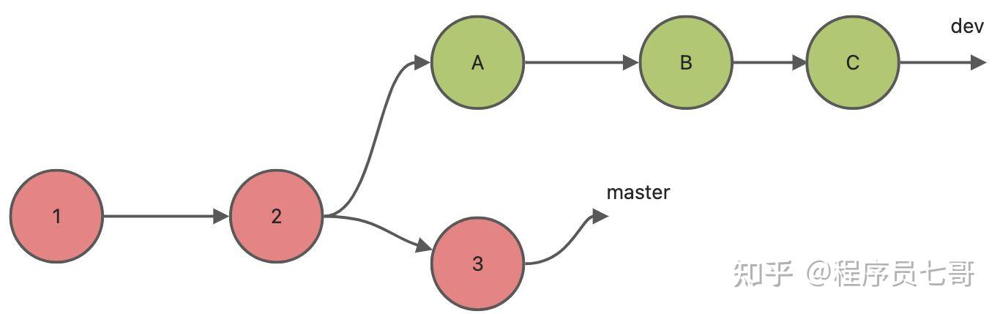
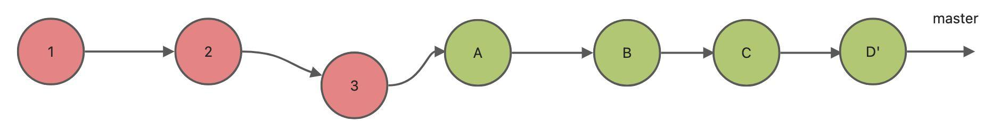
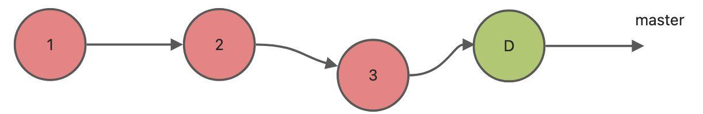
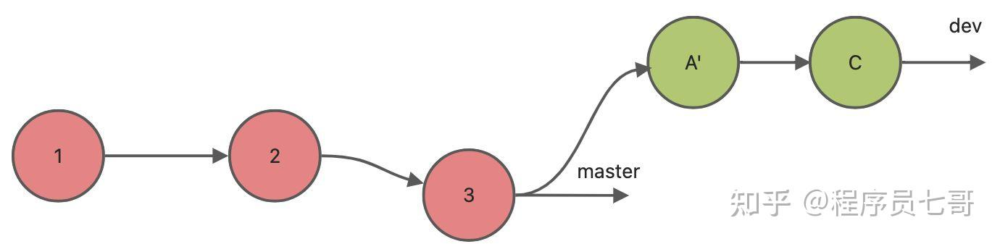
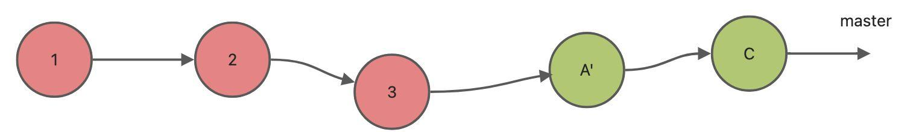

# Github 操作规范及常见问题整理

### 新建本地仓库并推送到远端
---
参考：[将本地代码托管到GitHub](https://docs.github.com/zh/migrations/importing-source-code/using-the-command-line-to-import-source-code/adding-locally-hosted-code-to-github)

### 移除远端文件或目录
---
```shell
git rm [-r] --cached 'dir/files'
git commit -m "message"
git push origin 'remote branch'
```

### 分支合并
---
参考：[Git分支合并：merge、squash、rebase](https://zhuanlan.zhihu.com/p/519497650)

项目场景假设：我们完成了`develop`分支的开发测试工作，需要把`develop`分支合并回`main`分支


#### 合并方式：merge (Create a merge commit)
<div style="margin-left: 2em"> <!--代码块的缩进-->

```shell
git checkout main
git merge develop
```
</div>

* `Git`会在`main`分支上创建一个新的合并提交（merge commit）,包含完整的提交历史记录
* 缺点：历史会有很多“合并节点”，`log`看起来可能比较乱
* 合并代码到公共分支时，应当使用`merge`，而不应使用`rebase`，否则会让别人本地仓库冲突


#### 合并方式：squash (Squash and merge)
* 由于在`develop`分支上执行的是开发工作，有一些很小的提交，或者是纠正前面的错误的提交。这些所有不必单独显示出来的提交可以合并成一个提交，然后提交到`main`分支
* `squash`并不会替我们产生提交D（见下图），它只是把所有原本属于A、B和C的改动合并，然后放在本地文件，需要你再次手动执行`git commit`操作（注意：该`commit`是你产生的，不是原来`develop`分支上的开发人员产生的，提交者本身发生了变化）
* 缺点：`squash`会变更提交者作者信息，这是一个很大的问题，后期问题追溯不好处理


#### 合并方式：Rebase
<div style="margin-left: 2em">

```shell
git checkout develop
git rebase -i main
git checkout main
git merge develop
```
</div>

* `Rebase -i`会弹出文本编辑框，允许你手动调整`commit`历史，来决定是否合并以及如何合并
<div style="margin-left: 2em">

```
pick <A> Message for commit #1
pick <B> Message for commit #2
pick <C> Message for commit #3
```
</div>

* 假设提交B是对提交A的一个拼写错误修正，因此可以不需要显式的指出来，我们把B修改为`fixup`
<div style="margin-left: 2em">

```
pick <A> Message for commit #1
fixup <B> Message for commit #2
pick <C> Message for commit #3
```
</div>

* `rebase`会把`develop`分支上的提交“重新播放”到`main`分支的最新提交之后，就像你直接在`main`分支上开发的一样，历史干净（下图中，A'是A和B的合并）：

* 最后将`develop`分支合并到`main`分支

* 缺点：`rebase`会改写提交历史（新的`commit id`），所以不能随便对公共分支做`rebase`，否则会让别人本地仓库冲突
* 合并代码到个人分支时，应使用`rebase`，可以不污染分支的提交记录，形成简洁的线性提交历史记录

#### 项目开发规范流程
* 确保`main`分支是最新的
<div style="margin-left: 2em"> <!--代码块的缩进-->

```shell
git checkout main
git pull origin main
```
</div>

* 基于`main`分支创建并切换到`develop`分支
<div style="margin-left: 2em">

```shell
git checkout -b develop
git checkout develop
```
</div>

* 在`develop`分支上完成开发测试工作之后，将`main`分支合并到`develop`分支，解决合并过程中的冲突
<div style="margin-left: 2em">

```shell
git checkout main
git pull origin main
git checkout develop
git rebase -i main
```
</div>

* 标记已解决，完成提交操作，再次确认`develop`分支无问题（编译/运行）
<div style="margin-left: 2em">

```shell
git add <filename>
git commit -m "message"
```
</div>

* 将`develop`分支合并到`main`分支并推送到远端
<div style="margin-left: 2em">

```shell
git checkout main
git merge develop
git push origin main
```
</div>

* 【或者】推送`develop`分支到远端，并在远端发起`PR`
<div style="margin-left: 2em">

```shell
git checkout develop
git push -u origin develop
```
</div>

* 删除本地和远端分支【可选】
<div style="margin-left: 2em">

```shell
git branch -d develop
git push origin --delete develop
```
</div>

### PR
---
使用`PR`（`Pull Request`）的方式进行代码审查，保持功能模块的清晰性和审查的严格性

一个简单项目场景：
* 主分支`main`负责产品发布，对应远端分支`origin/main`，接受`PR`
* 开发分支`develop`负责产品开发，对应远端分支`origin/develop`，由小组组长或发布负责人发起`PR`，将`develop`分支合并到`main`分支。通常这个操作会在项目发布或者版本切换时进行
* 开发者从`develop`分支创建自己的本地分支`develop_module_A`，可以选择将分支推送到远端`origin/develop_module_A`，在完成功能模块开发后，由开发者发起`PR`，将`develop_module_A`分支合并到`develop`分支。确认无误后，可选择删除远端分支以避免远端分支过多（或者，开发者不创建远端分支`origin/develop_module_A`，只在本地分支上工作，完成工作后将本地分支`develop_module_A`合并到`develop`分支，并推送到远端分支`origin/develop`）
* 只要`PR`处于`OPEN`状态，你在本地分支上进行更改并提交更新（例如：添加新功能、修复BUG或调整实现），这些提交会自动被添加到该`PR`中

### Tag
---
> `git tag` is a command used in Git to mark specific points in a repository's history as important. These points are typically used to mark release versions (e.g., `v1.0.0`, `v2.1-beta`)

除了发布产品（`Release`）之外，`tag`在`Git`中还有很多用途：
* 记录某个`commit`是里程碑版本、功能冻结点或稳定版本，不一定要用于发布产品，例如内部版本、测试版本、快速迭代版本等
* 快速`checkout`到某个历史点：`git checkout v0.9-beta`
* `CI/CD`（Continuous Integration/Continuous Deployment）流程触发，使用`tag`触发特定的`workflow`

#### 轻量`Tag`
> `Lightweight Tags`: These are simply pointers to a specific commit
* 创建命令：`git tag v1.0.0`

#### 附注`Tag`
> Annotated Tags: These store extra metadata like the tagger's name, email, date, and a tagging message. They are more robust and recommended for releases.
* 创建命令：`git tag -a v1.0.0 -m "Release version 1.0.0"`
  * `-a`：表示`annotated tag`
  * `-m`：`tag`的说明信息

#### 查看`Tag`详细信息
* 查看命令：`git show v1.0.0`
> This displays information about a specific tag, including the commit it points to and, for annotated tags, the tag message and metadata.

#### 推送`Tag`到远端
> By default, `git push` does not transfer tags. You need to explicitly push them.
* 推送单个`tag`：`git push origin v1.0.0`
* 推送所有`tag`：`git push origin --tags`

#### 删除`Tag`
* 删除本地`Tag`：`git tag -d v1.0.0`
* 删除远端`Tag`：
  * 命令1：`git push origin :refs/tags/v1.0.0`
  * 命令2:`git push origin --delete v1.0.0`

### 清理仓库中的历史文件【慎重使用】
---
问题描述：`git clone`会将整个仓库的历史记录（完整的commit DAG + 所有文件快照）下载到`.git`目录中，包括那些已经被`git delete`的文件。如果提交历史中存在很多大的图片或二进制文件，即使在后来的提交中被删除了，也仍然会导致仓库变大，`git clone`操作变慢。

解决方法：
* `cd “仓库根目录“`
* 确保本地已无修改：`git status`
* 确认`.git`目录大小：`du -sh .git`【可选】
* 查看“历史中存在、当前已删除”的文件
<div style="margin-left: 2em"> <!--代码块的缩进-->

```shell
git log --diff-filter=D --summary | grep delete
```
</div>

* 提取Git历史中所有曾出现过的图片路径（以图片文件为例）：
<div style="margin-left: 2em">

```shell
git log --all --pretty=format: --name-only \
  | grep -E '\.(gif|png|jpg|jpeg|bmp)$' \
  | sort -u > all_images_in_history.txt
```
</div>

* 生成当前Git跟踪的图片文件列表
<div style="margin-left: 2em"> 

```shell
git ls-files | grep -Ei '\.(gif|png|jpg|jpeg|bmp)$' | sort > current_images.txt
```
</div>

* 对比历史和当前，找出已被删除的图像文件
<div style="margin-left: 2em"> 

```shell
comm -23 all_images_in_history.txt current_images.txt > deleted_images.txt
```
</div>

* 安装`git-filter-repo`
<div style="margin-left: 2em"> 

```shell
brew install git-filter-repo
```
</div>

* 备份原始仓库【保险起见】：
<div style="margin-left: 2em"> 

```shell
cd ..
cp -r collection collection_backup
```
</div>

* 克隆一份用于清理历史的新仓库（因为`git-filter-repo`工具要求`operate on a fresh clone`。参数`--no-local`表示强制要求Git复制仓库对象而非出于优化考虑使用“硬链接”。此外，`filtered-repo.git`是一个裸仓库，只包含`.git`，不包含工作文件）：
<div style="margin-left: 2em"> 

```shell
git clone --mirror --no-local ./collection filtered-repo.git
```
</div>

* 进入克隆并执行清理命令（注意：这是**不可逆**操作！Git的`commit`历史将被重写，因为你从历史中移除了某些文件的所有痕迹。其次所有的`commit`的`SHA`哈希值都可能改变。也会影响`Github`网页端的`Contributions`（贡献图/小绿点））
<div style="margin-left: 2em"> 

```shell
cd filtered-repo.git
git filter-repo --paths-from-file ../collection/deleted_images.txt --invert-paths--invert-paths
```
</div>

* 对比`log`输出，确认文件是否已被彻底删除（以`deleted_images.txt`文件中列出的`images/blender/Add_Custom_Bone_To_Rigfy01.png`，`log`不一致，则表明`git-filter-repo`已经重写了历史记录）
<div style="margin-left: 2em"> 

```shell
cd ../collection
git log -- images/blender/Add_Custom_Bone_To_Rigfy01.png
cd ../filtered-repo.git
git log -- images/blender/Add_Custom_Bone_To_Rigfy01.png
```
</div>

* 将裸仓库克隆为一个正常的工作区【可选：确认`.git`目录是否成功瘦身】
<div style="margin-left: 2em"> 

```shell
cd ..
git clone filtered-repo.git cleaned-collection
cd cleaned-collection
du -sh .git
```
</div>

* 替换远程仓库（这里没有选择新建远程仓库。如果需要保留旧的远程仓库，那么应该选择新建一个远程仓库）
<div style="margin-left: 2em"> 

```shell
git remote set-url origin git@github.com:zhang0xf/collection.git
git remote -v
```
</div>

* 强制推送新历史到远端仓库【WARNNING：这一步会覆盖远程仓库的历史记录，确认协作者已经知情】
<div style="margin-left: 2em"> 

```shell
git push --force origin main
```
</div>

* 如果一切正常，将`"cleaned-collection"`设置为本地的工作区
<div style="margin-left: 2em"> 

```shell
rm -rf collection
mv cleaned-collection collection
```
</div>

* 清理现场（WARNNING：必须确认新仓库没有问题，可以不着急清理）
<div style="margin-left: 2em"> 

```shell
rm -rf filtered-repo.git
rm -rf collection_backup
```
</div>

* 通知协作人员重新克隆：`git clone git@github.com:zhang0xf/collection.git`

实际项目建议：
* 如果历史中虽然有图像/视频，但仓库体积没有大到克隆非常慢，就可以不处理。
* 只做未来的规范，不动历史。写好团队文档，提醒大家不要上传大文件。清理的是“未来的口子”，不是“过去的疤”。

来自开源项目的惯例：
* 图像、音视频文件一旦被误上传，一般不会追究过去，但会从此限制未来。
* 若实在想删历史，建议新建一个无历史的仓库并做一次性迁移。
* 大多数开源项目都不追求仓库的“纯净”历史，只在极端情况下清理。