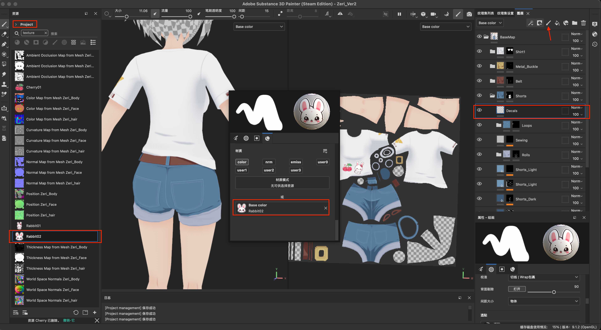

# SubstancePainter快捷键
* `F1`:显示3D和UV视窗
* `F2`:显示3D视窗
* `F3`:显示UV视窗
* `shift + 鼠标右键[左右滑动]`:调整光线方向
* `option + 鼠标左键`:旋转视角
* `option + 鼠标中键`:平移视角
* `option + 滚轮Up/Down`:缩放视角
* `f`:聚焦到对象
* `x`:笔刷灰度值快速在0和1之间切换
* `m`:切换到材质模式
* `option + 鼠标左键[点击材质channel]`:启用该channel并且关闭其他channel
* `option + 鼠标左键选择图层属性的color通道`:会快速置灰其他的通道(normal,user0, user1等)
* `cmd + 鼠标右键[左右滑动]`:缩放笔刷大小
* `cmd + 鼠标左键[上下滑动]`:旋转笔刷
* `option + shift + 鼠标左键`:切换到某个正视图
* `w`:移动变换操纵器
* `e`:旋转变换操纵器
* `r`:缩放变换操纵器
* `shift + 拖动参数滚动条`:更精细地调整参数
* `shift + 鼠标左键`:将笔刷沿直线路径绘制

# Substance Painter使用技巧、问题及解决方案

### 灵活使用笔刷的校准属性
* 问题描述:使用笔刷在模型上绘制时，笔刷被前边模型遮挡。
* 问题解决:调整笔刷的校准属性,将`Wrap包裹`改为`UV`就不用担心在UV上绘制时,笔刷会涂抹到其他对象上

### 在模型贴图片、贴纸等
* 问题描述:制作模型贴图时，希望添加贴纸来丰富贴图细节。

* 问题解决：
  * 从`pinterest`等网站下载寻找贴图并下载.
  
  * 使用`Kirta`将贴图背景设置为透明(详细另见:[Kirta.md](./krita.md))，使用`文件 -> 导出...`导出`PNG`格式的图片，在导出设置界面:`压缩率`拉到最小,勾选`强制转换为sRDB`,勾选`保存透明度通道`。
  
  
  * 在`Substance Painter`中使用`文件 -> 导入资源`进入导入资源界面，添加资源并设置资源类型为`texture`,`将你的资源导入到`设置当前项目.
  
  * 新建用于绘制贴花的图层(并非`填充图层`，而是普通图层),选择`Basic Hard`类型的笔刷，并设置笔刷的`Base Color`属性为导入的贴图,最后绘制。
  

  ### 按模型选择
  * 问题描述:人物头发在展UV时，由于`UV孤岛`很多,故使用了`UV -> Pack Islands`自动排列所有头发的所有`UV孤岛`，导致隶属于同一个`Mesh`的头发会随机分布整张Texture的不同区域，而使用Substance Painter制作贴图时，为了使工程整洁，自然而然需要按照模型组织目录。
  * 问题解决：在绘制`遮罩`时,使用`几何体填充`中的`模型填充`。
  