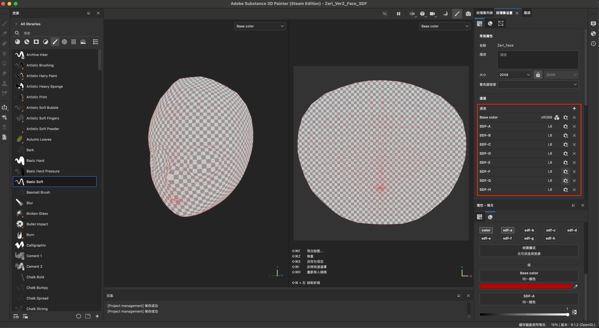
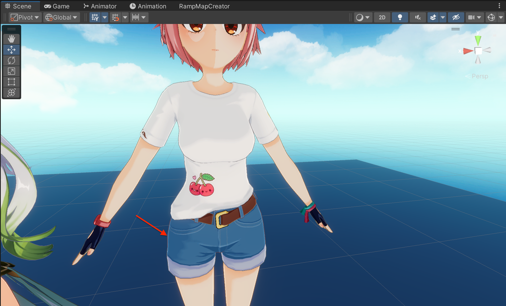

# SubstancePainter快捷键
* `F1`:显示3D和UV视窗
* `F2`:显示3D视窗
* `F3`:显示UV视窗
* `shift + 鼠标右键[左右滑动]`:调整光线方向
* `option + 鼠标左键`:旋转视角
* `option + 鼠标中键`:平移视角
* `option + 滚轮Up/Down`:缩放视角
* `f`:聚焦到对象
* `x`:笔刷灰度值快速在0和1之间切换
* `m`:切换到材质模式
* `option + 鼠标左键[点击材质channel]`:启用该channel并且关闭其他channel
* `option + 鼠标左键选择图层属性的color通道`:会快速置灰其他的通道(normal,user0, user1等)
* `cmd + 鼠标右键[左右滑动]/鼠标滚轮`:缩放笔刷大小
* `cmd + 鼠标左键[上下滑动]`:旋转笔刷
* `option + shift + 鼠标左键`:切换到某个正视图
* `w`:移动变换操纵器
* `e`:旋转变换操纵器
* `r`:缩放变换操纵器
* `shift + 拖动参数滚动条`:更精细地调整参数
* `shift + 鼠标左键`:将笔刷沿直线路径绘制
* `command + z`:撤销(Undo)
* `command + Shift + z`:取消撤销(Redo)

# Substance Painter使用技巧、问题及解决方案

### 高低模烘焙的准备
* 高模分配纯色材质,以支持`Substance Painter`，建议使用科学的命名规则，例如：`ID_Body01`（相同的前缀可以归档材质，使在blnder中更方便查找）；
* 低模规划好UV布局,另见[blender.md](./blender.md)中UV相关的一些建议；
* 高低模需符合命名规则(`_Low`,`_High`)；

### 高低模烘焙的设置
* 参考视频: [Substance 3D Painter 8.3 烘焙功能讲解](https://www.bilibili.com/video/BV1mv4y1k7yC/?spm_id_from=333.1387.favlist.content.click&vd_source=b9589ad635db7dddd215259c55a8a09c)
* 参考视频: [MainMian GameModel Pate35(时间戳1:52:18)](https://www.bilibili.com/video/BV1gZ4y1e7nW?spm_id_from=333.788.videopod.episodes&vd_source=b9589ad635db7dddd215259c55a8a09c&p=3)

### 单独烘焙某个部位
* 问题描述：在烘焙人物模型时，由于只给了低模三个材质：头发、脸部和身体；导致身体这一个“纹理集”包含了太多“部件”，从而在设置`封套`的“最大前部距离”时，出现“水桶效应”，必须扩大到完全去除红色的“匹配错误”，从而导致手部区域的“最大前部距离”不是最佳值。进而导致烘焙结果出错：手指沟区域法线和AO均出错。

* 问题解决：将手部单独设置一个`纹理集`并进行烘焙，即可设置合理的`最大前部距离`，从而得到正确的烘焙结果。但需要注意的是，此时“部件”的UV仍然应该是整个身体UV的“一小部分区域”，最后各个“部件”导出的贴图再经过绘图软件，如Photoshop、Kirta等合并，得到最后的整体贴图。

* 注意：在实际工程时，“部件”的单独烘焙，即给它创建一个单独的`纹理集`，即在低模分配材质时，不再是头发、脸部和身体三个材质，而是有着诸如"手部"，“鞋子”等部件的材质。当然，这些材质只用于烘焙，最终导入Unity引擎时，仍然应该是仅有三个材质（对应三个贴图）。

### 自定义卡通渲染贴图导出设置
* 添加自定义`Zeri ToonShader`贴图导出设置:

### Unity游戏引擎贴图导入设置
* BaseMap:勾选`sRGB(Color Texture)`、设置`Wrap Mode`为`Clamp`、主角是摄像机跟随的对象，故取消勾选`Generate Mipmaps`；

* LightMap:由于存储灰度值，取消勾选`sRGB(Color Texture)`、设置`Wrap Mode`为`Clamp`、取消勾选`Generate Mipmaps`；

* NormalMap:设置`Texture Type`为`Normal Map`、设置`Wrap Mode`为`Clamp`、取消勾选`Generate Mipmaps`；

* RampMap:勾选`sRGB(Color Texture)`、设置`Wrap Mode`为`Clamp`、设置`Non-Power of 2`为`None`、取消勾选`Generate Mipmaps`；

* FaceLightMap(SDF):勾选`sRGB(Color Texture)`,设置`Wrap Mode`为`Clamp`、保证A通道有SDF灰度值信息;

* FaceShadowMask:勾选`sRGB(Color Texture)`,设置`Wrap Mode`为`Clamp`、保证A通道有SDF灰度值信息;

### 灵活使用笔刷的校准属性
* 问题描述:使用笔刷在模型上绘制时，笔刷被前边模型遮挡。
* 问题解决:调整笔刷的校准属性,将`Wrap包裹`改为`UV`就不用担心在UV上绘制时,笔刷会涂抹到其他对象上

### 在模型贴图片、贴纸等
* 问题描述:制作模型贴图时，希望添加贴纸来丰富贴图细节。

* 问题解决：
  * 从`pinterest`等网站下载寻找贴图并下载.
  
  * 使用`Kirta`将贴图背景设置为透明(详细另见:[Kirta.md](./krita.md))，使用`文件 -> 导出...`导出`PNG`格式的图片，在导出设置界面:`压缩率`拉到最小,勾选`强制转换为sRDB`,勾选`保存透明度通道`。
  
  
  * 在`Substance Painter`中使用`文件 -> 导入资源`进入导入资源界面，添加资源并设置资源类型为`texture`,`将你的资源导入到`设置当前项目.
  
  * 新建用于绘制贴花的图层(并非`填充图层`，而是普通图层),选择`Basic Hard`类型的笔刷，并设置笔刷的`Base Color`属性为导入的贴图,最后绘制。
  

  ### 按模型选择
  * 问题描述:人物头发在展UV时，由于`UV孤岛`很多,故使用了`UV -> Pack Islands`自动排列所有头发的所有`UV孤岛`，导致隶属于同一个`Mesh`的头发会随机分布整张Texture的不同区域，而使用Substance Painter制作贴图时，为了使工程整洁，自然而然需要按照模型组织目录。
  * 问题解决：在绘制`遮罩`时,使用`几何体填充`中的`模型填充`。
  

  ### 重新聚焦
  * 问题描述:绘制贴图的过程中，旋转、缩放等都是必要的操作，那么如何重新摆正？
  
  * 问题解决:`f`重新聚焦.

  ### 制作脸部SDF图
  * 使用`Substance Painter`制作`SDF阈值图`的优势：有参考模型，可以直观地观察并绘制脸部的`伦勃朗光`(例如：眼角、鼻尖区域的伦勃朗光)。
  * 在`Blender`中额外复制一份脸部模型,并使用`Grid Fill`将眼睛和嘴巴的镂空部分填充(注意: 1.**不可**使用`UV -> Unwrap`重新展开,否则会导致SDF的UV坐标与原模型脸部UV坐标不再匹配，进而导致游戏引擎中对人物脸部阴影的渲染出现差错! 2.这里的`Grid Fill`操作也是必须的，否则导入到`Substance Painter`后，无法选取包含眼睛和嘴巴镂空区域，导致无法完整选取整个面部区域，最终导致导出的`SDF阈值图`图集(A、B、C ...等)无法正确合成最终的`Face_LightMap`,关于眼睛和嘴巴区域多出的阴影，我们会在游戏引擎中，使用一张`Face_Shadow_Mask`进行剔除。)
  
  
  * 单独导出用于制作`SDF阈值图`的脸部模型，并创建独立的`Substance Painter`项目,在`纹理集设置`中，设置分辨率与原模型脸部贴图一致（均为2048 * 2048）清理所有不需要的通道,只保留`Base Color`通道,并添加自定义的`用户通道`（user0 ~ user15）,并且重命名通道名称为:`SDF-A`、`SDF-B` ... `SDF-H`;
  
  * 在`蒙版(Mask)`上绘制`SDF阈值`(光线从0 ~ 180度的不同角度照射到脸部的明暗分布),我们绘制`A ~ H`共8张阈值图(注意:`Default`图层必须将所有通道的值设置为0)。
  
  
  * 修改每个图层的`Base color`，使其拥有不同的颜色，并按序排列图层，检查并优化阈值(鼻尖的`伦勃朗光`可最后绘制)。（注意：每个图层对应不同的`纹理通道`）
  
  
  * 完成所有绘制工作后，检查无误后，进行导出贴图的设置。添加自定义的`Zeri ToonShader Face SDF`导出预设：
  
  
  
  
  * 将制作的阈值图导入`Unity`引擎，并使用编写的`Unity Editor`工具`SDFGenerator`:1、运行命令`Generate SDF`生成各阈值图对应的SDF图;2、运行命令`Smooth SDF`将相邻的两张SDF图平滑合并生成一张小范围的阈值图;3、运行命令`Combine SDF`将各小范围阈值图相加得出最后的`SDF面部光照贴图`。

### 制作脸部阴影遮罩
* 在`blender`中单独导出脸部模型，并在`Substance Painter`中创建新的工程，在`纹理集设置`中,删除不同通道，只保留`Base Color`通道。添加自定义`用户通道`并且重命名为`ShadowMask`。

* 添加`填充图层(fill layer)`作为背景图层，来控制导出贴图的默认值（例如：默认背景色），设置`Base Color`通道的默认颜色为纯白,`ShadowMask`通道的默认灰度值为1（在游戏引擎中代表此处无阴影）。

* 绘制完遮罩之后，进入`导出贴图`设置，并新增自定义导出设置`Zeri ToonShader Face Shadow Mask`,检查无误后导出。

### 游戏引擎渲染的阴影色过暗
* 问题描述:RampMap(使用编写的Unity工具生成)中的阴影色由`Substance painter`中直接拷贝而来,最终的渲染效果，阴影色明显过暗!

* 问题分析:由于最终的渲染代码计算最终颜色时，部分因子为`BaseColor`的采样值 * `RampMap`的采样值。这导致计算阴影色时，`BaseColor`贴图上本就存在的手绘阴影，会与`RampMap`上复制而来的阴影色相乘（Multiply混合模式），所以加深了阴影色，使之与`Substance painter`中所见的颜色效果不符
* 问题解决: 在`Substance painter`中，不能直接绘制阴影色，而是应该将图层的混合模式更改为`Multiply`模式，即底色与图层颜色相乘来调整最后的阴影色，以达到混合模式为`Normal`时直接绘制阴影色的效果。在`RampMap`工具中，复制的不再是最终的阴影色，而是在`Substance painter`图层中用于`Multiply`的颜色。（这种方式也可以认为是颜色的预处理。当然，对于不需要确定阴影色的图层直接使用`Normal`即可）

### 关于阴影色的选取
* 阴影颜色不是只要比固有色深就行了,灰度值下沉的同时(也可不改变灰度值),应当增加色相和饱和度(即向色盘右下方向/右方向选取),才不会使阴影颜色变黑。
* 基色的选择:应尽可能选择不深的基色(色盘的左上区域),重点是不要使用完美的黑色,那样会很难控制颜色。
* 关于阴影色的参考:
  * [https://www.bilibili.com/opus/517957632680171840](https://www.bilibili.com/opus/517957632680171840)
  * [https://www.163.com/dy/article/GON3184U05169PP0.html](https://www.163.com/dy/article/GON3184U05169PP0.html)
* 关于冷暖色:色彩学上根据心理感受把颜色分为暖色(红、黄、橙)、冷色(青、蓝)和中性色(紫、绿、黑、灰、白)。