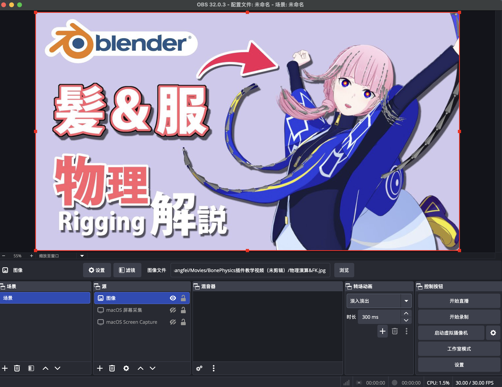

# 视频生产流程及注意事项

### `OBS`录制4K素材
主流视频网站（如哔哩哔哩、YouTube）对 4K 分辨率支持良好，但对 macOS 的默认分辨率（3456 × 2234）兼容性较差。录制视频时，建议将输出分辨率设置为 4K（3840 × 2160），以获得更稳定的播放和画质表现。

---

### `OBS`自定义屏幕捕捉的范围
使用“屏幕采集”录制时，如需避免录入桌面的顶部菜单栏（日期、时间等），可手动调整捕捉区域。将鼠标移至红色捕捉边框，按住 Option 键并拖动鼠标左键，即可改变屏幕录制范围。

---

### `OBS`将图片转换为视频
需在“来源”中添加“图像”源并调整大小，再点击“开始录制”，即可将静态图录制为视频文件
 
 

---

### `iMovie`视频剪辑
略

---

### `AI`配音
曼波配音生成器：[https://tools.dayun.cool/manbo](https://tools.dayun.cool/manbo)(注：使用`Chrome`打开，`Safari`会提示不安全)

#### 问题及注意事项
1. 专业流程应当同时具备"配音稿"和“字幕稿”，但为方便管理，我们将两者合并。即将字幕按行放入`.txt`文件（同时也是导入`Aegisub`的字幕文本），并将每行内容送由曼波`AI`配音，得到对应的`.mp3`文件（例如：`130_至此，插件的完整使用流程结束.mp3`）。
2. 曼波`AI`无法为特定词（例如：`Rigify`）配音，只能逐字母阅读。对此，可以使用谐音“欺骗”曼波，例如：`Rigify` 改为 `瑞吉fi`。
3. 曼波`AI`进行英文配音时，无法准确阅读连词，需要将其拆开。例如：`physics-related`改为`physics related`，`open-source`改为`open source`。
4. 曼波`AI`进行英文配音时，无法准确阅读`'s`，需要去掉`'`。例如：`character's`改为`characters`。
5. 如果曼波`AI`出现网站崩溃、无法访问、开始收费等问题，可尝试自己训练`TTS`模型，参考：[https://www.yuque.com/baicaigongchang1145haoyuangong/ib3g1e](https://www.yuque.com/baicaigongchang1145haoyuangong/ib3g1e)

---

### `Aegisub`字幕制作

#### 选择字幕格式
[Youtube]() 和 [Bilibili]() 只支持`.srt`格式的字幕，无法渲染`.ass`格式的字幕。`Aegisub`可通过`File >> Export As ...`导出`.srt`格式的字幕文件。

#### `.ass`与`.srt`的区别
`.ass`:
* 支持字体
* 支持颜色
* 支持位置
* 支持动画
* 支持特效
* 专业字幕格式

`.srt`:
* 只有时间 + 文字
* 无样式
* 平台通用

#### 烧录字幕
若想在视频中使用`.ass`支持的特效字幕，可以通过烧录字幕的方式，将字幕渲染进视频画面，但存在诸多缺点：
* 不能关闭
* 不能多语言切换
* 修改必须重新导出视频

#### “打轴”技巧
1. 勾选“自动提交”方便操作。
2. 勾选“频谱分析”方便观察。
3. 通常为电影/动画“打轴”时，`鼠标左键`标记该行字幕开始（或拖动“红轴”），`鼠标右键`标记该行字幕结束（或拖动“蓝轴”），`空格Space`播放预览，`G键`完成当前字幕行并跳转到下一行。
4. 频谱上的白框表示上一行字幕的“轴范围”，若两行字幕的“轴范围”发生重叠，受到影响的字幕行会变为红色，使用`鼠标右键`字幕行，呼出上下文菜单来解决冲突。
5. 为教学视频“打轴”时，由于拥有视频剪辑的源文件，可以更精准设置轴起点和终点。

---
