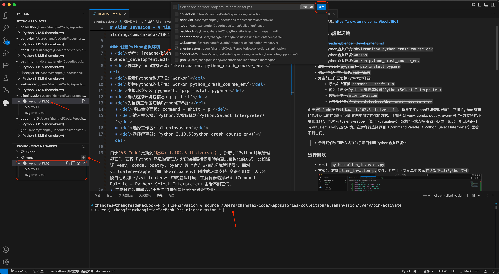
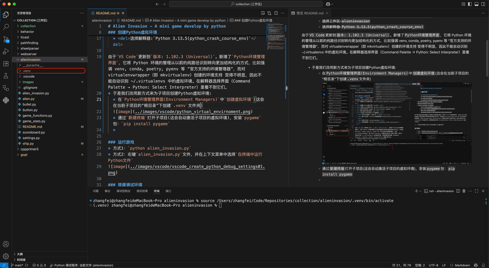

# VS Code Development

### 创建`Python`虚拟环境
由于`VSCode`新增了`Python环境管理界面(Environment Managers)`，它将`Python`环境的管理从以前的纯路径识别转向更加结构化的方式，比如强调`venv`, `conda`, `poetry`, `pyenv`等“官方支持的环境管理器”，而对`virtualenvwrapper`即 `mkvirtualenv`）创建的环境支持变得不明显，因此不能自动识别`~/.virtualenvs`中的虚拟环境，在解释器选择界面（`Command Palette → Python: Select Interpreter`）里看不到它们。

因此需要从`Python环境管理界面(Environment Managers)`来为插件项目创建虚拟环境，这将在项目的"根目录"下创建`.venv`文件夹。`新建终端`时会自动激活对应的虚拟环境.

---

### `Jinja2`模板代码标红
#### 问题描述
若在`.html`文件中混用了：
* `HTML`
* `Jinja2`模板语法：``、`{{ ... }}`
* `JavaScript`

`VSCode`默认的`HTML`语言模式并不认识`Jinja2`，会将``标红

#### 问题解决
安装`Better Jinja`扩展，然后将`.html`的语言模式切换到`Jinja HTML`（状态栏右下角`选择语言模式` → `Jinja HTML`）
