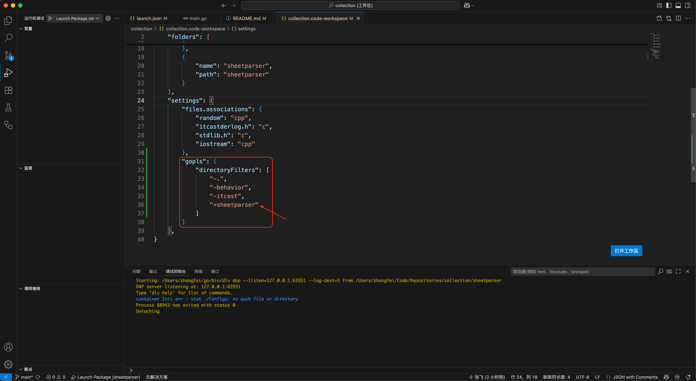

# Sheet Parser

### Go Build
* [optional]`go env -w GO111MODULE=on`
* [optional]`go env -w GOPROXY=https://goproxy.io,direct`
* `go mod init parser`
* `go get github.com/tealeg/xlsx`
* `go get github.com/kai1987/go-text-censor`
* `go mod tidy`

### Makefile Build
* 使用`Makefile`指令替代`go`指令(简化常用构建流程、跨平台统一构建、更易与CI/CD工具集成):
  * `make`/`make build`: 编译`main.go`为`bin/parser`
  * `make clean`: 删除`bin/parser`
  * `make fmt`: 格式化所有 Go 文件
  * `make tidy`: 清理无用依赖
  * `make test`: 运行所有子包测试

### 搭建调试环境
* 创建`launch package(sheetparser)`调试器。另见:[behavior/README.md](../behavior/README.md)或者[itcast/README.md](../itcast/README.md)
* 不同点在于:需要修改`collection/collection.code-workspace`工作区文件来使`gopls`插件的语言分析器仅作用于`collection/sheetparser`子文件夹以成功去除编辑器警告(注意:该警告只有在`运行和调试`界面选择了`launch package(sheetparser)`时才会在编辑器出现，且该警告并不影响go项目的编译,运行和调试)

* 注意: `launch.json`配置的`program`字段需要指向`main.go`所在的目录或直接指向`main.go`,而不是编译之后的二进制文件(与`c/c++`的调试配置是不同的)
* 此外，该项目不需要`tasks.json`配置